# Mermaid Diagrams

Create diagrams using Mermaid syntax. Reference detailed docs in `references/` for complex cases.

## Quick Reference

| Diagram | Keyword | Use For |
|---------|---------|---------|
| Flowchart | `flowchart` | Processes, decisions, workflows |
| Sequence | `sequenceDiagram` | API calls, interactions, protocols |
| Class | `classDiagram` | OOP design, data models |
| State | `stateDiagram-v2` | State machines, lifecycles |
| ER | `erDiagram` | Database schemas, relationships |
| Gantt | `gantt` | Project timelines, schedules |
| GitGraph | `gitGraph` | Git branching, versioning |
| Mindmap | `mindmap` | Brainstorming, hierarchies |
| Timeline | `timeline` | Chronologies, roadmaps |
| Kanban | `kanban` | Task boards, workflows |
| Architecture | `architecture-beta` | Infrastructure, cloud |

## Flowchart

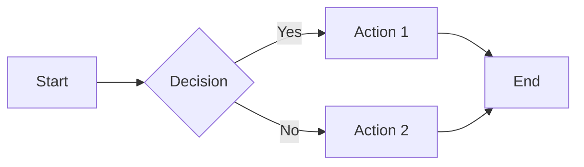

**Directions**: `TB` (top-bottom), `LR` (left-right), `BT`, `RL`

**Node Shapes**:
- `[text]` Rectangle
- `(text)` Rounded
- `{text}` Diamond
- `((text))` Circle
- `[(text)]` Database
- `{{text}}` Hexagon

**Links**: `-->` arrow, `---` line, `-.->` dashed, `==>` thick

For subgraphs, styling, icons: see `references/01-flowchart.md`

## Sequence Diagram

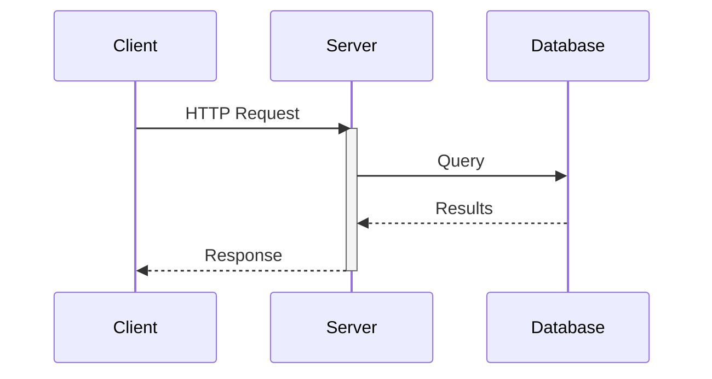

**Arrows**: `->>` solid, `-->>` dashed, `-x` error, `-)` async

**Blocks**: `loop`, `alt/else`, `opt`, `par/and`, `critical/option`, `break`, `rect`

For activations, notes, boxes: see `references/02-sequence-diagram.md`

## Class Diagram

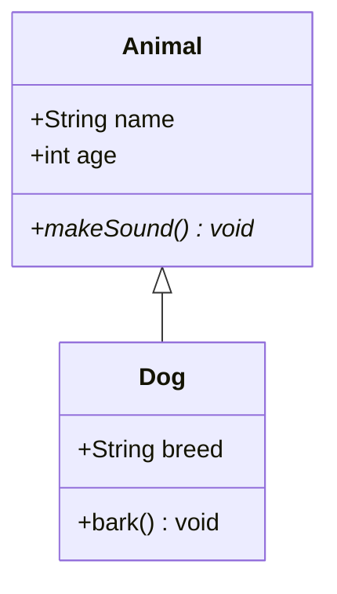

**Visibility**: `+` public, `-` private, `#` protected, `~` package

**Relations**: `<|--` inheritance, `*--` composition, `o--` aggregation, `-->` association

For generics, namespaces, annotations: see `references/03-class-diagram.md`

## State Diagram

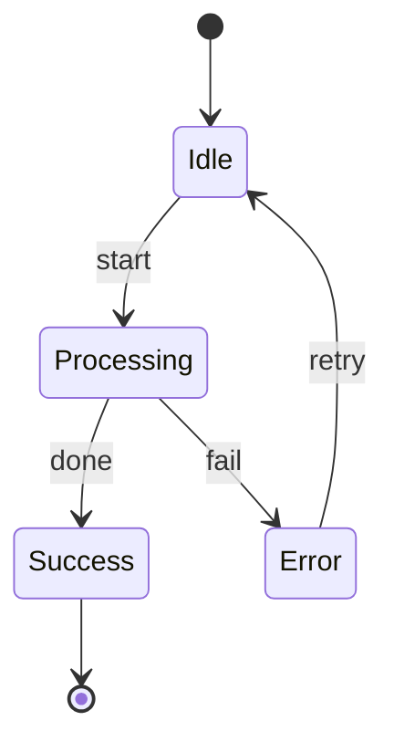

**Special States**: `[*]` start/end, `<<choice>>`, `<<fork>>`, `<<join>>`

For composite states, concurrency, notes: see `references/04-state-diagram.md`

## Entity Relationship

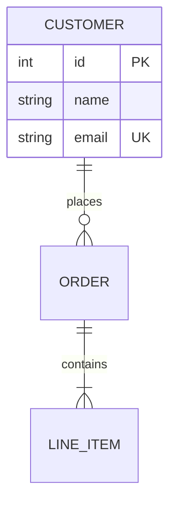

**Cardinality**: `||` one, `o|` zero-one, `}|` one-many, `}o` zero-many

**Keys**: `PK` primary, `FK` foreign, `UK` unique

For relationships, aliases: see `references/05-entity-relationship-diagram.md`

## Gantt Chart

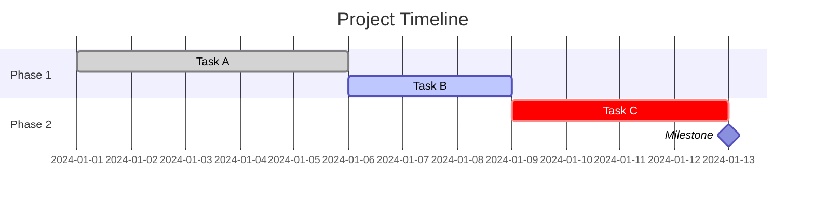

**States**: `done`, `active`, `crit`

**Dependencies**: `after taskId`

For date formats, excludes, vertical markers: see `references/07-gantt.md`

## GitGraph

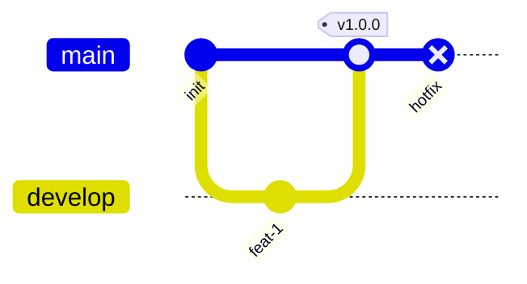

**Commands**: `commit`, `branch`, `checkout`, `merge`, `cherry-pick`

**Types**: `NORMAL`, `HIGHLIGHT`, `REVERSE`

For orientations, themes: see `references/11-gitgraph.md`

## Mindmap

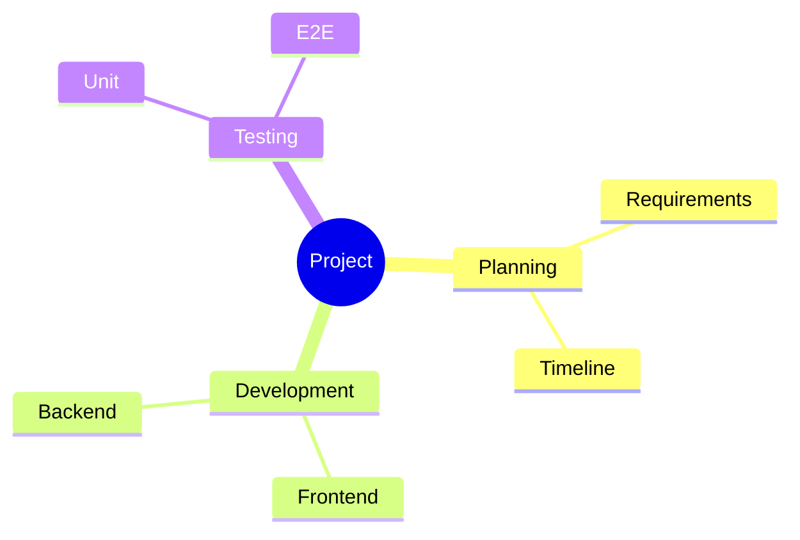

**Shapes**: `(())` circle, `[]` square, `()` rounded, `))((` bang, `)(` cloud

For icons, classes: see `references/13-mindmap.md`

## Timeline

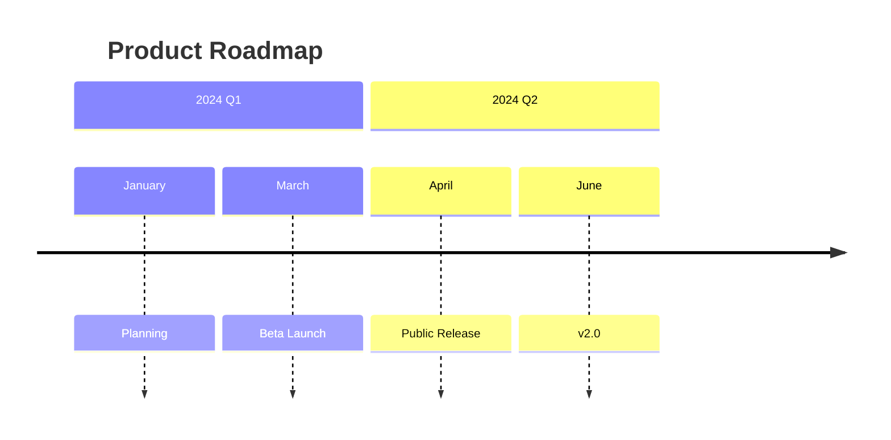

For sections, multiple events: see `references/14-timeline.md`

## Kanban

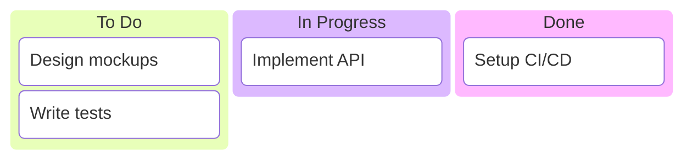

For metadata, ticket URLs: see `references/20-kanban.md`

## Architecture

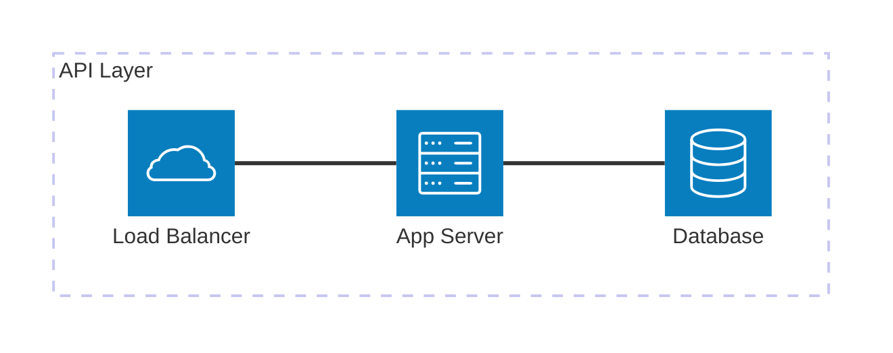

**Icons**: `server`, `database`, `disk`, `internet`, `cloud`

**Positions**: `T` top, `B` bottom, `L` left, `R` right

For groups, junctions: see `references/21-architecture.md`

## Configuration

Add frontmatter for themes and settings:

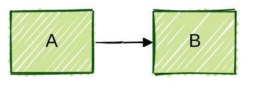

**Themes**: `default`, `forest`, `dark`, `neutral`, `base`

## Preview

After creating a diagram, use `scripts/preview.py` to render and preview:

```bash
python scripts/preview.py diagram.mmd
```

## Workflow

1. Identify diagram type from user request
2. Write Mermaid code with proper syntax
3. For complex cases, consult `references/` docs
4. Generate preview if requested
