# Flowchart - Mermaid

> Documentacion oficial: https://mermaid.js.org/syntax/flowchart.html

Los diagramas de flujo se componen de **nodos** (formas geometricas) y **enlaces** (flechas o lineas).

## Sintaxis Basica

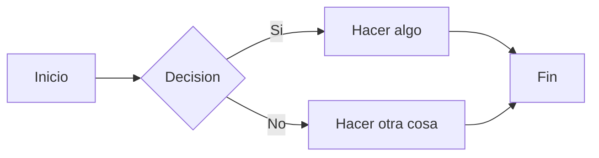

## Direcciones del Diagrama

| Codigo | Direccion |
|--------|-----------|
| `TB` o `TD` | De arriba hacia abajo (Top to Bottom) |
| `BT` | De abajo hacia arriba (Bottom to Top) |
| `LR` | De izquierda a derecha (Left to Right) |
| `RL` | De derecha a izquierda (Right to Left) |

## Formas de Nodos

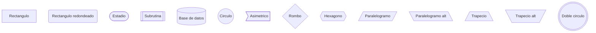

## Nueva Sintaxis de Formas (v11.3.0+)

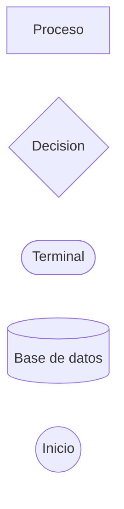

### Lista Completa de Formas Nuevas

| Nombre Semantico | Nombre Corto | Descripcion | Alias |
|------------------|--------------|-------------|-------|
| Process | `rect` | Proceso estandar | `proc`, `process`, `rectangle` |
| Event | `rounded` | Evento | `event` |
| Terminal Point | `stadium` | Punto terminal | `pill`, `terminal` |
| Decision | `diam` | Decision | `decision`, `diamond`, `question` |
| Prepare Conditional | `hex` | Preparacion | `hexagon`, `prepare` |
| Database | `cyl` | Base de datos | `cylinder`, `database`, `db` |
| Start | `circle` | Inicio | `circ` |
| Document | `doc` | Documento | `document` |
| Multi-Document | `docs` | Multiples documentos | `documents`, `stacked-document` |
| Cloud | `cloud` | Nube | `cloud` |
| Delay | `delay` | Retraso | `half-rounded-rectangle` |
| Extract | `tri` | Triangulo | `extract`, `triangle` |
| Manual Input | `sl-rect` | Entrada manual | `manual-input`, `sloped-rectangle` |
| Display | `curv-trap` | Display | `curved-trapezoid`, `display` |
| Fork/Join | `fork` | Fork o Join | `join` |
| Collate | `hourglass` | Collate | `collate` |
| Comment | `brace` | Comentario | `brace-l`, `comment` |
| Lightning Bolt | `bolt` | Comunicacion | `com-link`, `lightning-bolt` |

## Tipos de Enlaces

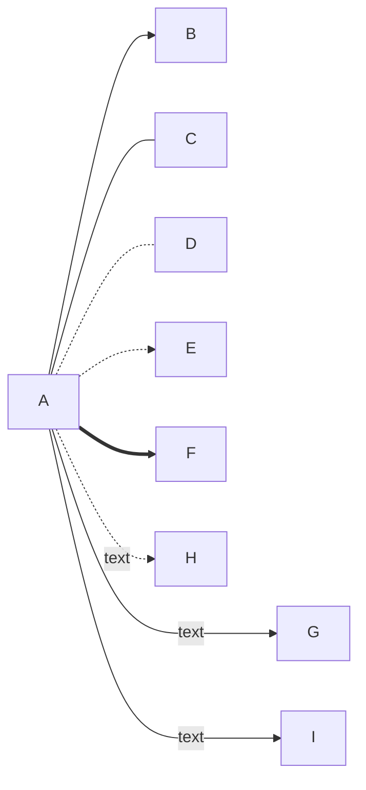

| Sintaxis | Descripcion |
|----------|-------------|
| `-->` | Flecha solida |
| `---` | Linea solida sin flecha |
| `-.-` | Linea punteada sin flecha |
| `-.->` | Flecha punteada |
| `==>` | Flecha gruesa |
| `--texto-->` | Flecha con texto |
| `--o` | Flecha con circulo |
| `--x` | Flecha con X |
| `<-->` | Flecha bidireccional |

## Longitud de Enlaces

Agrega mas guiones para aumentar la longitud:

| Longitud | 1 | 2 | 3 |
|----------|---|---|---|
| Normal | `---` | `----` | `-----` |
| Con flecha | `-->` | `--->` | `---->` |
| Grueso | `===` | `====` | `=====` |
| Grueso con flecha | `==>` | `===>` | `====>` |
| Punteado | `-.-` | `-..-` | `-...-` |
| Punteado con flecha | `-.->` | `-..->` | `-...->` |

## Subgrafos

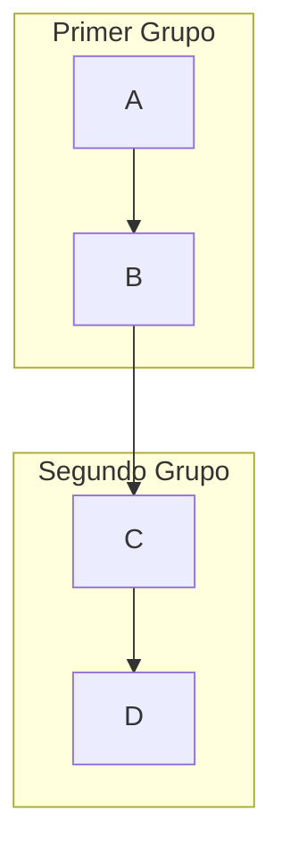

### Direccion en Subgrafos

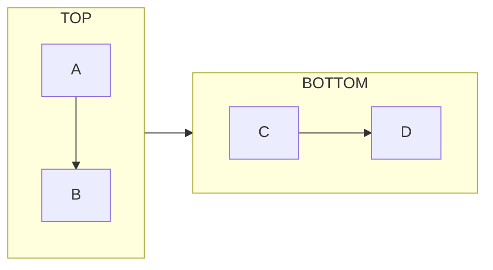

## Estilos

### Definir Clases

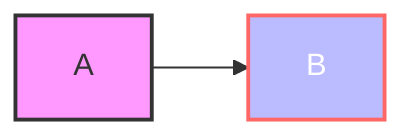

### Estilo Inline

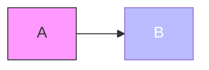

### Clase Default

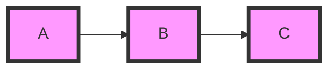

## Enlaces con IDs y Animaciones (v11.10.0+)

```mermaid
flowchart LR
    e1@A --> B
    e1@{ animate: true }
```

### Tipos de Animacion

```mermaid
flowchart LR
    e1@A --> B
    e1@{ animation: fast }
```

## Iconos e Imagenes (v11.3.0+)

### Iconos


### Imagenes

```mermaid
flowchart TD
    A@{ img: "https://example.com/image.png", label: "Imagen", h: 60 }
```

## Markdown en Nodos

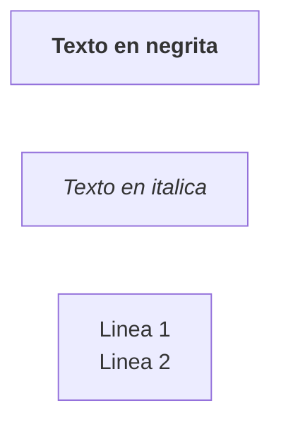

## Interaccion (Click Events)

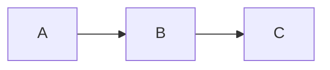

## Comentarios


## Caracteres Especiales

Para usar caracteres especiales, envuelvelos en comillas:

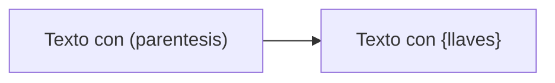

### Codigos de Entidad

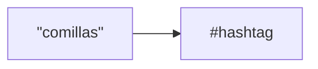

## Configuracion

### Frontmatter YAML

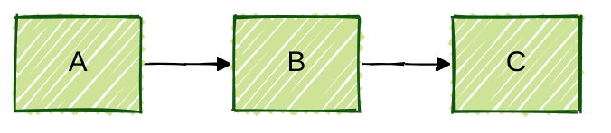

### Algoritmo de Layout

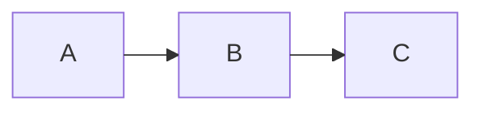

**Layouts disponibles:**
- `dagre` (default)
- `elk` (mas opciones avanzadas)

### Configuracion ELK

```yaml
---
config:
  layout: elk
  elk:
    mergeEdges: true
    nodePlacementStrategy: LINEAR_SEGMENTS
---
```
