# Sequence Diagram - Mermaid

> Documentacion oficial: https://mermaid.js.org/syntax/sequenceDiagram.html

Un diagrama de secuencia muestra como los procesos operan entre si y en que orden.

## Sintaxis Basica

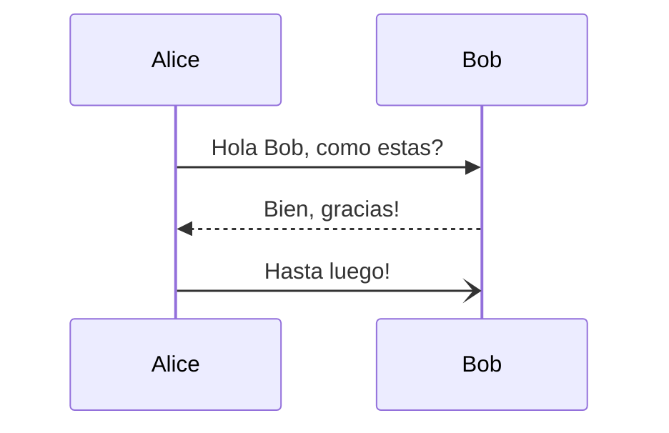

## Participantes

### Definicion Implicita

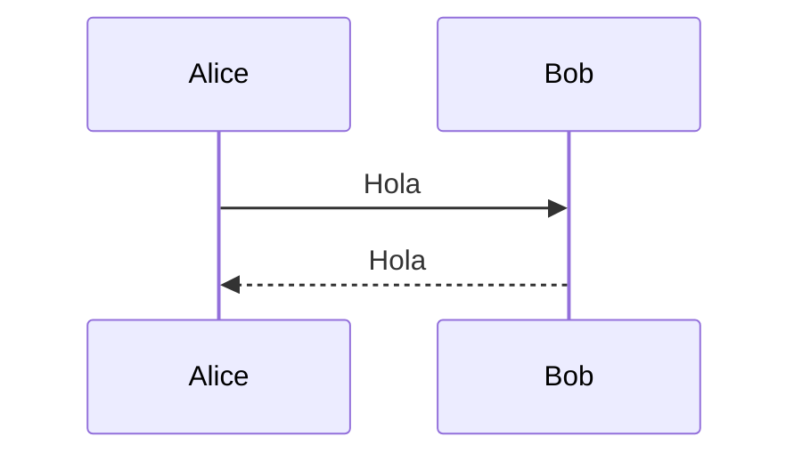

### Definicion Explicita con Orden

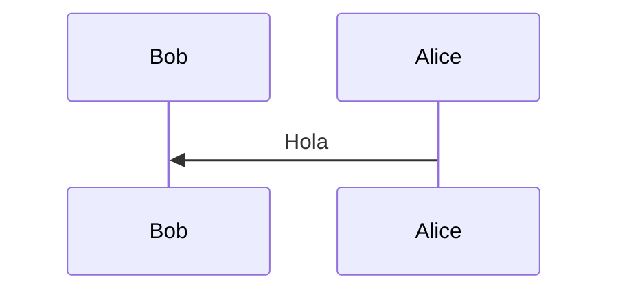

### Actores

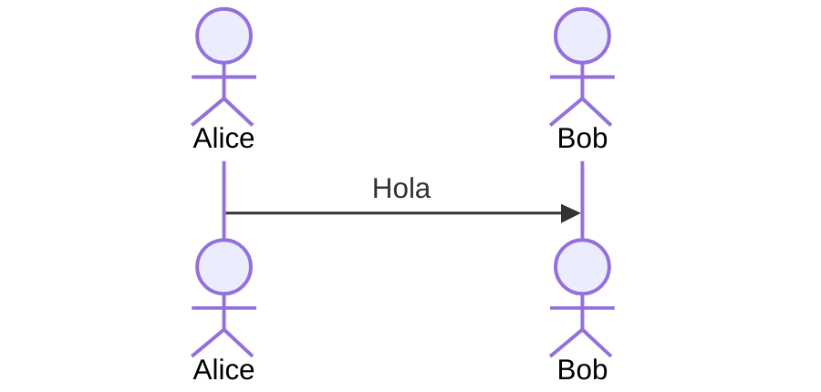

### Tipos de Participantes

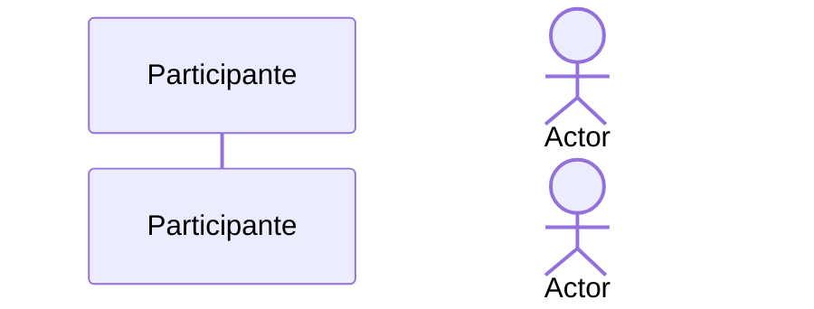

### Simbolos Especiales

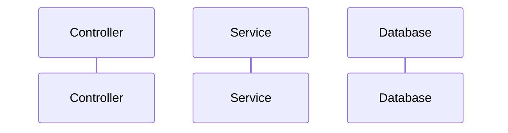

**Simbolos disponibles usando JSON:**
- Boundary
- Control
- Entity
- Database
- Collections
- Queue

## Tipos de Flechas/Mensajes

| Tipo | Descripcion |
|------|-------------|
| `->` | Linea solida sin flecha |
| `-->` | Linea punteada sin flecha |
| `->>` | Linea solida con flecha |
| `-->>` | Linea punteada con flecha |
| `<<->>` | Flecha bidireccional solida (v11.0.0+) |
| `<<-->>` | Flecha bidireccional punteada (v11.0.0+) |
| `-x` | Linea solida con X (error) |
| `--x` | Linea punteada con X |
| `-)` | Linea solida con flecha abierta (async) |
| `--)` | Linea punteada con flecha abierta |

## Activaciones

### Sintaxis Explicita

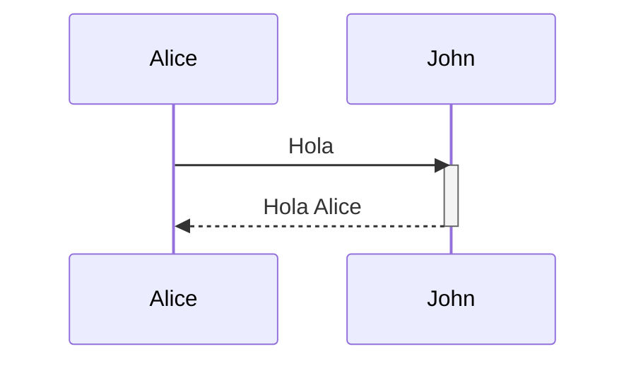

### Sintaxis Abreviada (+/-)


### Activaciones Apiladas

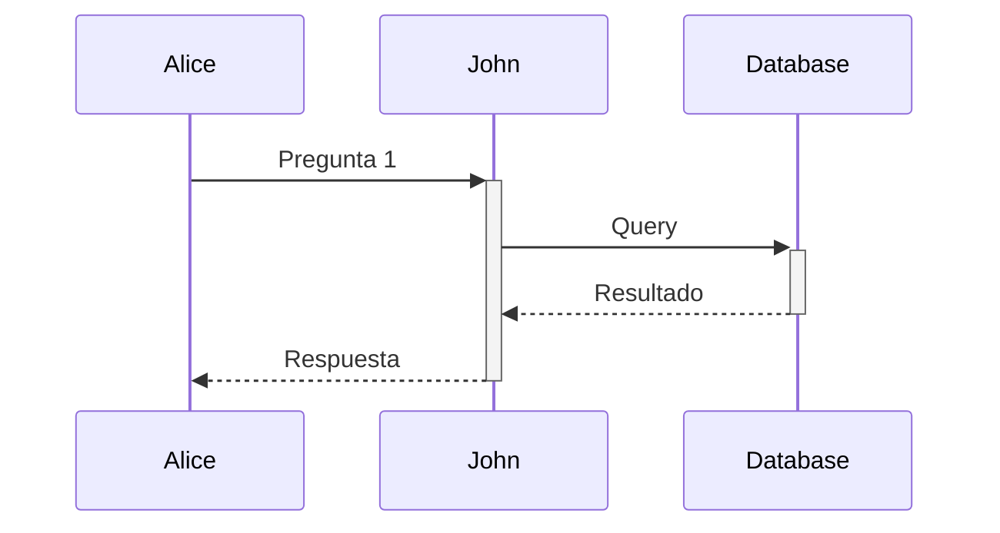

## Notas

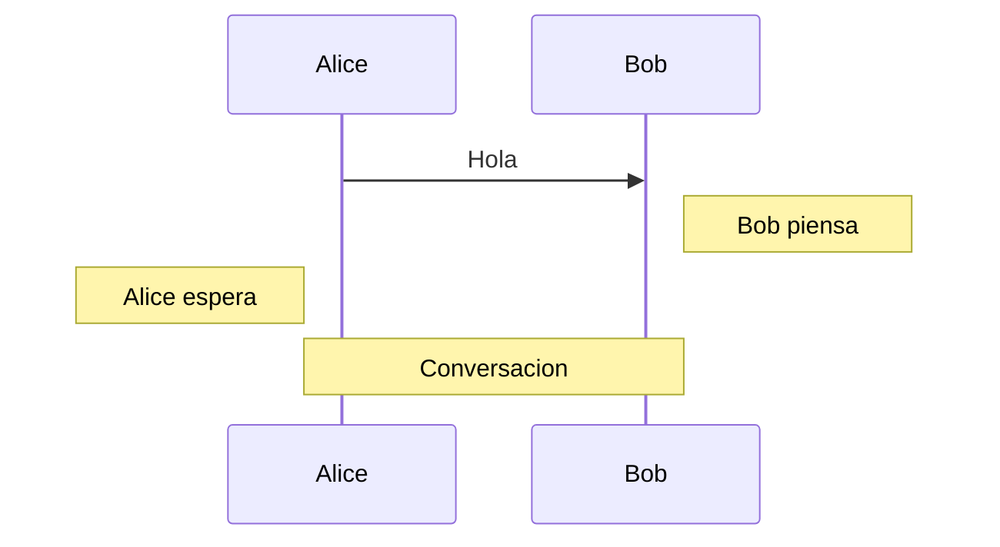

## Saltos de Linea

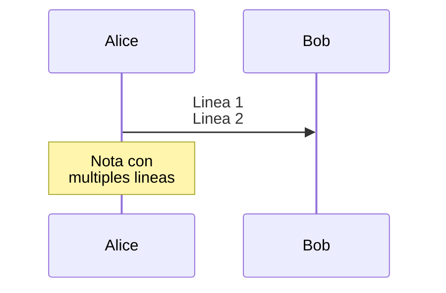

## Loops

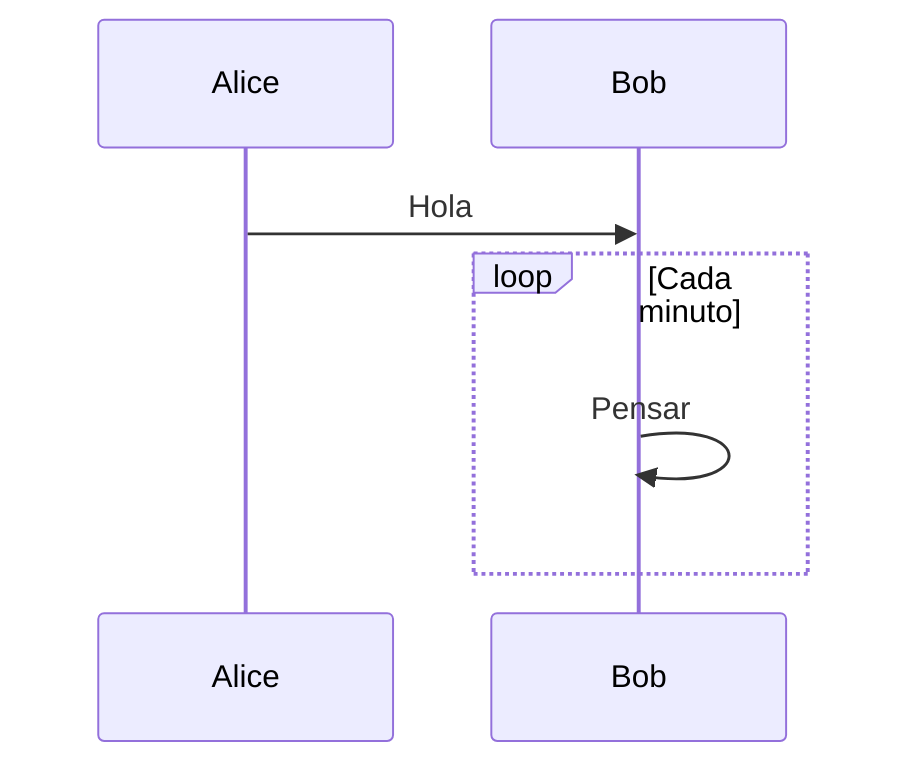

## Alternativas (Alt/Else)

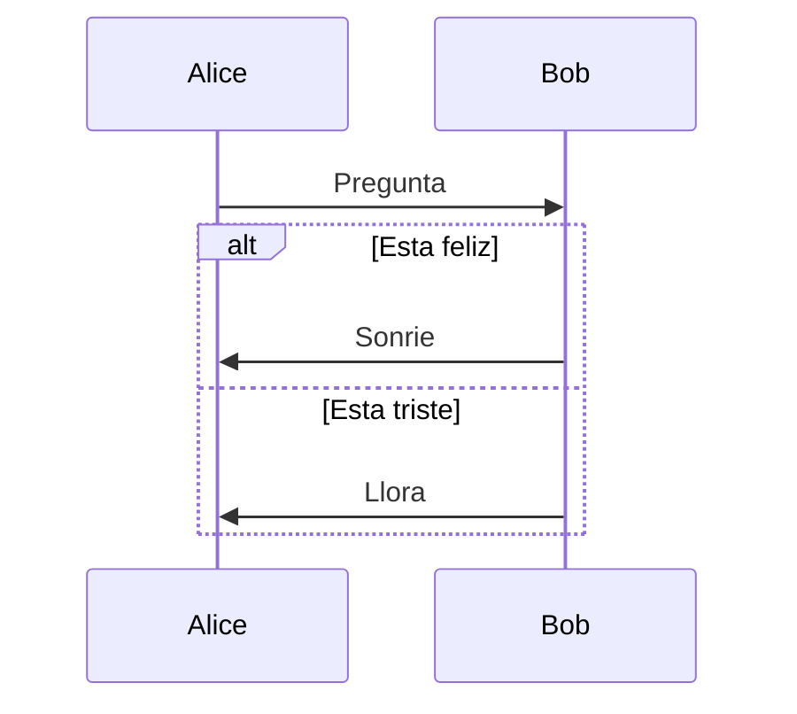

## Opcional (Opt)

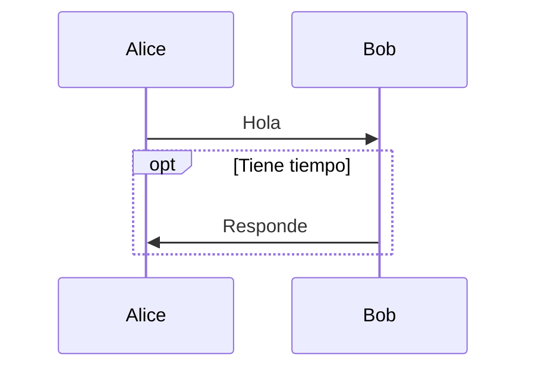

## Paralelo (Par)

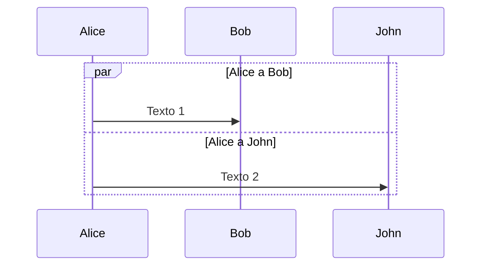

### Par Anidado

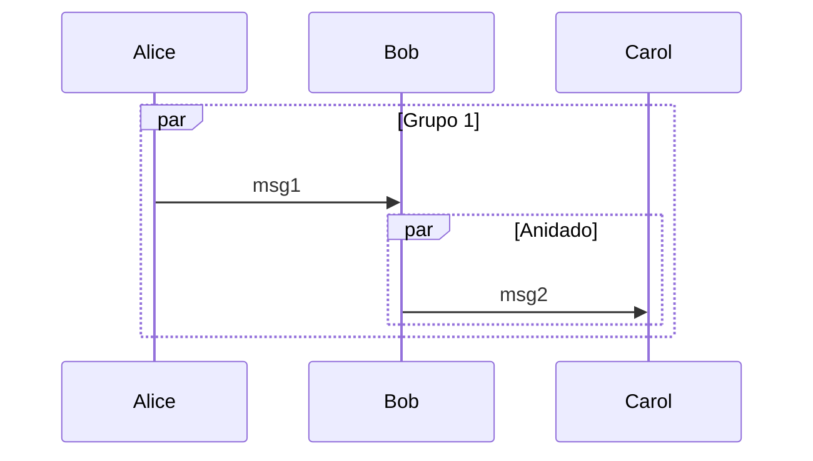

## Region Critica

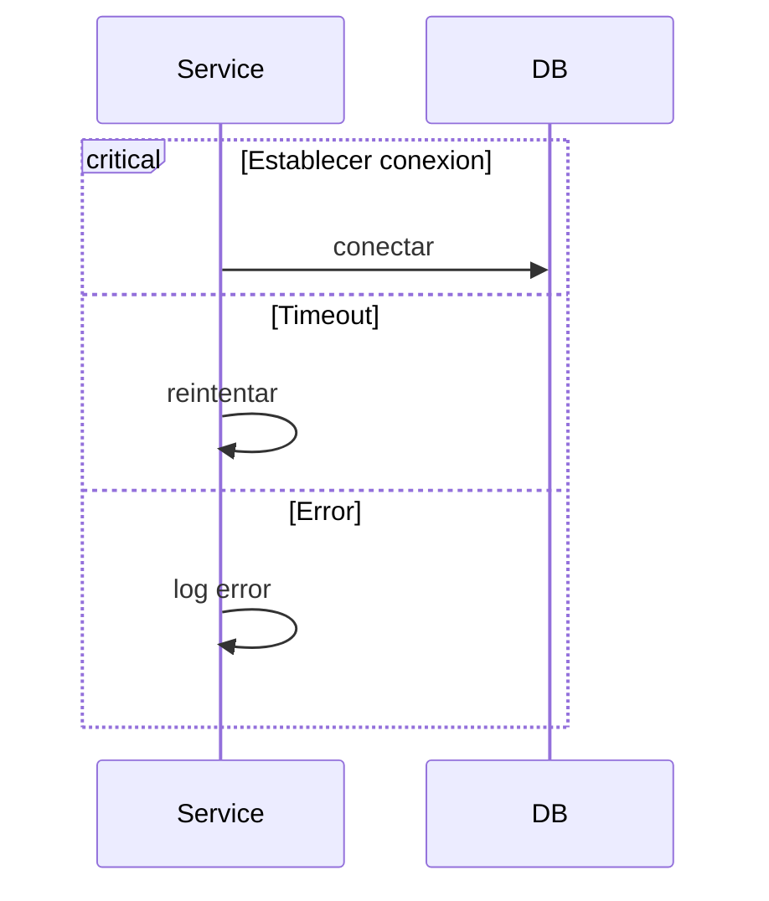

## Break

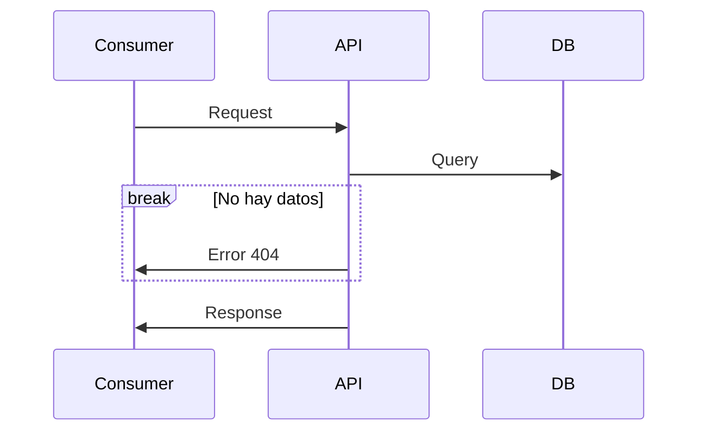

## Resaltado de Fondo (Rect)

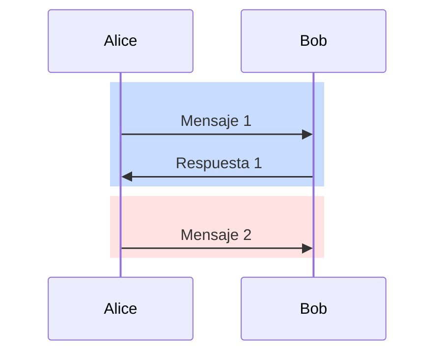

## Grupos (Box)

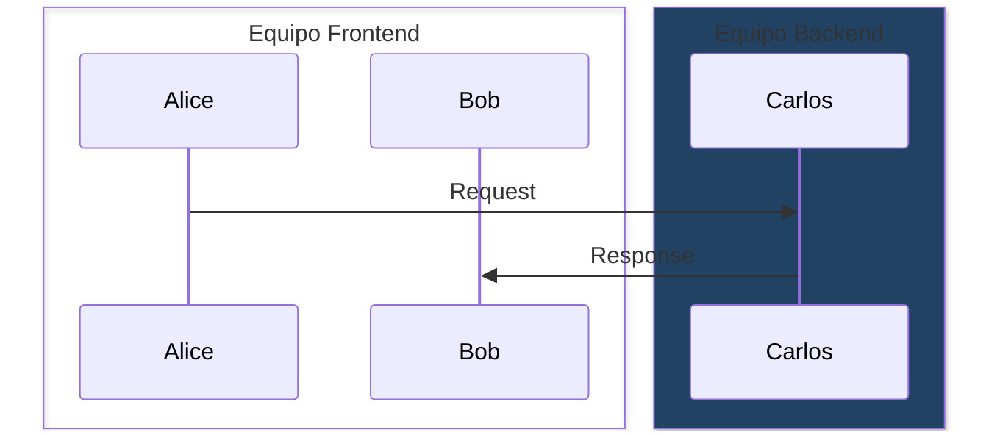

## Creacion y Destruccion de Actores (v10.3.0+)

```mermaid
sequenceDiagram
    Alice->>Bob: Hola
    create participant Carl
    Alice->>Carl: Hola Carl
    destroy Carl
    Alice-xCarl: Adios
```

## Numeros de Secuencia

```mermaid
sequenceDiagram
    autonumber
    Alice->>John: Hola
    John->>Alice: Hola
    Alice->>John: Como estas?
```

## Menus de Actor

```mermaid
sequenceDiagram
    participant Alice
    participant John
    
    link Alice: Dashboard @ https://dashboard.example.com
    link Alice: Wiki @ https://wiki.example.com
    
    Alice->>John: Hola
```

## Comentarios

```mermaid
sequenceDiagram
    %% Este es un comentario
    Alice->>Bob: Hola
```

## Escape de Caracteres

```mermaid
sequenceDiagram
    Alice->>Bob: I #9829; you
    Bob->>Alice: Me too #59; thanks
```

## Configuracion

### Parametros Disponibles

| Parametro | Descripcion | Default |
|-----------|-------------|---------|
| `mirrorActors` | Renderiza actores arriba y abajo | false |
| `bottomMarginAdj` | Ajusta el margen inferior | 1 |
| `actorFontSize` | Tamano de fuente del actor | 14 |
| `actorFontFamily` | Familia de fuente del actor | "Open Sans" |
| `noteFontSize` | Tamano de fuente de notas | 14 |
| `noteAlign` | Alineacion del texto en notas | center |
| `messageFontSize` | Tamano de fuente de mensajes | 16 |

### Ejemplo de Configuracion

```javascript
mermaid.sequenceConfig = {
  diagramMarginX: 50,
  diagramMarginY: 10,
  boxTextMargin: 5,
  noteMargin: 10,
  messageMargin: 35,
  mirrorActors: true
};
```

## Estilos CSS

### Clases Disponibles

| Clase | Descripcion |
|-------|-------------|
| `.actor` | Estilos para la caja del actor |
| `.actor-line` | Linea vertical del actor |
| `.messageLine0` | Estilos para linea de mensaje solida |
| `.messageLine1` | Estilos para linea de mensaje punteada |
| `.messageText` | Texto en las flechas |
| `.note` | Caja de nota |
| `.noteText` | Texto en las notas |
| `.loopText` | Texto en los loops |
| `.loopLine` | Lineas en los loops |
