# Class Diagram - Mermaid

> Documentacion oficial: https://mermaid.js.org/syntax/classDiagram.html

El diagrama de clases es el bloque de construccion principal del modelado orientado a objetos.

## Sintaxis Basica

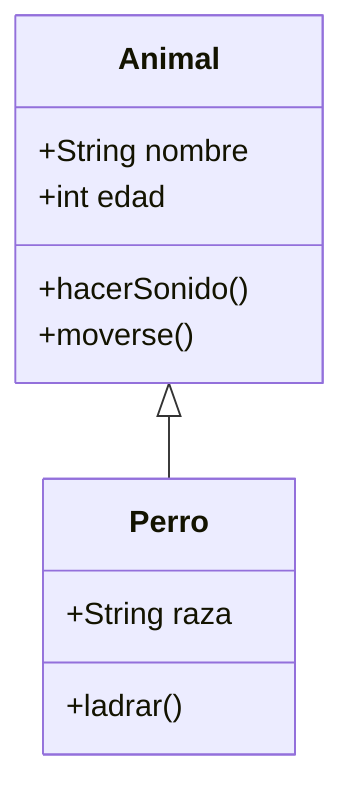

## Definir una Clase

### Forma Explicita

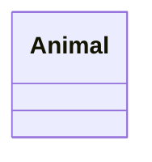

### Via Relacion

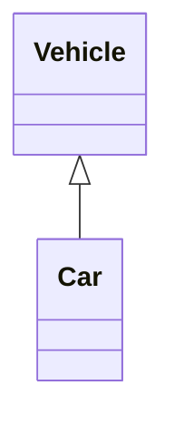

## Etiquetas de Clase

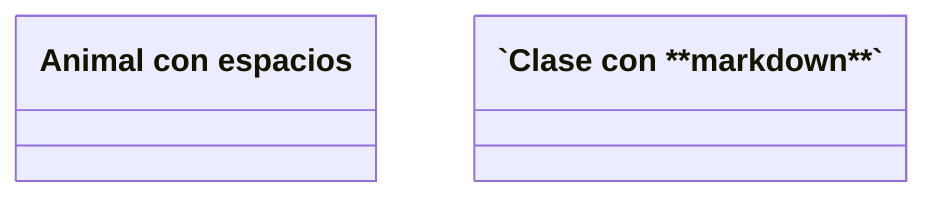

## Definir Miembros

### Con Dos Puntos

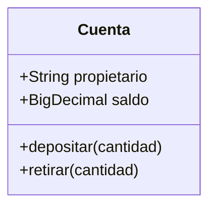

### Con Llaves


### Tipo de Retorno

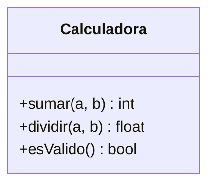

## Tipos Genericos

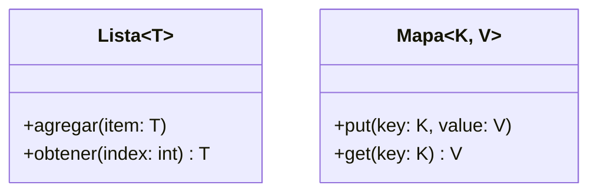

## Visibilidad

| Simbolo | Significado |
|---------|-------------|
| `+` | Publico |
| `-` | Privado |
| `#` | Protegido |
| `~` | Package/Internal |

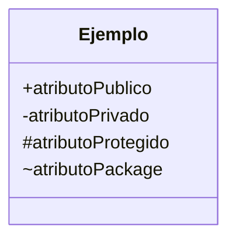

## Clasificadores

| Simbolo | Significado |
|---------|-------------|
| `*` | Abstracto |
| `$` | Estatico |

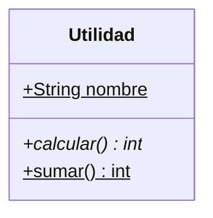

## Tipos de Relaciones

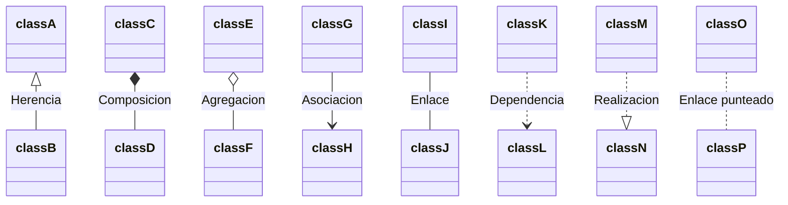

| Tipo | Descripcion |
|------|-------------|
| `<\|--` | Herencia |
| `*--` | Composicion |
| `o--` | Agregacion |
| `-->` | Asociacion |
| `--` | Enlace solido |
| `..>` | Dependencia |
| `..\|>` | Realizacion |
| `..` | Enlace punteado |

## Relaciones Bidireccionales

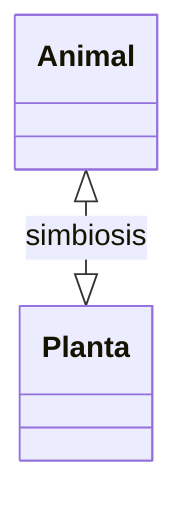

## Etiquetas en Relaciones

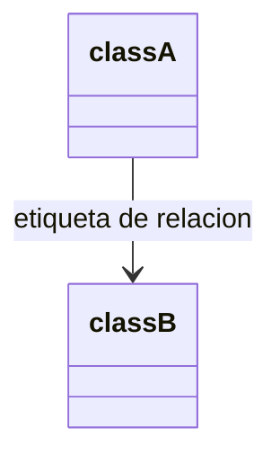

## Cardinalidad/Multiplicidad

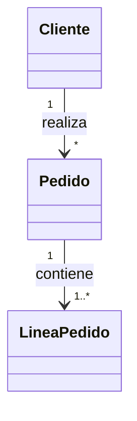

| Notacion | Significado |
|----------|-------------|
| `1` | Solo 1 |
| `0..1` | Cero o uno |
| `1..*` | Uno o mas |
| `*` | Muchos |
| `n` | n (donde n>1) |
| `0..n` | Cero a n |
| `1..n` | Uno a n |

## Lollipop Interfaces

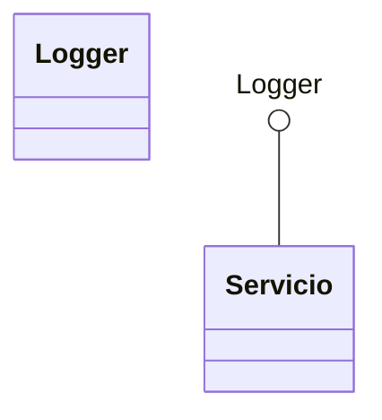

## Namespaces

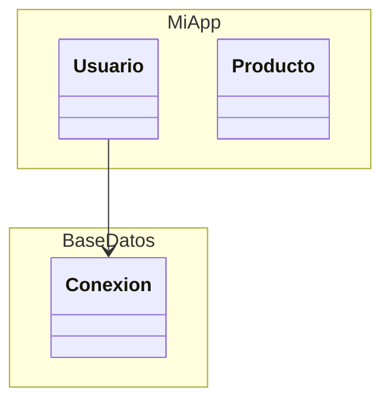

## Anotaciones

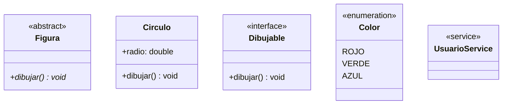

**Anotaciones disponibles:**
- `<<interface>>`
- `<<abstract>>`
- `<<service>>`
- `<<enumeration>>`

## Notas

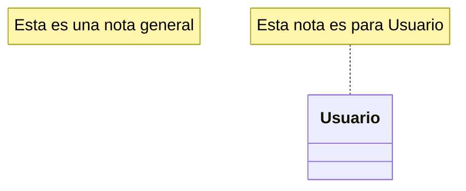

## Direccion del Diagrama

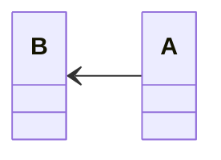

**Direcciones disponibles:**
- `TB` - Top to Bottom
- `BT` - Bottom to Top
- `LR` - Left to Right
- `RL` - Right to Left

## Comentarios


## Estilos

### Estilo Individual

```mermaid
classDiagram
    class Animal
    class Perro
    
    style Animal fill:#f9f,stroke:#333,stroke-width:4px
```

### Definir Clases de Estilo

```mermaid
classDiagram
    class Animal:::estiloRosa
    class Perro:::estiloAzul
    
    classDef estiloRosa fill:#f9f,stroke:#333,stroke-width:2px
    classDef estiloAzul fill:#bbf,stroke:#f66,stroke-width:2px
```

### Operador Shorthand :::

```mermaid
classDiagram
    class Animal:::importante
    classDef importante fill:#f00,color:#fff
```

### Clase Default

```mermaid
classDiagram
    classDef default fill:#f9f,stroke:#333,stroke-width:4px
    class A
    class B
```

## Interaccion (Click)

```mermaid
classDiagram
    class Animal
    class Perro
    
    link Animal "https://www.example.com" "Tooltip"
    callback Perro "callbackFunction" "Tooltip"
```

## Configuracion

### Ocultar Caja de Miembros Vacia

```mermaid
---
config:
  class:
    hideEmptyMembersBox: true
---
classDiagram
    class Animal
```

## Ejemplo Completo

```mermaid
classDiagram
    class Animal {
        <<abstract>>
        +String nombre
        +int edad
        +hacerSonido()* void
        +moverse() void
    }
    
    class Mamifero {
        +bool tienePelo
        +amamantar() void
    }
    
    class Perro {
        +String raza
        +ladrar() void
        +hacerSonido() void
    }
    
    class Gato {
        +String color
        +maullar() void
        +hacerSonido() void
    }
    
    class Mascota {
        <<interface>>
        +jugar() void
        +alimentar() void
    }
    
    Animal <|-- Mamifero
    Mamifero <|-- Perro
    Mamifero <|-- Gato
    Mascota <|.. Perro
    Mascota <|.. Gato
```
