# State Diagram - Mermaid

> Documentacion oficial: https://mermaid.js.org/syntax/stateDiagram.html

Un diagrama de estados describe el comportamiento de sistemas mostrando estados y transiciones.

## Sintaxis Basica

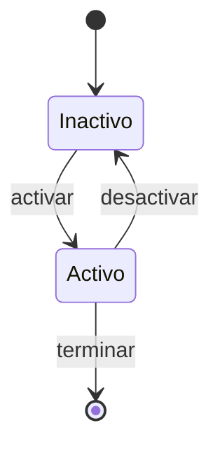

## Estados

### Declaracion Simple

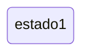

### Con Keyword State

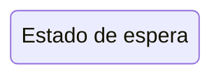

### Con Descripcion (Dos Puntos)


## Transiciones

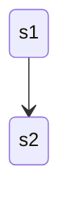

### Transiciones con Texto

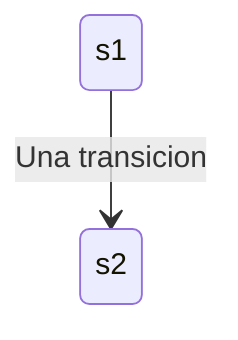

## Inicio y Fin


- `[*]` al inicio de una flecha = Estado inicial
- `[*]` al final de una flecha = Estado final

## Estados Compuestos

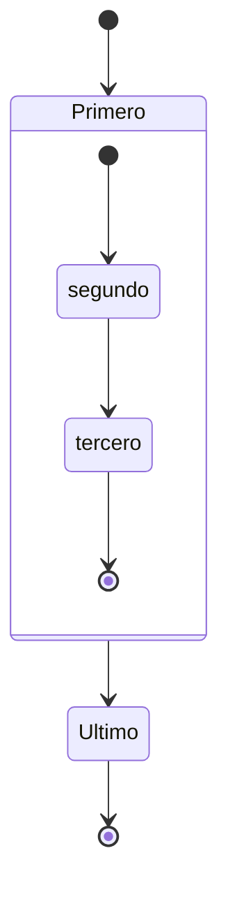

### Estados Anidados

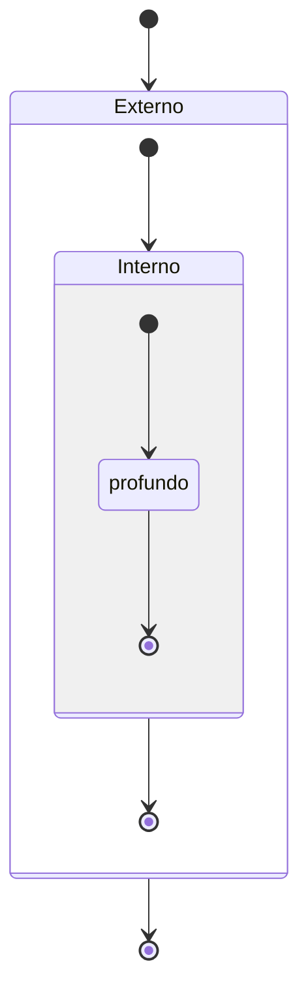

### Transiciones entre Estados Compuestos

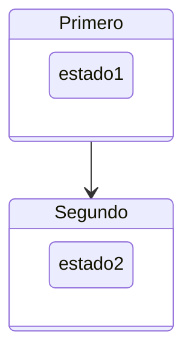

## Choice (Eleccion)

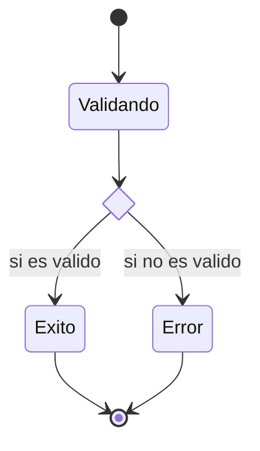

## Fork/Join

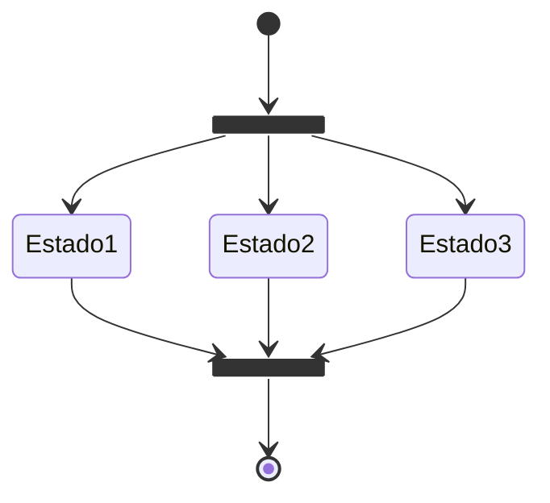

## Notas

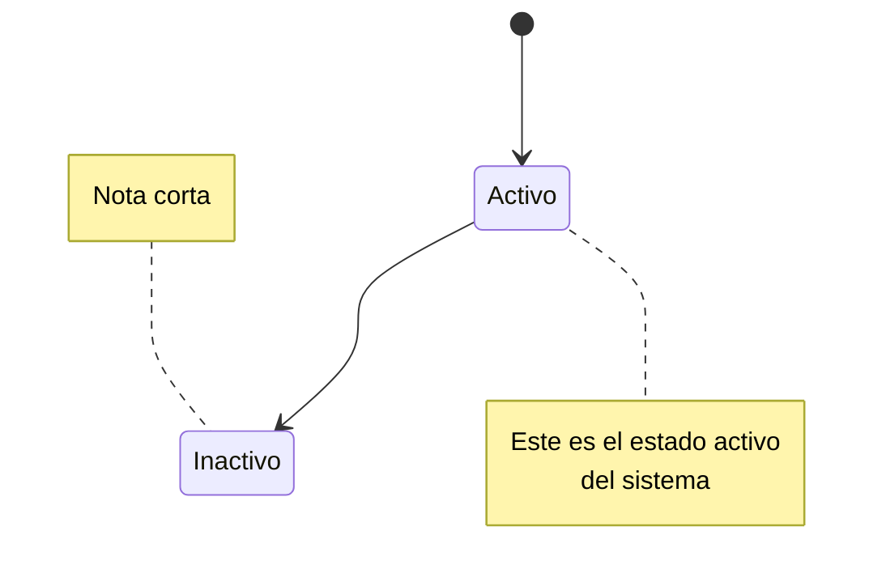

## Concurrencia

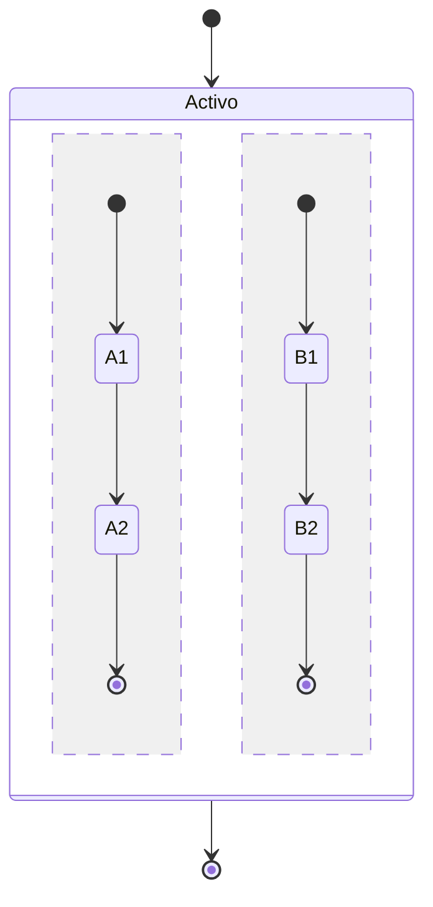

## Direccion del Diagrama

```mermaid
stateDiagram-v2
    direction LR
    [*] --> A --> B --> [*]
```

**Direcciones disponibles:**
- `TB` - Top to Bottom (default)
- `LR` - Left to Right
- `RL` - Right to Left
- `BT` - Bottom to Top

## Comentarios

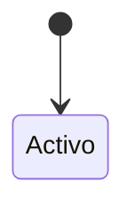

## Estilos con classDef

### Definir Estilos

```mermaid
stateDiagram-v2
    classDef movimiento font-style:italic
    classDef error fill:#f00,color:white,font-weight:bold
```

### Aplicar Estilos con class

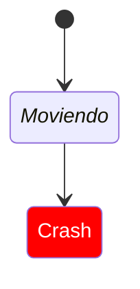

### Aplicar Estilos con :::

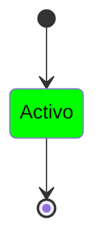

## Espacios en Nombres de Estados

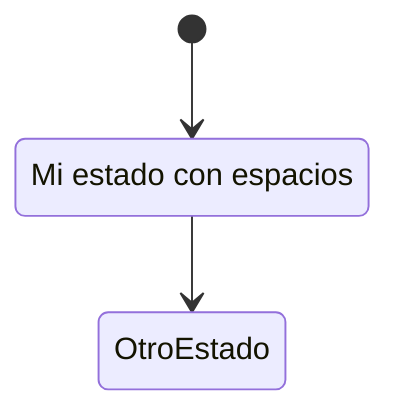

## Ejemplo Completo: Proceso de Pedido

```mermaid
stateDiagram-v2
    [*] --> Pendiente
    
    state Pendiente {
        [*] --> EnCarrito
        EnCarrito --> Confirmado : confirmar
    }
    
    Pendiente --> Procesando : pagar
    
    state Procesando {
        [*] --> Validando
        Validando --> Preparando : valido
        Validando --> Cancelado : invalido
        Preparando --> Enviando
        Enviando --> [*]
    }
    
    state verificar <<choice>>
    Procesando --> verificar
    verificar --> Entregado : exitoso
    verificar --> Fallido : fallido
    
    Entregado --> [*]
    Fallido --> Pendiente : reintentar
    
    note right of Procesando
        Este estado maneja
        todo el proceso de envio
    end note
```

## Ejemplo: Maquina de Estados de Semaforo

```mermaid
stateDiagram-v2
    direction LR
    
    [*] --> Verde
    Verde --> Amarillo : timeout
    Amarillo --> Rojo : timeout
    Rojo --> Verde : timeout
    
    classDef verde fill:#0f0
    classDef amarillo fill:#ff0
    classDef rojo fill:#f00,color:#fff
    
    class Verde verde
    class Amarillo amarillo
    class Rojo rojo
```

## Limitaciones

- classDef no se puede aplicar a estados inicial/final `[*]`
- classDef no se puede aplicar dentro de estados compuestos
