# Entity Relationship Diagram (ERD) - Mermaid

> Documentacion oficial: https://mermaid.js.org/syntax/entityRelationshipDiagram.html

Los diagramas ER describen entidades y sus relaciones en bases de datos.

## Sintaxis Basica

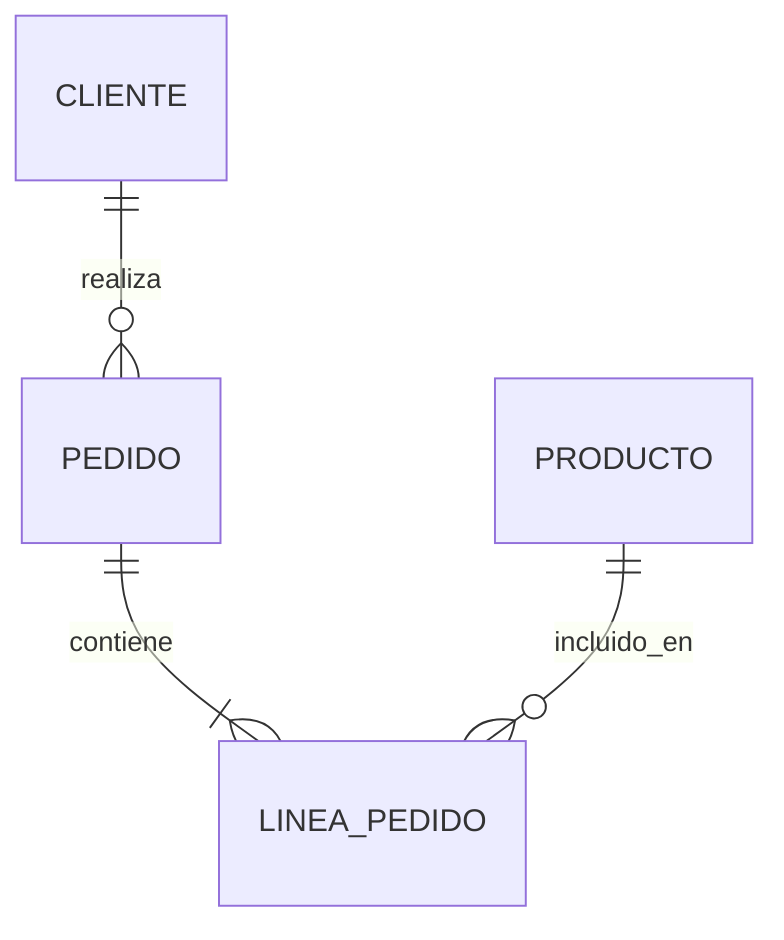

## Estructura de una Declaracion

```
PRIMERA_ENTIDAD [relacion] SEGUNDA_ENTIDAD : etiqueta
```

## Entidades con Atributos

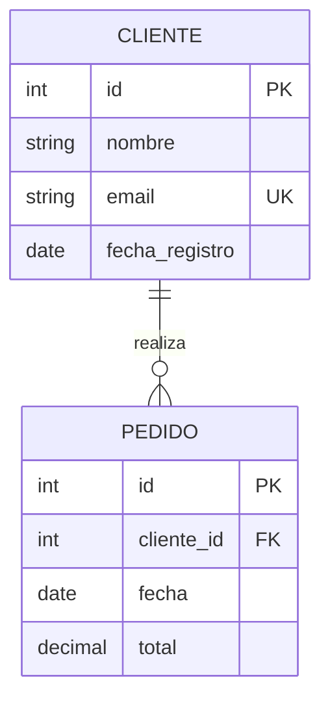

## Sintaxis de Atributos

```
ENTIDAD {
    tipo nombre [clave] ["comentario"]
}
```

### Tipos de Claves

| Clave | Descripcion |
|-------|-------------|
| `PK` | Primary Key |
| `FK` | Foreign Key |
| `UK` | Unique Key |

### Multiples Claves

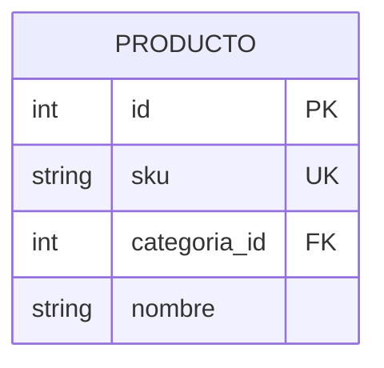

### Comentarios en Atributos

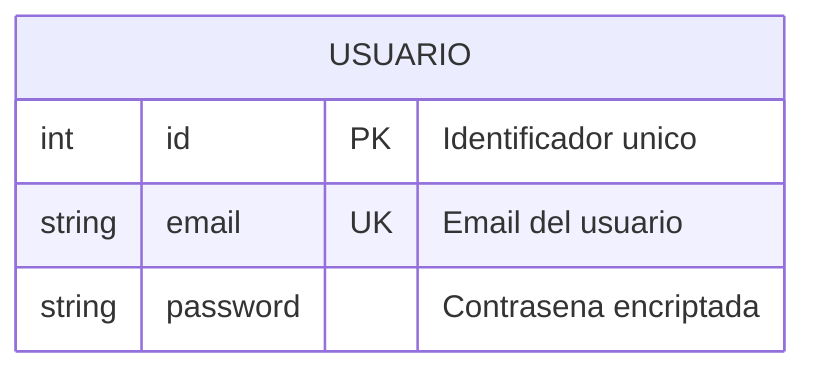

## Cardinalidades

### Tabla de Cardinalidades

| Valor Izq | Valor Der | Significado |
|-----------|-----------|-------------|
| `\|o` | `o\|` | Cero o uno |
| `\|\|` | `\|\|` | Exactamente uno |
| `}o` | `o{` | Cero o mas |
| `}\|` | `\|{` | Uno o mas |

### Alias de Cardinalidades

| Valor | Alias | Significado |
|-------|-------|-------------|
| `\|o` / `o\|` | `one or zero`, `zero or one` | Cero o uno |
| `}\|` / `\|{` | `one or more`, `one or many`, `many(1)`, `1+` | Uno o mas |
| `}o` / `o{` | `zero or more`, `zero or many`, `many(0)`, `0+` | Cero o mas |
| `\|\|` | `only one`, `1` | Exactamente uno |

## Tipos de Relaciones

### Identificadora (Linea Solida)

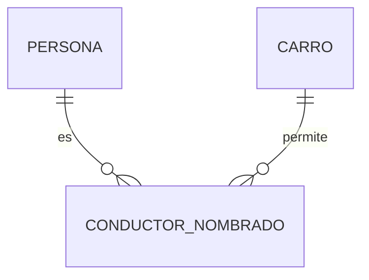

### No Identificadora (Linea Punteada)

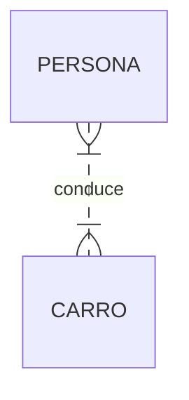

| Valor | Alias | Significado |
|-------|-------|-------------|
| `--` | `to` | Identificadora |
| `..` | `optionally to` | No identificadora |

## Alias de Entidades

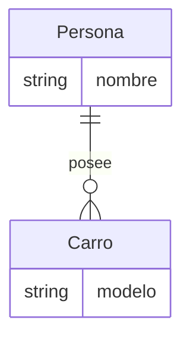

## Texto Unicode

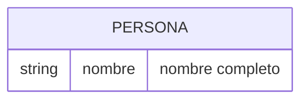

## Markdown en Texto

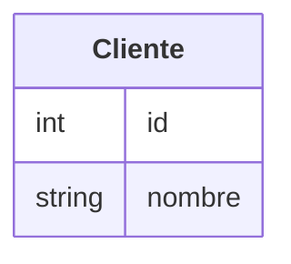

## Direccion del Diagrama

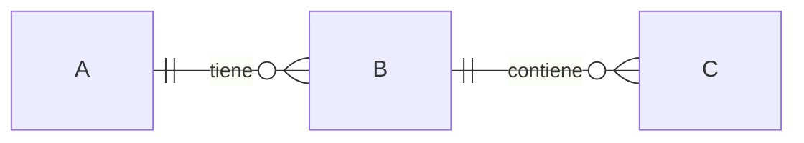

**Direcciones disponibles:**
- `TB` - Top to Bottom (default)
- `BT` - Bottom to Top
- `LR` - Left to Right
- `RL` - Right to Left

## Estilos

### Estilo Individual

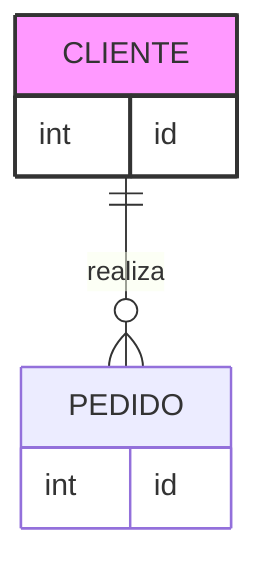

### Clases de Estilo

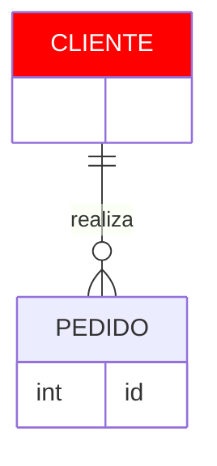

### Clase Default

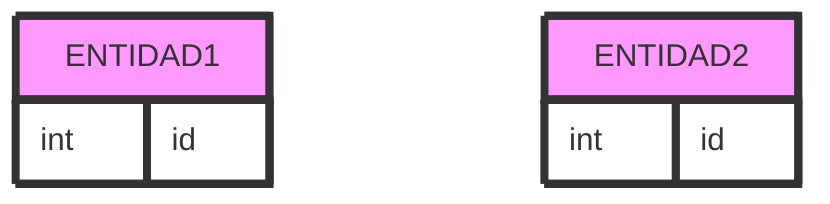

## Configuracion de Layout

### Usando ELK

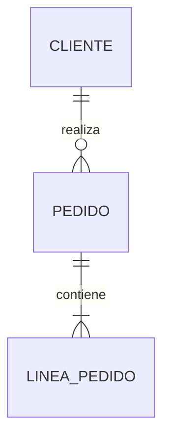

## Ejemplo Completo: E-commerce

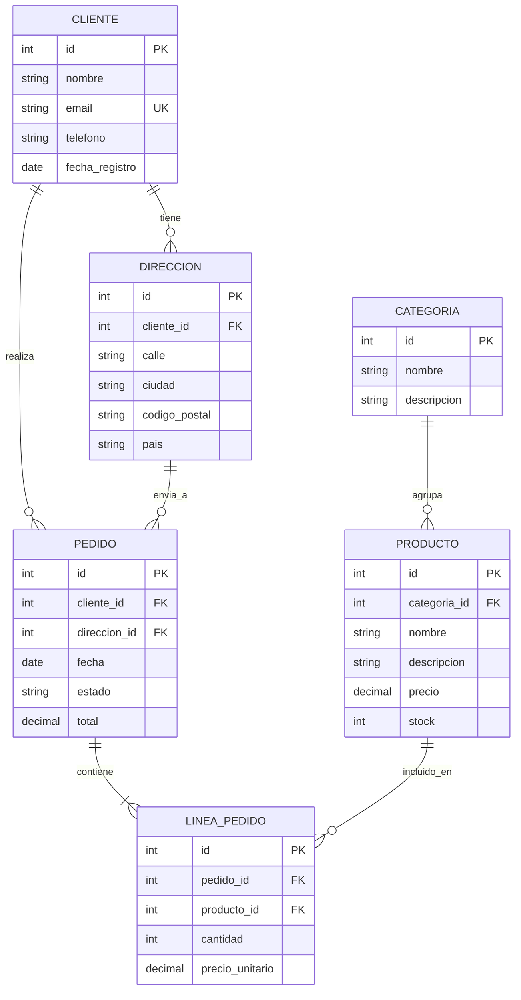

## Ejemplo: Sistema de Blog

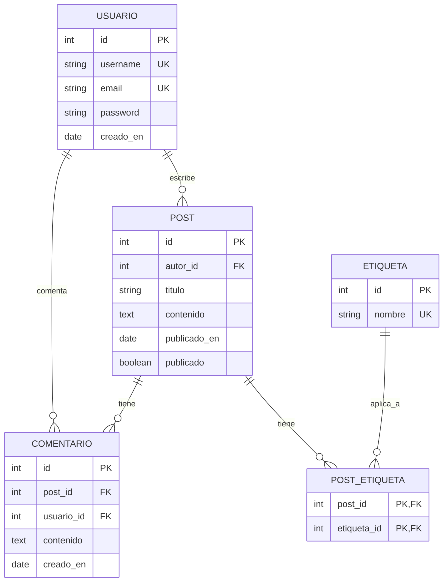
