# User Journey (Viaje del Usuario) - Mermaid

> Documentacion oficial: https://mermaid.js.org/syntax/userJourney.html

Los diagramas de User Journey describen los pasos que un usuario toma para completar una tarea, junto con su nivel de satisfaccion en cada paso.

## Sintaxis Basica

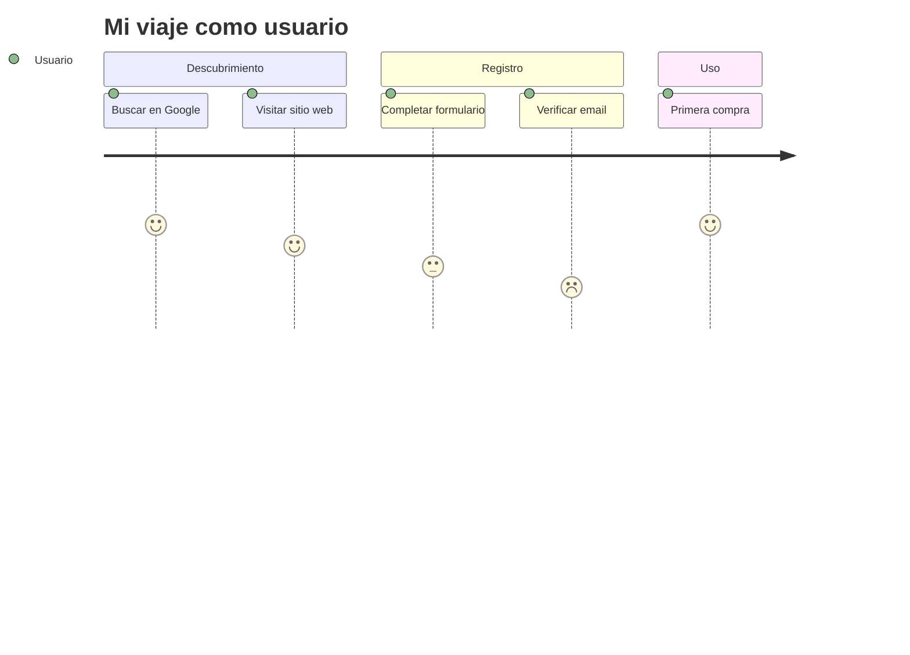

## Estructura General

```
journey
    title Titulo del viaje
    section Nombre de la seccion
        Nombre de tarea: puntuacion: actores
```

## Componentes

### Titulo

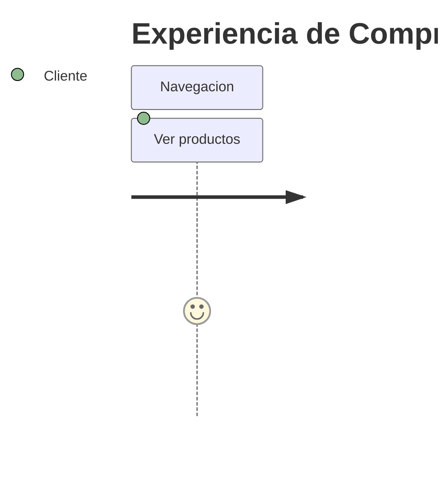

### Secciones

Las secciones agrupan tareas relacionadas:

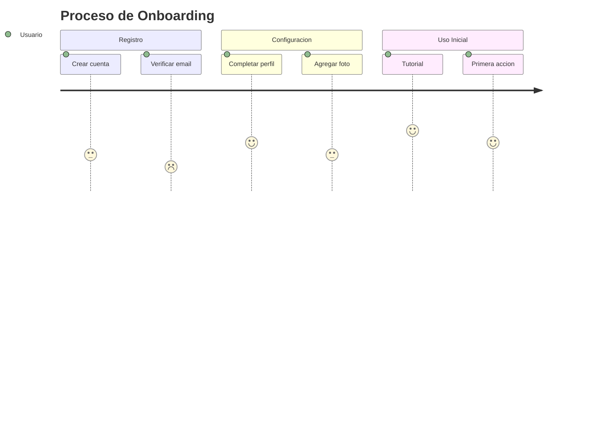

### Tareas

Formato: `Nombre de tarea: puntuacion: actores`

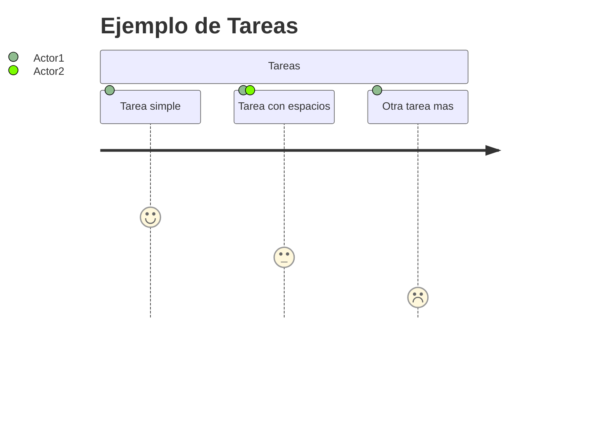

## Sistema de Puntuacion

La puntuacion va de 1 a 5:

| Puntuacion | Significado | Color |
|------------|-------------|-------|
| 5 | Excelente / Muy satisfecho | Verde |
| 4 | Bueno / Satisfecho | Verde claro |
| 3 | Neutral / Regular | Amarillo |
| 2 | Malo / Insatisfecho | Naranja |
| 1 | Muy malo / Frustrado | Rojo |

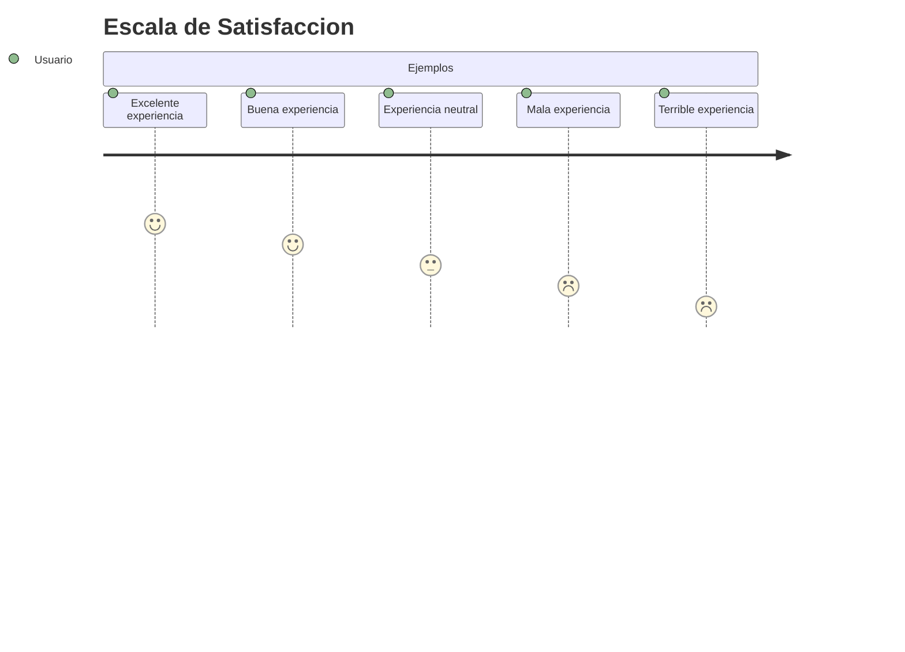

## Actores

Los actores representan quienes participan en cada paso:

### Actor Unico

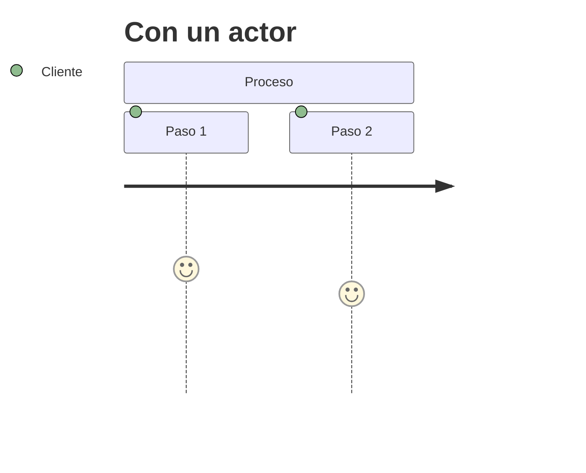

### Multiples Actores

Los actores se separan por comas:

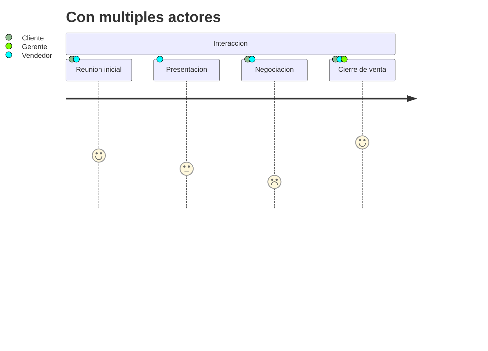

## Ejemplos Completos

### Experiencia de E-commerce


### Dia de Trabajo Tipico

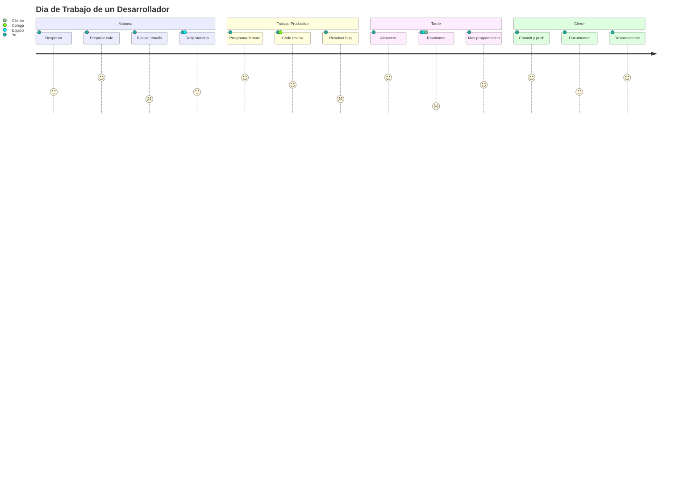

### Onboarding de Usuario

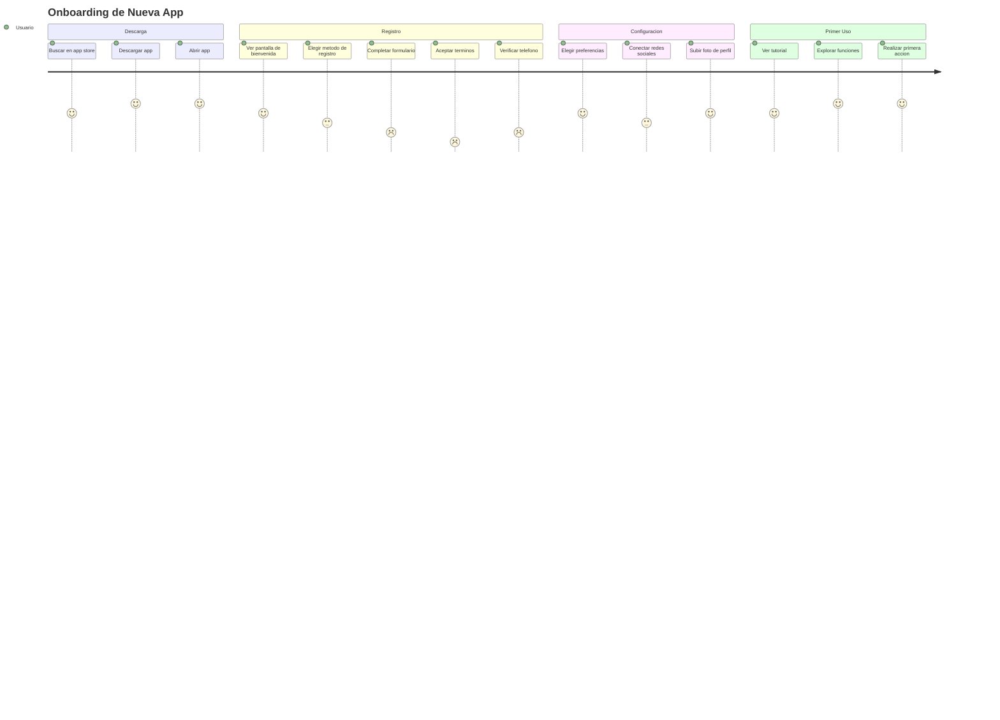

### Proceso de Soporte Tecnico

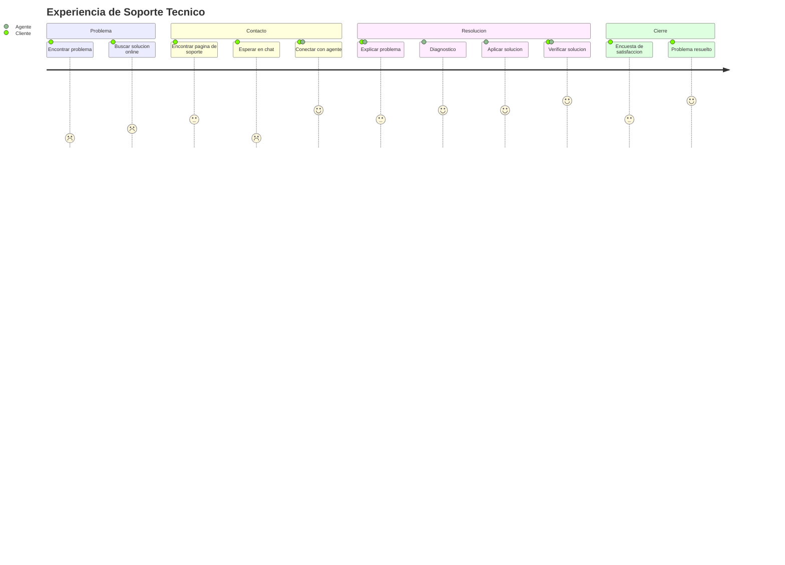

## Configuracion

### Usando Frontmatter

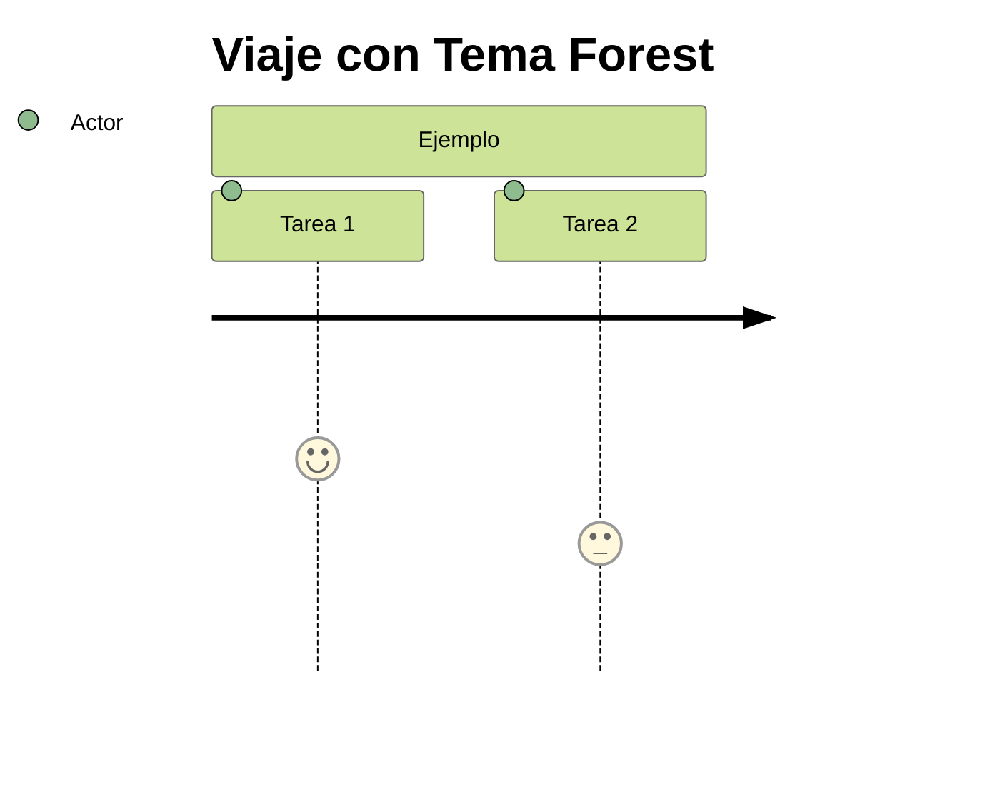

### Usando Directivas

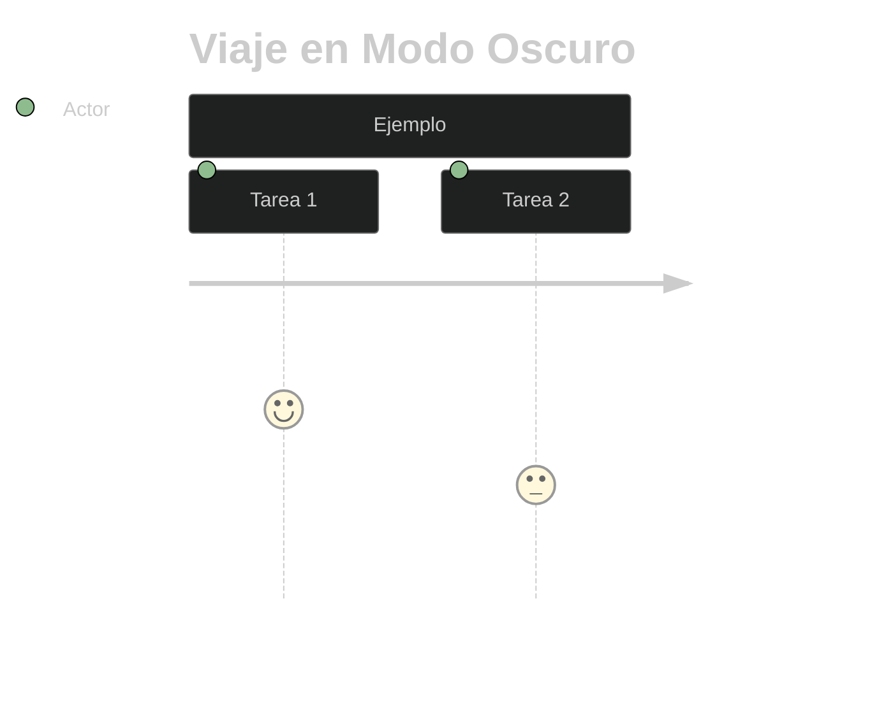

## Tips y Mejores Practicas

1. **Mantener tareas cortas**: Nombres descriptivos pero concisos
2. **Ser honesto con las puntuaciones**: Reflejar la experiencia real
3. **Agrupar logicamente**: Usar secciones para fases del proceso
4. **Limitar actores**: Demasiados actores pueden confundir
5. **Enfocarse en momentos clave**: No incluir cada micro-paso
6. **Usar para identificar pain points**: Los scores bajos revelan areas de mejora

## Casos de Uso Comunes

| Caso de Uso | Proposito |
|-------------|-----------|
| UX Research | Mapear experiencia actual del usuario |
| Product Design | Identificar areas de mejora |
| Customer Success | Entender puntos de friccion |
| Onboarding | Optimizar flujo de nuevos usuarios |
| Service Design | Disenar servicios centrados en usuario |
