# Gantt Chart (Diagrama de Gantt) - Mermaid

> Documentacion oficial: https://mermaid.js.org/syntax/gantt.html

Los diagramas de Gantt ilustran cronogramas de proyectos, mostrando tareas, duraciones y dependencias.

## Sintaxis Basica

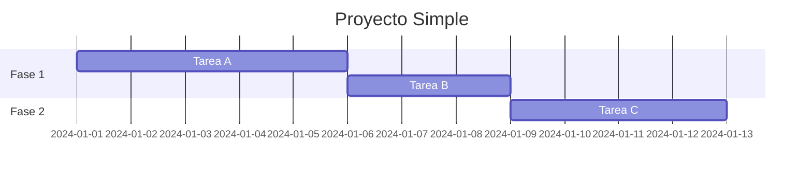

## Estructura General

```
gantt
    title Titulo del proyecto
    dateFormat FORMATO
    
    section Nombre de seccion
        Nombre tarea :id, fecha_inicio, duracion
```

## Configuracion de Fechas

### dateFormat

Define el formato de entrada de fechas:

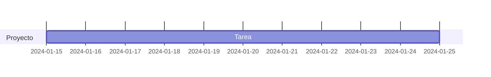

| Formato | Ejemplo |
|---------|---------|
| `YYYY-MM-DD` | 2024-01-15 |
| `DD-MM-YYYY` | 15-01-2024 |
| `YYYY-MM-DD HH:mm` | 2024-01-15 14:30 |

### axisFormat

Define como se muestra el eje temporal:

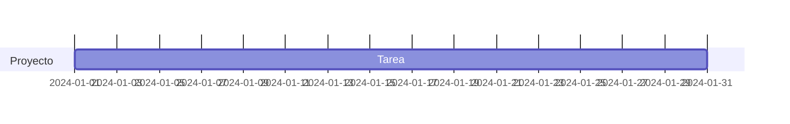

| Formato | Resultado | Descripcion |
|---------|-----------|-------------|
| `%Y` | 2024 | Ano completo |
| `%y` | 24 | Ano corto |
| `%m` | 01-12 | Mes |
| `%d` | 01-31 | Dia |
| `%H` | 00-23 | Hora |
| `%M` | 00-59 | Minutos |
| `%B` | January | Nombre del mes |
| `%b` | Jan | Mes abreviado |
| `%A` | Monday | Dia de la semana |
| `%a` | Mon | Dia abreviado |
| `%W` | 01-53 | Numero de semana |

### tickInterval

Define el intervalo de las marcas del eje:

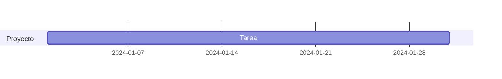

Opciones: `1day`, `1week`, `1month`, `1year`

## Definicion de Tareas

### Sintaxis Completa

```
Nombre tarea :[estado], [id], [fecha_inicio | after id], duracion
```

### Por Fecha de Inicio

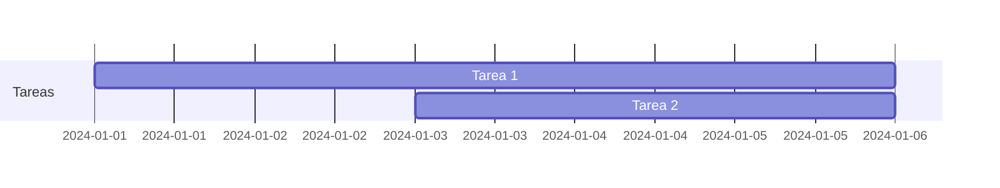

### Por Dependencia

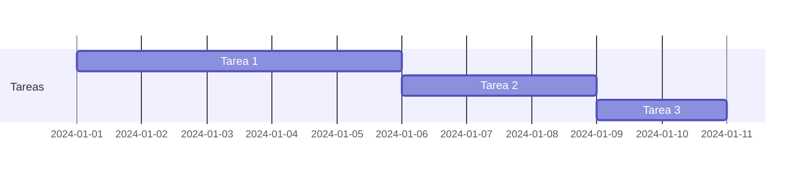

### Con Fecha de Fin

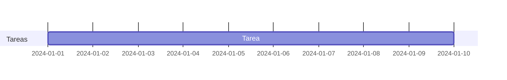

## Estados de Tareas

### Tareas Completadas

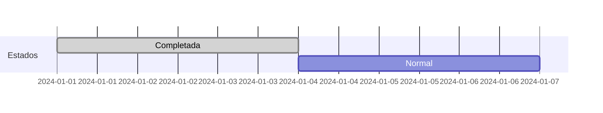

### Tareas Activas

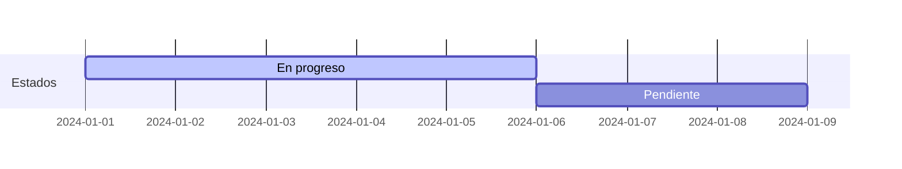

### Tareas Criticas

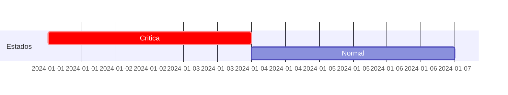

### Combinacion de Estados

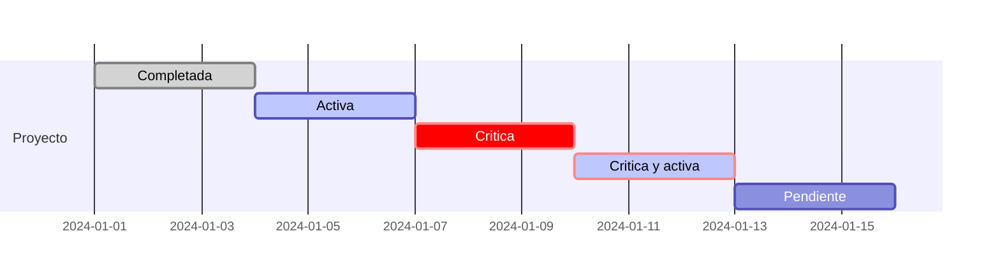

## Milestones (Hitos)

Los hitos son puntos de referencia sin duracion:

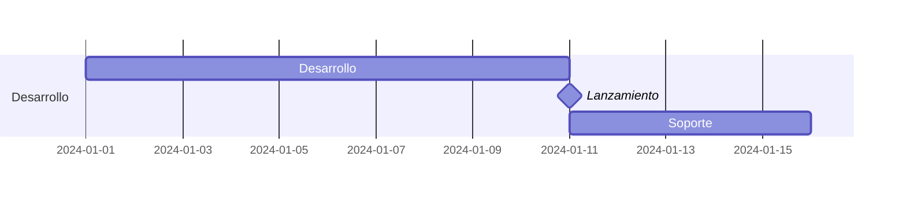

## Secciones

Agrupan tareas relacionadas:

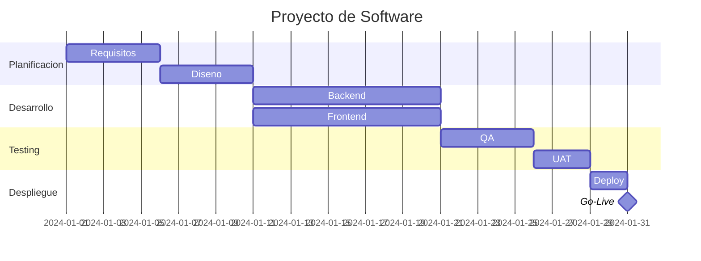

## Exclusion de Fechas

### Excluir Fines de Semana

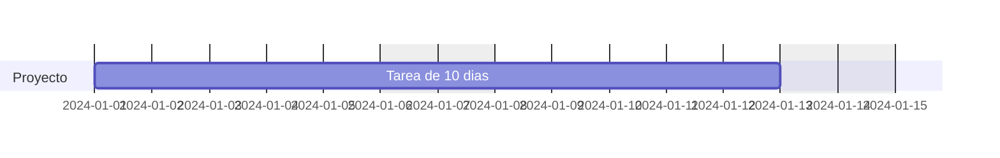

### Excluir Fechas Especificas

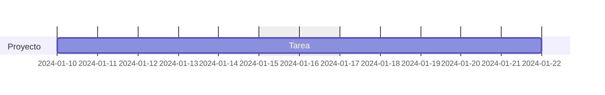

### Dias Laborables

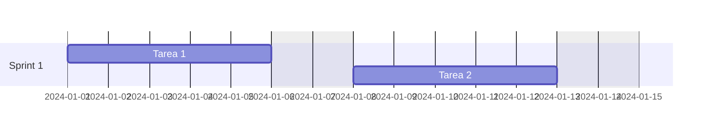

## Marcadores Verticales

Marcan fechas importantes:

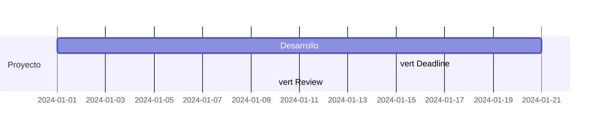

## Interactividad

### Click Events

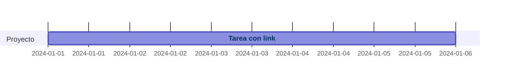

### Callback


## Configuracion Avanzada

### Frontmatter


### Directivas

```mermaid
%%{init: {'gantt': {'barHeight': 30, 'fontSize': 14}}}%%
gantt
    dateFormat YYYY-MM-DD
    
    section Proyecto
        Tarea :2024-01-01, 10d
```

## Ejemplos Completos

### Proyecto de Desarrollo Web

```mermaid
gantt
    title Desarrollo de Aplicacion Web
    dateFormat YYYY-MM-DD
    excludes weekends
    
    section Analisis
        Levantamiento de requisitos  :done, req, 2024-01-01, 5d
        Documentacion de requisitos  :done, doc, after req, 3d
        Aprobacion                   :milestone, apr, after doc, 0d
    
    section Diseno
        Arquitectura del sistema     :done, arq, after apr, 4d
        Diseno de base de datos      :done, db, after apr, 3d
        Mockups UI/UX                :active, ui, after apr, 5d
    
    section Desarrollo
        Setup del proyecto           :crit, set, after arq db, 2d
        Desarrollo Backend           :crit, bak, after set, 15d
        Desarrollo Frontend          :fro, after ui, 15d
        Integracion API              :int, after bak, 5d
    
    section Testing
        Pruebas unitarias            :test1, after bak, 5d
        Pruebas de integracion       :test2, after int fro, 5d
        Pruebas de usuario           :uat, after test2, 3d
    
    section Despliegue
        Preparar ambiente            :prep, after test2, 2d
        Despliegue a produccion      :dep, after uat prep, 1d
        Go-Live                      :milestone, gl, after dep, 0d
```

### Sprint de Scrum

```mermaid
gantt
    title Sprint 15 - Equipo Alpha
    dateFormat YYYY-MM-DD
    excludes weekends
    axisFormat %d/%m
    
    section Planificacion
        Sprint Planning         :done, sp, 2024-01-08, 1d
    
    section Historia 1
        US-101 Desarrollo       :done, us101, after sp, 3d
        US-101 Testing          :done, us101t, after us101, 1d
    
    section Historia 2
        US-102 Desarrollo       :active, us102, after sp, 4d
        US-102 Testing          :us102t, after us102, 1d
    
    section Historia 3
        US-103 Desarrollo       :crit, us103, 2024-01-10, 3d
        US-103 Testing          :crit, us103t, after us103, 2d
    
    section Cierre
        Code Review             :cr, 2024-01-17, 1d
        Demo                    :demo, 2024-01-18, 1d
        Retrospectiva           :retro, after demo, 1d
        Sprint Review           :milestone, sr, after retro, 0d
```

### Lanzamiento de Producto

```mermaid
gantt
    title Lanzamiento Producto v2.0
    dateFormat YYYY-MM-DD
    
    section Pre-Lanzamiento
        Finalizar desarrollo     :done, dev, 2024-01-01, 14d
        QA Final                 :done, qa, after dev, 7d
        Beta testing             :active, beta, after qa, 10d
        Fix bugs criticos        :crit, fix, after beta, 5d
    
    section Marketing
        Preparar materiales      :mkt1, 2024-01-15, 14d
        Campana de expectativa   :mkt2, after mkt1, 7d
        Comunicado de prensa     :mkt3, 2024-02-10, 3d
    
    section Lanzamiento
        Deploy final             :dep, 2024-02-14, 1d
        Lanzamiento publico      :milestone, launch, 2024-02-15, 0d
    
    section Post-Lanzamiento
        Monitoreo                :mon, after launch, 7d
        Soporte intensivo        :sup, after launch, 14d
        Retrospectiva            :retro, 2024-03-01, 1d
```

## Opciones de Configuracion

| Opcion | Descripcion | Default |
|--------|-------------|---------|
| `titleTopMargin` | Margen superior del titulo | 25 |
| `barHeight` | Altura de las barras | 20 |
| `barGap` | Espacio entre barras | 4 |
| `topPadding` | Padding superior | 50 |
| `leftPadding` | Padding izquierdo | 75 |
| `fontSize` | Tamano de fuente | 11 |
| `sectionFontSize` | Tamano fuente secciones | 11 |
| `numberSectionStyles` | Estilos de seccion | 4 |

## Tips y Mejores Practicas

1. **Usar IDs significativos**: Facilita las dependencias
2. **Agrupar en secciones**: Mejora la legibilidad
3. **Usar milestones**: Para marcar puntos clave
4. **Excluir fines de semana**: Para proyectos laborales
5. **Marcar tareas criticas**: Identifica el camino critico
6. **Mantener actualizados los estados**: done, active, crit
