# Quadrant Chart (Grafico de Cuadrantes) - Mermaid

> Documentacion oficial: https://mermaid.js.org/syntax/quadrantChart.html

Los graficos de cuadrantes visualizan datos en cuatro cuadrantes basados en dos ejes, utiles para matrices de priorizacion, analisis competitivo y toma de decisiones.

## Sintaxis Basica

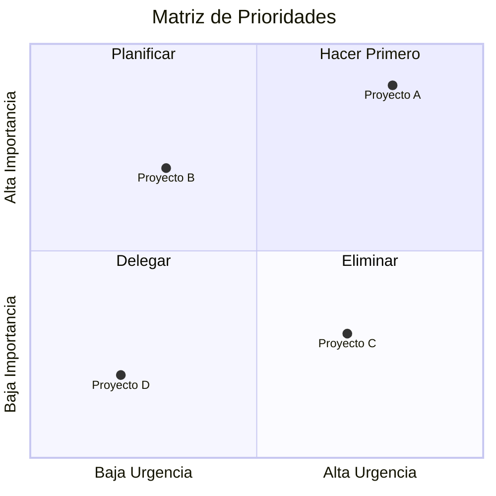
```mermaid
quadrantChart
    title Matriz de Prioridades
    x-axis Baja Urgencia --> Alta Urgencia
    y-axis Baja Importancia --> Alta Importancia
    quadrant-1 Hacer Primero
    quadrant-2 Planificar
    quadrant-3 Delegar
    quadrant-4 Eliminar
    
    Proyecto A: [0.8, 0.9]
    Proyecto B: [0.3, 0.7]
    Proyecto C: [0.7, 0.3]
    Proyecto D: [0.2, 0.2]
```

## Estructura General

```
quadrantChart
    title Titulo
    x-axis Texto Izq --> Texto Der
    y-axis Texto Inferior --> Texto Superior
    quadrant-1 Nombre Cuadrante 1
    quadrant-2 Nombre Cuadrante 2
    quadrant-3 Nombre Cuadrante 3
    quadrant-4 Nombre Cuadrante 4
    
    Punto: [x, y]
```

## Componentes

### Titulo

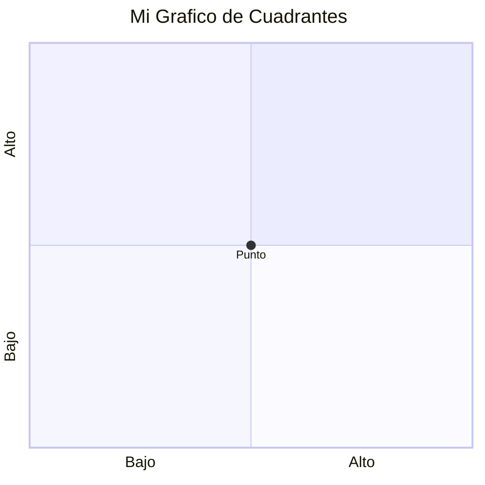
```mermaid
quadrantChart
    title Mi Grafico de Cuadrantes
    x-axis Bajo --> Alto
    y-axis Bajo --> Alto
    Punto: [0.5, 0.5]
```

### Ejes

Los ejes definen las dimensiones de analisis:

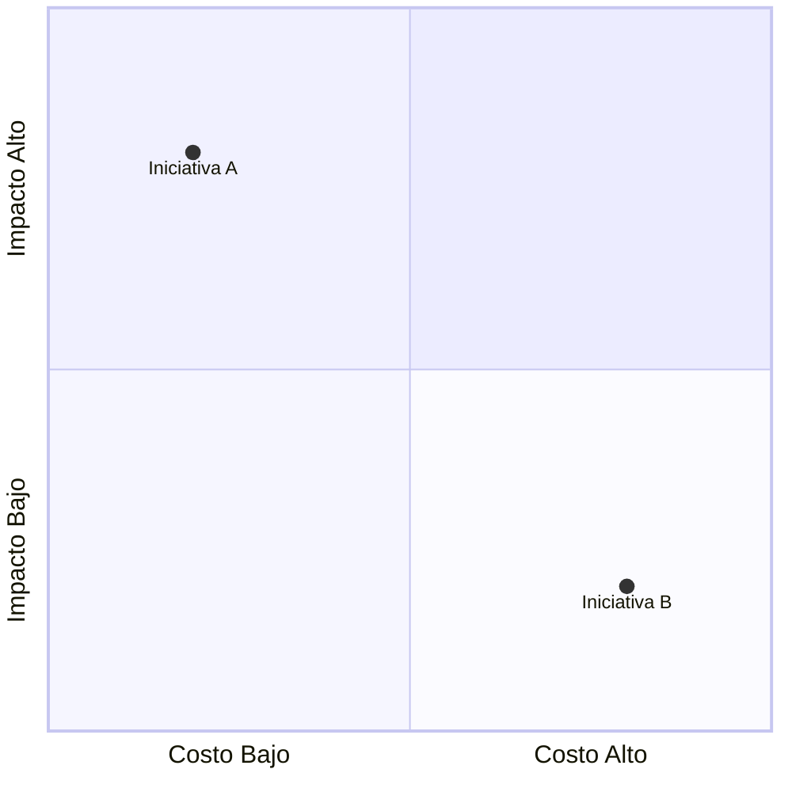
```mermaid
quadrantChart
    x-axis Costo Bajo --> Costo Alto
    y-axis Impacto Bajo --> Impacto Alto
    
    Iniciativa A: [0.2, 0.8]
    Iniciativa B: [0.8, 0.2]
```

### Etiquetas de Cuadrantes

Los cuadrantes se numeran asi:

```
  quadrant-2 | quadrant-1
  (sup-izq)  | (sup-der)
  -----------+-----------
  quadrant-3 | quadrant-4
  (inf-izq)  | (inf-der)
```

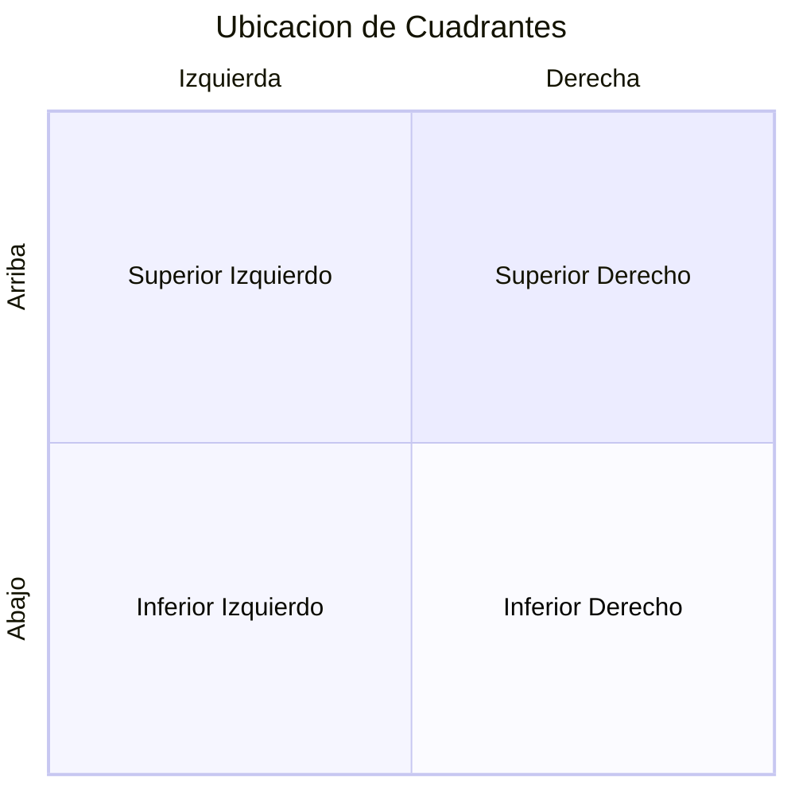
```mermaid
quadrantChart
    title Ubicacion de Cuadrantes
    x-axis Izquierda --> Derecha
    y-axis Abajo --> Arriba
    quadrant-1 Superior Derecho
    quadrant-2 Superior Izquierdo
    quadrant-3 Inferior Izquierdo
    quadrant-4 Inferior Derecho
```

### Puntos de Datos

Los puntos usan coordenadas `[x, y]` donde x e y estan entre 0 y 1:

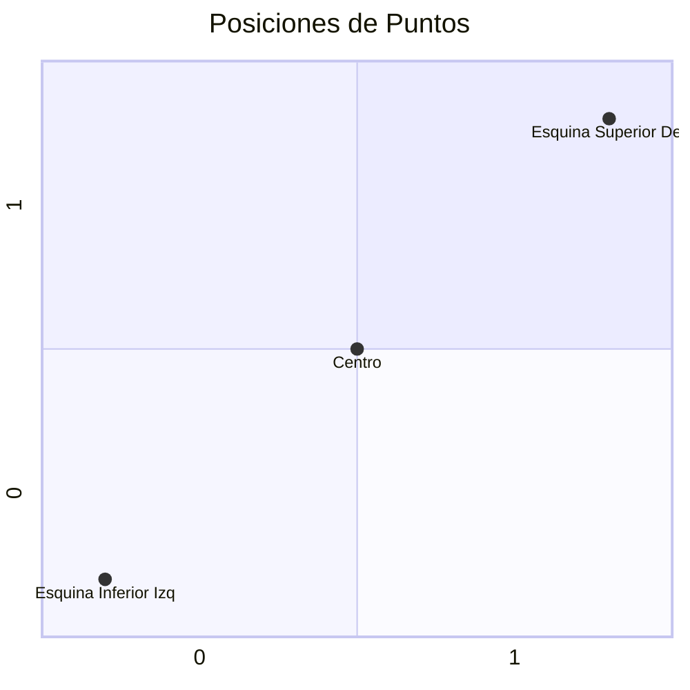
```mermaid
quadrantChart
    title Posiciones de Puntos
    x-axis 0 --> 1
    y-axis 0 --> 1
    
    Centro: [0.5, 0.5]
    Esquina Superior Der: [0.9, 0.9]
    Esquina Inferior Izq: [0.1, 0.1]
```

## Estilos de Puntos

### Radio Personalizado

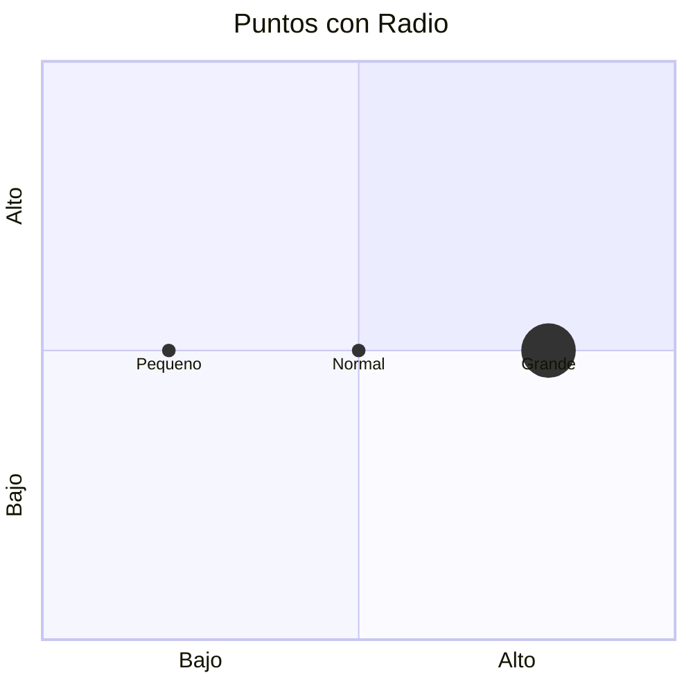
```mermaid
quadrantChart
    title Puntos con Radio
    x-axis Bajo --> Alto
    y-axis Bajo --> Alto
    
    Pequeno: [0.2, 0.5] radius: 5
    Normal: [0.5, 0.5]
    Grande: [0.8, 0.5] radius: 20
```

### Color Personalizado

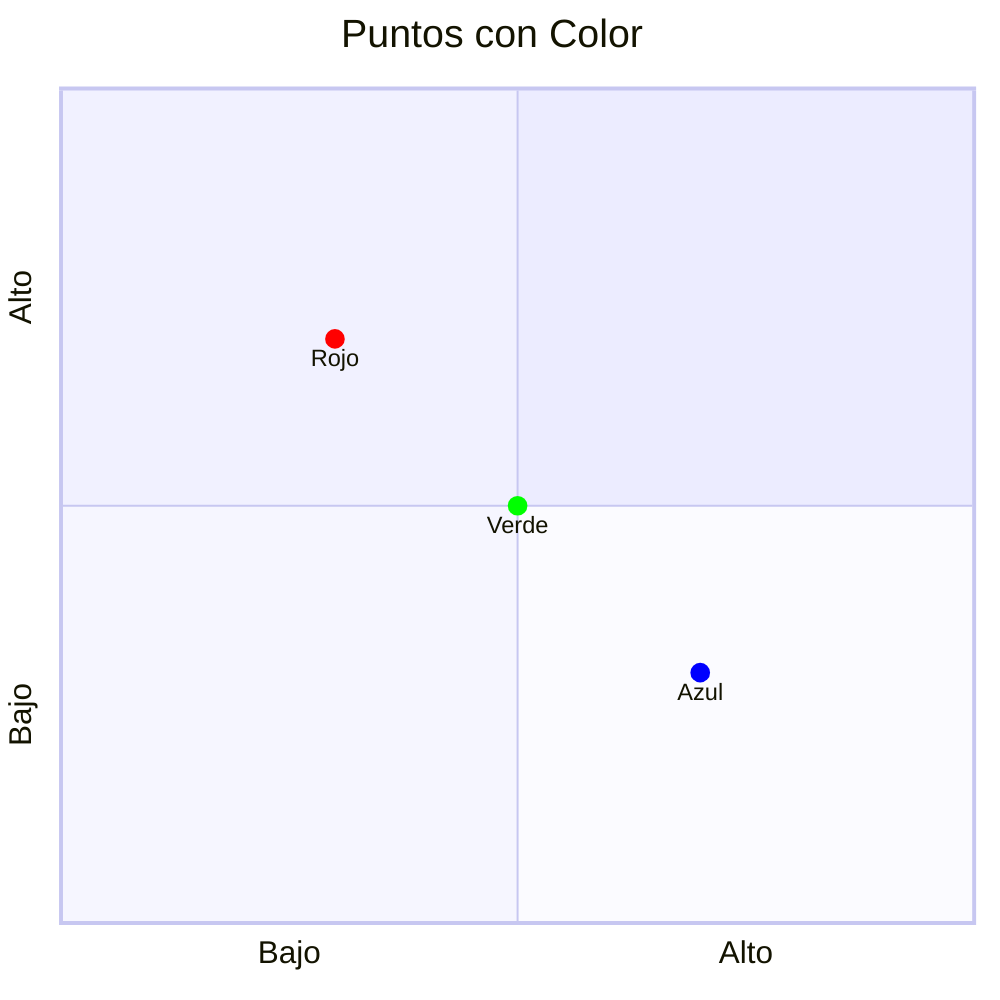
```mermaid
quadrantChart
    title Puntos con Color
    x-axis Bajo --> Alto
    y-axis Bajo --> Alto
    
    Rojo: [0.3, 0.7] color: #ff0000
    Verde: [0.5, 0.5] color: #00ff00
    Azul: [0.7, 0.3] color: #0000ff
```

### Radio y Color

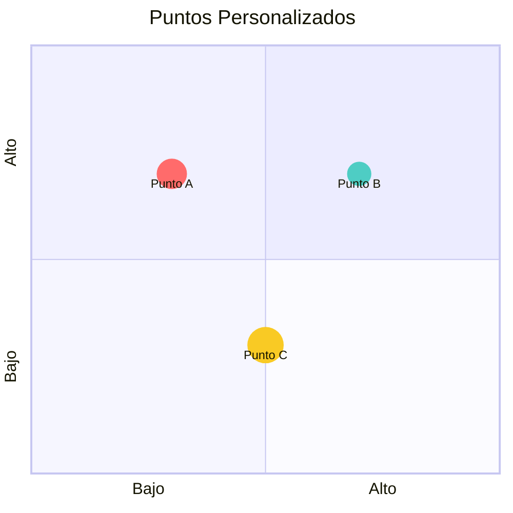
```mermaid
quadrantChart
    title Puntos Personalizados
    x-axis Bajo --> Alto
    y-axis Bajo --> Alto
    
    Punto A: [0.3, 0.7] color: #ff6b6b, radius: 15
    Punto B: [0.7, 0.7] color: #4ecdc4, radius: 12
    Punto C: [0.5, 0.3] color: #f9ca24, radius: 18
```

### Clases de Estilo

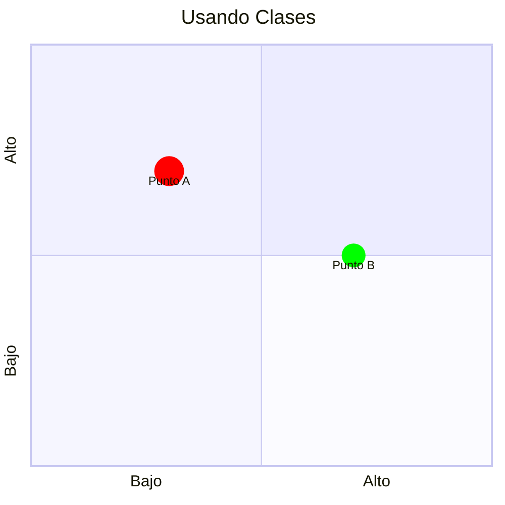
```mermaid
quadrantChart
    title Usando Clases
    x-axis Bajo --> Alto
    y-axis Bajo --> Alto
    
    Punto A:::clase1: [0.3, 0.7]
    Punto B:::clase2: [0.7, 0.5]
    
    classDef clase1 color: #ff0000, radius: 15
    classDef clase2 color: #00ff00, radius: 12
```

## Casos de Uso Comunes

### Matriz de Eisenhower

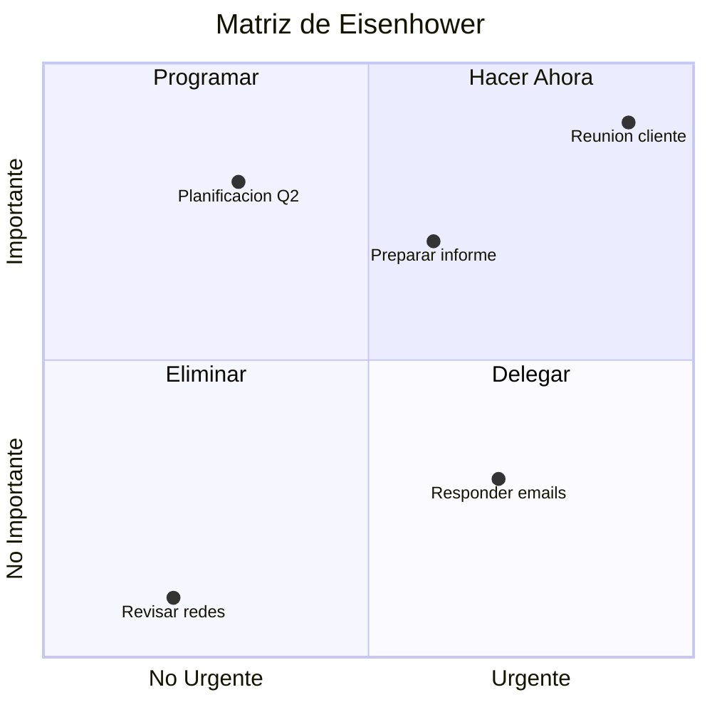
```mermaid
quadrantChart
    title Matriz de Eisenhower
    x-axis No Urgente --> Urgente
    y-axis No Importante --> Importante
    quadrant-1 Hacer Ahora
    quadrant-2 Programar
    quadrant-3 Eliminar
    quadrant-4 Delegar
    
    Reunion cliente: [0.9, 0.9]
    Planificacion Q2: [0.3, 0.8]
    Responder emails: [0.7, 0.3]
    Revisar redes: [0.2, 0.1]
    Preparar informe: [0.6, 0.7]
```

### Matriz BCG (Crecimiento-Participacion)

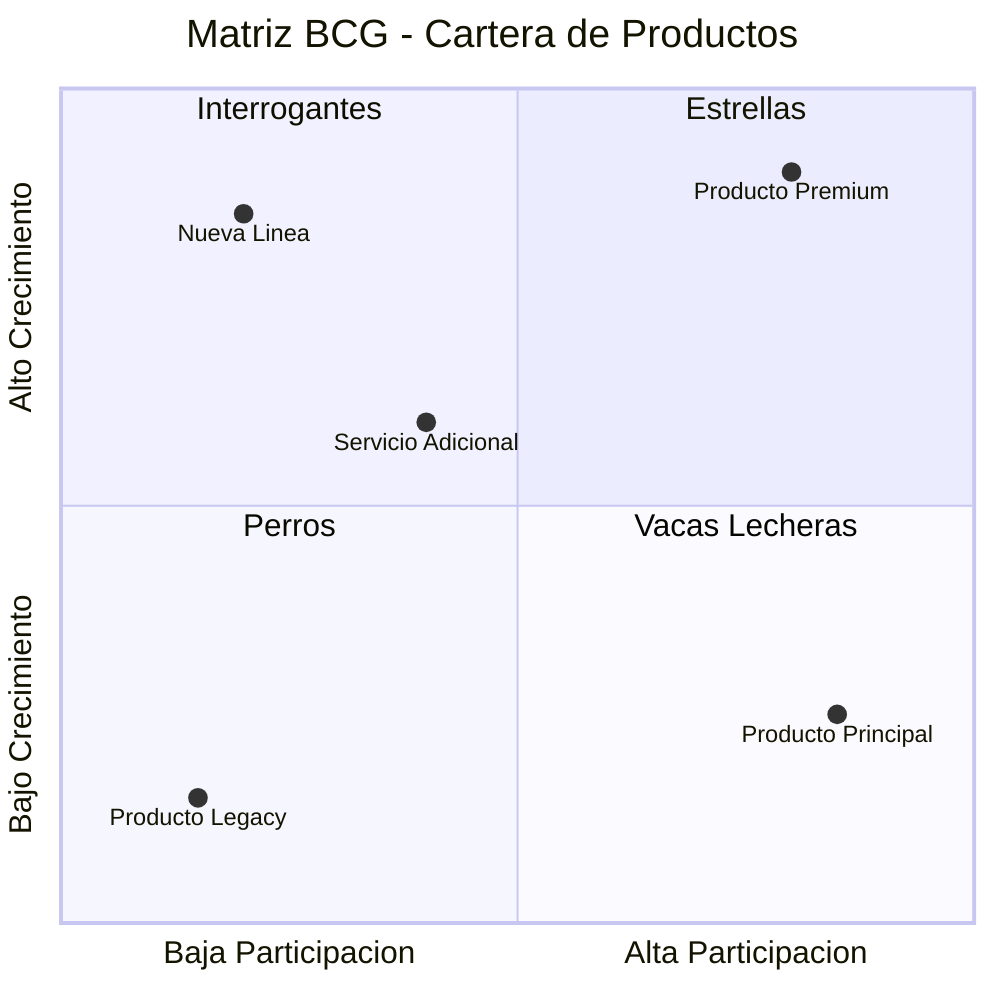
```mermaid
quadrantChart
    title Matriz BCG - Cartera de Productos
    x-axis Baja Participacion --> Alta Participacion
    y-axis Bajo Crecimiento --> Alto Crecimiento
    quadrant-1 Estrellas
    quadrant-2 Interrogantes
    quadrant-3 Perros
    quadrant-4 Vacas Lecheras
    
    Producto Premium: [0.8, 0.9]
    Nueva Linea: [0.2, 0.85]
    Producto Legacy: [0.15, 0.15]
    Producto Principal: [0.85, 0.25]
    Servicio Adicional: [0.4, 0.6]
```

### Analisis de Competidores

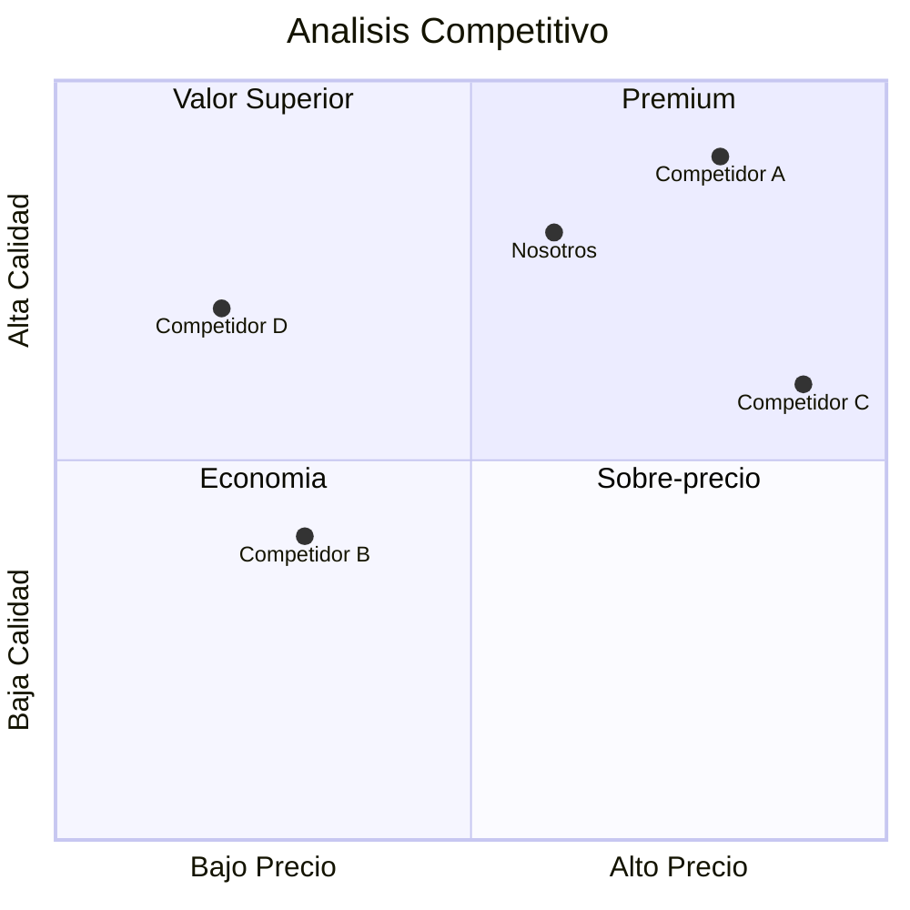
```mermaid
quadrantChart
    title Analisis Competitivo
    x-axis Bajo Precio --> Alto Precio
    y-axis Baja Calidad --> Alta Calidad
    quadrant-1 Premium
    quadrant-2 Valor Superior
    quadrant-3 Economia
    quadrant-4 Sobre-precio
    
    Nosotros: [0.6, 0.8]
    Competidor A: [0.8, 0.9]
    Competidor B: [0.3, 0.4]
    Competidor C: [0.9, 0.6]
    Competidor D: [0.2, 0.7]
```

### Matriz Esfuerzo-Impacto

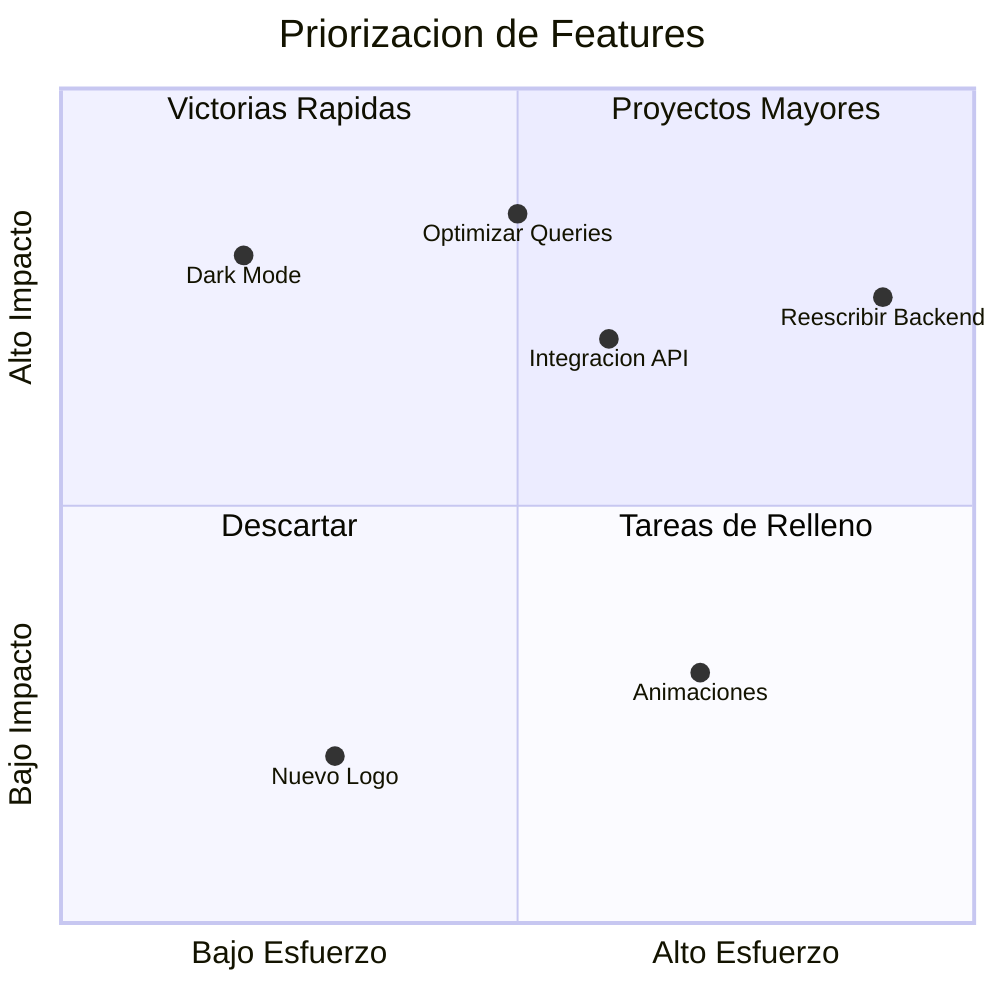
```mermaid
quadrantChart
    title Priorizacion de Features
    x-axis Bajo Esfuerzo --> Alto Esfuerzo
    y-axis Bajo Impacto --> Alto Impacto
    quadrant-1 Proyectos Mayores
    quadrant-2 Victorias Rapidas
    quadrant-3 Descartar
    quadrant-4 Tareas de Relleno
    
    Dark Mode: [0.2, 0.8]
    Reescribir Backend: [0.9, 0.75]
    Nuevo Logo: [0.3, 0.2]
    Optimizar Queries: [0.5, 0.85]
    Animaciones: [0.7, 0.3]
    Integracion API: [0.6, 0.7]
```

### Matriz de Riesgos

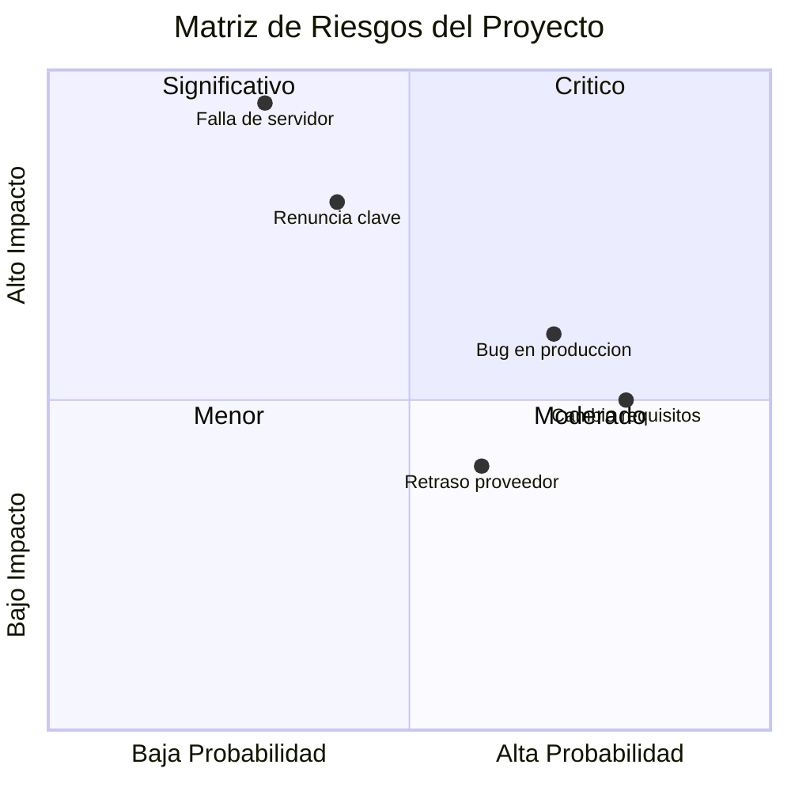
```mermaid
quadrantChart
    title Matriz de Riesgos del Proyecto
    x-axis Baja Probabilidad --> Alta Probabilidad
    y-axis Bajo Impacto --> Alto Impacto
    quadrant-1 Critico
    quadrant-2 Significativo
    quadrant-3 Menor
    quadrant-4 Moderado
    
    Falla de servidor: [0.3, 0.95]
    Renuncia clave: [0.4, 0.8]
    Bug en produccion: [0.7, 0.6]
    Retraso proveedor: [0.6, 0.4]
    Cambio requisitos: [0.8, 0.5]
```

## Configuracion

### Tema Default

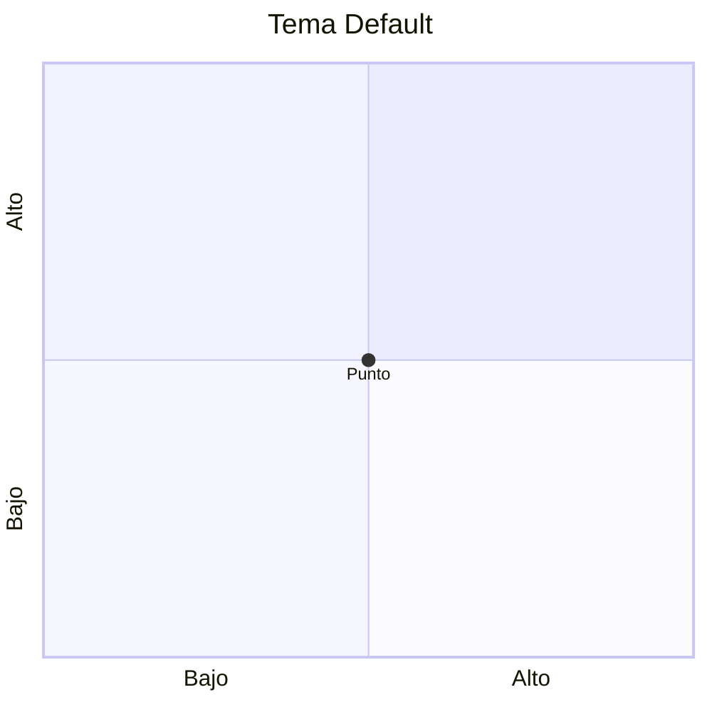
```mermaid
quadrantChart
    title Tema Default
    x-axis Bajo --> Alto
    y-axis Bajo --> Alto
    Punto: [0.5, 0.5]
```

### Tema Forest

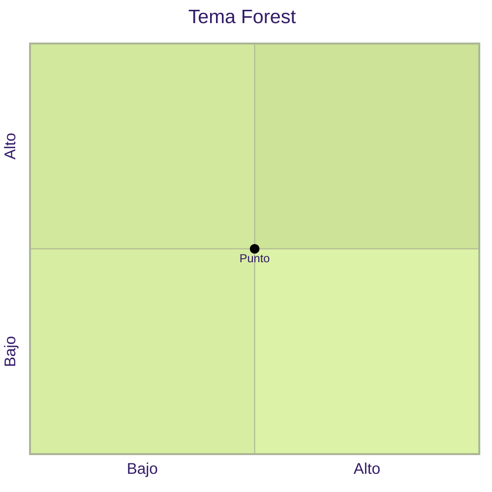
```mermaid
%%{init: {'theme': 'forest'}}%%
quadrantChart
    title Tema Forest
    x-axis Bajo --> Alto
    y-axis Bajo --> Alto
    Punto: [0.5, 0.5]
```

### Tema Dark

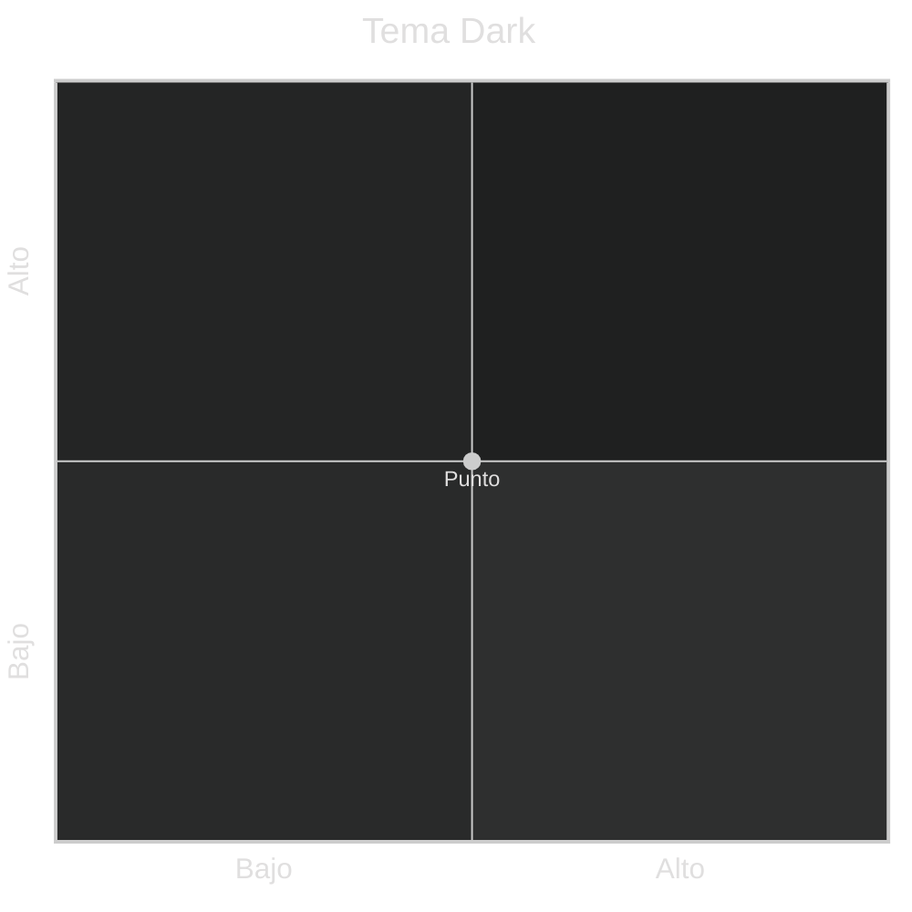
```mermaid
%%{init: {'theme': 'dark'}}%%
quadrantChart
    title Tema Dark
    x-axis Bajo --> Alto
    y-axis Bajo --> Alto
    Punto: [0.5, 0.5]
```

### Configuracion de Cuadrantes

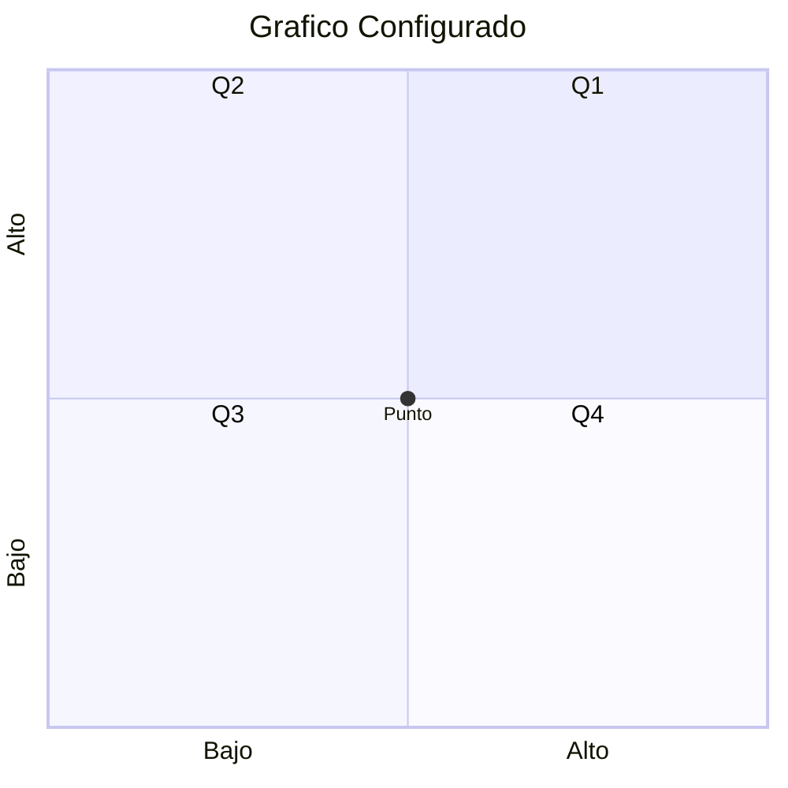
```mermaid
%%{init: {'quadrantChart': {'chartWidth': 500, 'chartHeight': 500, 'titleFontSize': 20}}}%%
quadrantChart
    title Grafico Configurado
    x-axis Bajo --> Alto
    y-axis Bajo --> Alto
    quadrant-1 Q1
    quadrant-2 Q2
    quadrant-3 Q3
    quadrant-4 Q4
    Punto: [0.5, 0.5]
```

## Opciones de Configuracion

| Opcion | Descripcion | Default |
|--------|-------------|---------|
| `chartWidth` | Ancho del grafico | 500 |
| `chartHeight` | Alto del grafico | 500 |
| `titleFontSize` | Tamano fuente titulo | 20 |
| `titlePadding` | Padding del titulo | 10 |
| `quadrantPadding` | Padding de cuadrantes | 5 |
| `xAxisLabelFontSize` | Tamano fuente eje X | 16 |
| `yAxisLabelFontSize` | Tamano fuente eje Y | 16 |
| `quadrantLabelFontSize` | Tamano etiqueta cuadrante | 16 |
| `pointTextPadding` | Padding texto punto | 5 |
| `pointLabelFontSize` | Tamano etiqueta punto | 12 |
| `pointRadius` | Radio default de puntos | 5 |

## Variables de Tema

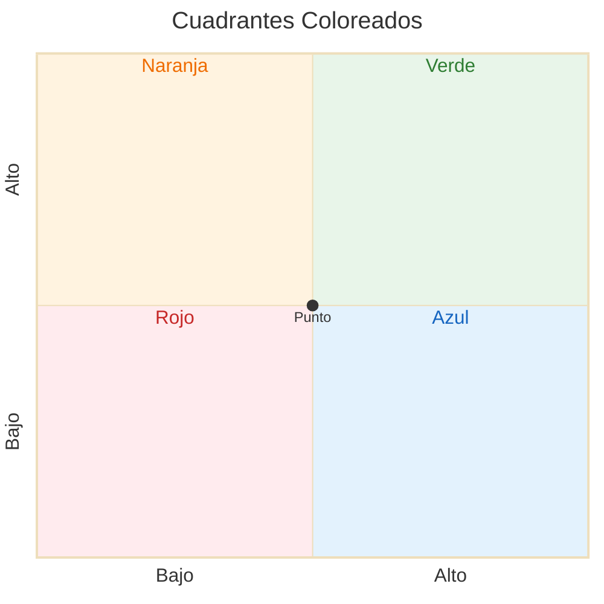
```mermaid
%%{init: {'theme': 'base', 'themeVariables': {
    'quadrant1Fill': '#e8f5e9',
    'quadrant2Fill': '#fff3e0',
    'quadrant3Fill': '#ffebee',
    'quadrant4Fill': '#e3f2fd',
    'quadrant1TextFill': '#2e7d32',
    'quadrant2TextFill': '#ef6c00',
    'quadrant3TextFill': '#c62828',
    'quadrant4TextFill': '#1565c0'
}}}%%
quadrantChart
    title Cuadrantes Coloreados
    x-axis Bajo --> Alto
    y-axis Bajo --> Alto
    quadrant-1 Verde
    quadrant-2 Naranja
    quadrant-3 Rojo
    quadrant-4 Azul
    Punto: [0.5, 0.5]
```

## Tips y Mejores Practicas

1. **Elegir ejes significativos**: Las dimensiones deben ser relevantes para la decision
2. **Etiquetas claras**: Cuadrantes con nombres accionables
3. **Limitar puntos**: Demasiados puntos reducen claridad
4. **Usar colores con proposito**: Diferenciar categorias o prioridades
5. **Escala consistente**: Mantener criterios uniformes para posicionar
6. **Documentar criterios**: Explicar como se determinaron las posiciones

## Casos de Uso

| Matriz | Ejes | Proposito |
|--------|------|-----------|
| Eisenhower | Urgencia/Importancia | Gestion del tiempo |
| BCG | Participacion/Crecimiento | Cartera de productos |
| Esfuerzo-Impacto | Esfuerzo/Impacto | Priorizacion |
| Riesgos | Probabilidad/Impacto | Gestion de riesgos |
| SWOT | Interno-Externo/Positivo-Negativo | Estrategia |
