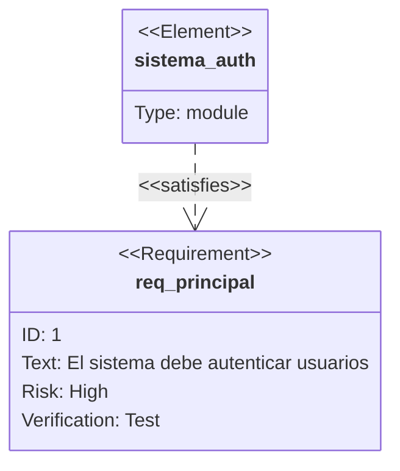
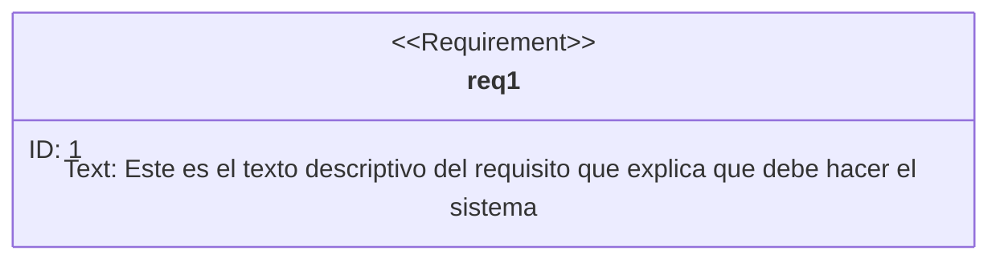
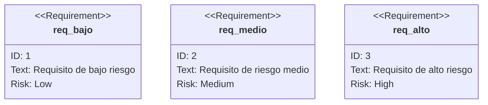
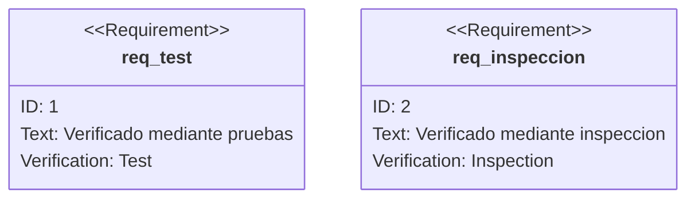

# Requirement Diagram (Diagrama de Requisitos) - Mermaid

> Documentacion oficial: https://mermaid.js.org/syntax/requirementDiagram.html

Los diagramas de requisitos visualizan requisitos y su relacion con elementos de diseno, siguiendo la especificacion SysML (Systems Modeling Language).

## Sintaxis Basica



## Estructura General

```
requirementDiagram

requirement nombre {
    id: identificador
    text: descripcion del requisito
    risk: nivel_riesgo
    verifymethod: metodo_verificacion
}

element nombre {
    type: tipo_elemento
    docref: referencia
}

elemento - relacion -> requisito
```

## Tipos de Requisitos

### Requirement (Requisito Generico)

```mermaid
requirementDiagram

requirement req_generico {
    id: REQ-001
    text: Requisito generico del sistema
    risk: medium
    verifymethod: demonstration
}
```

### Functional Requirement (Requisito Funcional)

```mermaid
requirementDiagram

functionalRequirement req_funcional {
    id: FR-001
    text: El sistema debe permitir login con email
    risk: low
    verifymethod: test
}
```

### Interface Requirement (Requisito de Interfaz)

```mermaid
requirementDiagram

interfaceRequirement req_interfaz {
    id: IR-001
    text: La API debe responder en formato JSON
    risk: low
    verifymethod: inspection
}
```

### Performance Requirement (Requisito de Rendimiento)

```mermaid
requirementDiagram

performanceRequirement req_rendimiento {
    id: PR-001
    text: El tiempo de respuesta debe ser menor a 200ms
    risk: high
    verifymethod: test
}
```

### Physical Requirement (Requisito Fisico)

```mermaid
requirementDiagram

physicalRequirement req_fisico {
    id: PHR-001
    text: El servidor debe tener 16GB RAM minimo
    risk: medium
    verifymethod: inspection
}
```

### Design Constraint (Restriccion de Diseno)

```mermaid
requirementDiagram

designConstraint restriccion {
    id: DC-001
    text: Debe usar PostgreSQL como base de datos
    risk: low
    verifymethod: inspection
}
```

## Propiedades de Requisitos

### ID

Identificador unico del requisito:

```mermaid
requirementDiagram

requirement req1 {
    id: REQ-2024-001
    text: Requisito con ID estructurado
}
```

### Text

Descripcion del requisito:



### Risk (Riesgo)

Nivel de riesgo del requisito:

| Valor | Descripcion |
|-------|-------------|
| `low` | Riesgo bajo |
| `medium` | Riesgo medio |
| `high` | Riesgo alto |



### Verify Method (Metodo de Verificacion)

Como se verifica el cumplimiento:

| Valor | Descripcion |
|-------|-------------|
| `analysis` | Mediante analisis |
| `inspection` | Mediante inspeccion |
| `test` | Mediante pruebas |
| `demonstration` | Mediante demostracion |



## Elementos

Los elementos representan componentes del diseno que satisfacen requisitos:

```mermaid
requirementDiagram

element modulo_auth {
    type: module
}

element clase_usuario {
    type: class
    docref: src/models/User.ts
}

element api_login {
    type: interface
    docref: docs/api/login.md
}
```

### Propiedades de Elementos

| Propiedad | Descripcion |
|-----------|-------------|
| `type` | Tipo de elemento (module, class, interface, etc.) |
| `docref` | Referencia a documentacion |

## Tipos de Relaciones

### Contains (Contiene)

Un requisito contiene otros requisitos:

```mermaid
requirementDiagram

requirement req_padre {
    id: REQ-001
    text: Requisito principal
}

requirement req_hijo {
    id: REQ-001.1
    text: Sub-requisito
}

req_padre - contains -> req_hijo
```

### Copies (Copia)

Un requisito es copia de otro:

```mermaid
requirementDiagram

requirement req_original {
    id: REQ-001
    text: Requisito original
}

requirement req_copia {
    id: REQ-001-COPY
    text: Copia del requisito
}

req_copia - copies -> req_original
```

### Derives (Deriva)

Un requisito deriva de otro:

```mermaid
requirementDiagram

requirement req_alto_nivel {
    id: REQ-001
    text: Requisito de alto nivel
}

requirement req_derivado {
    id: REQ-002
    text: Requisito derivado
}

req_derivado - derives -> req_alto_nivel
```

### Satisfies (Satisface)

Un elemento satisface un requisito:

```mermaid
requirementDiagram

requirement req_auth {
    id: REQ-001
    text: El sistema debe autenticar usuarios
}

element modulo_login {
    type: module
}

modulo_login - satisfies -> req_auth
```

### Verifies (Verifica)

Un elemento verifica un requisito:

```mermaid
requirementDiagram

requirement req_login {
    id: REQ-001
    text: El login debe funcionar correctamente
}

element test_login {
    type: test
    docref: tests/login.spec.ts
}

test_login - verifies -> req_login
```

### Refines (Refina)

Un requisito refina otro:

```mermaid
requirementDiagram

requirement req_general {
    id: REQ-001
    text: El sistema debe ser seguro
}

requirement req_especifico {
    id: REQ-002
    text: Las contrasenas deben tener minimo 8 caracteres
}

req_especifico - refines -> req_general
```

### Traces (Traza)

Trazabilidad entre requisitos:

```mermaid
requirementDiagram

requirement req_negocio {
    id: BR-001
    text: Requisito de negocio
}

requirement req_sistema {
    id: SR-001
    text: Requisito de sistema
}

req_sistema - traces -> req_negocio
```

## Ejemplos Completos

### Sistema de Autenticacion

```mermaid
requirementDiagram

requirement req_auth {
    id: REQ-001
    text: El sistema debe proporcionar autenticacion segura
    risk: high
    verifymethod: test
}

functionalRequirement req_login {
    id: FR-001
    text: Los usuarios pueden iniciar sesion con email y contrasena
    risk: medium
    verifymethod: test
}

functionalRequirement req_logout {
    id: FR-002
    text: Los usuarios pueden cerrar sesion
    risk: low
    verifymethod: test
}

performanceRequirement req_tiempo {
    id: PR-001
    text: El login debe completarse en menos de 2 segundos
    risk: medium
    verifymethod: test
}

element auth_module {
    type: module
    docref: src/auth/
}

element login_test {
    type: test
    docref: tests/auth/login.spec.ts
}

req_auth - contains -> req_login
req_auth - contains -> req_logout
req_login - derives -> req_tiempo

auth_module - satisfies -> req_login
auth_module - satisfies -> req_logout

login_test - verifies -> req_login
```

### API REST

```mermaid
requirementDiagram

requirement req_api {
    id: API-001
    text: El sistema debe exponer una API REST
    risk: medium
    verifymethod: demonstration
}

interfaceRequirement req_formato {
    id: API-002
    text: La API debe responder en formato JSON
    risk: low
    verifymethod: inspection
}

performanceRequirement req_latencia {
    id: API-003
    text: La latencia maxima debe ser 100ms
    risk: high
    verifymethod: test
}

designConstraint dc_version {
    id: DC-001
    text: Debe seguir OpenAPI 3.0
    risk: low
    verifymethod: inspection
}

element api_controller {
    type: class
    docref: src/controllers/ApiController.ts
}

element api_tests {
    type: test
    docref: tests/api/
}

req_api - contains -> req_formato
req_api - contains -> req_latencia
req_api - refines -> dc_version

api_controller - satisfies -> req_api
api_tests - verifies -> req_latencia
```

### Trazabilidad de Requisitos

```mermaid
requirementDiagram

requirement br_seguridad {
    id: BR-001
    text: Los datos del cliente deben estar protegidos
    risk: high
    verifymethod: analysis
}

requirement sr_encriptacion {
    id: SR-001
    text: Los datos sensibles deben encriptarse en reposo
    risk: high
    verifymethod: inspection
}

requirement sr_transporte {
    id: SR-002
    text: Las comunicaciones deben usar TLS 1.3
    risk: high
    verifymethod: test
}

designConstraint dc_aes {
    id: DC-001
    text: Usar AES-256 para encriptacion
    risk: medium
    verifymethod: inspection
}

element crypto_module {
    type: module
    docref: src/crypto/
}

element ssl_config {
    type: configuration
    docref: config/ssl.conf
}

sr_encriptacion - traces -> br_seguridad
sr_transporte - traces -> br_seguridad
sr_encriptacion - refines -> dc_aes

crypto_module - satisfies -> sr_encriptacion
ssl_config - satisfies -> sr_transporte
```

## Configuracion

### Tema

```mermaid
%%{init: {'theme': 'forest'}}%%
requirementDiagram

requirement req1 {
    id: 1
    text: Requisito con tema forest
}
```

## Resumen de Sintaxis

### Tipos de Requisitos

| Tipo | Uso |
|------|-----|
| `requirement` | Requisito generico |
| `functionalRequirement` | Requisito funcional |
| `interfaceRequirement` | Requisito de interfaz |
| `performanceRequirement` | Requisito de rendimiento |
| `physicalRequirement` | Requisito fisico |
| `designConstraint` | Restriccion de diseno |

### Relaciones

| Relacion | Significado |
|----------|-------------|
| `contains` | Contiene sub-requisitos |
| `copies` | Es copia de |
| `derives` | Deriva de |
| `satisfies` | Elemento satisface requisito |
| `verifies` | Elemento verifica requisito |
| `refines` | Refina/detalla |
| `traces` | Trazabilidad |

## Tips y Mejores Practicas

1. **IDs estructurados**: Usar convencion consistente (REQ-001, FR-001)
2. **Textos claros**: Requisitos SMART (Specific, Measurable, Achievable, Relevant, Time-bound)
3. **Trazabilidad completa**: Conectar requisitos de negocio hasta tests
4. **Riesgo apropiado**: Evaluar impacto realista
5. **Verificacion definida**: Cada requisito debe ser verificable
6. **Jerarquia clara**: Usar contains para descomponer requisitos
