# GitGraph (Diagrama Git) - Mermaid

> Documentacion oficial: https://mermaid.js.org/syntax/gitgraph.html

Los diagramas GitGraph representan visualmente commits, branches y merges de repositorios Git.

## Sintaxis Basica

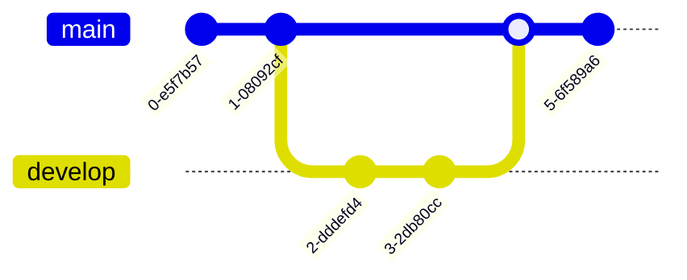

## Estructura General

```
gitGraph [orientacion]:
    commit [opciones]
    branch nombre
    checkout nombre
    merge nombre [opciones]
    cherry-pick id:"id"
```

## Comandos Principales

### commit

Crea un nuevo commit en la rama actual:

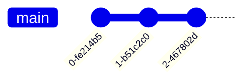

### branch

Crea una nueva rama desde el punto actual:

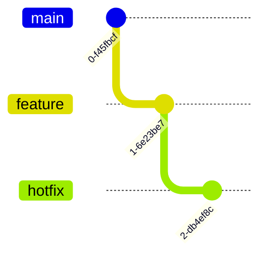

### checkout

Cambia a una rama existente:

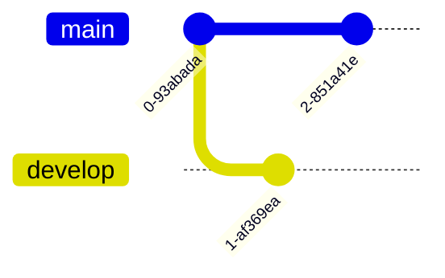

### merge

Fusiona una rama en la rama actual:

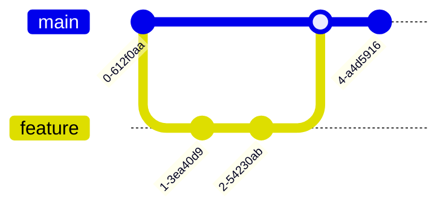

### cherry-pick

Aplica un commit especifico de otra rama:

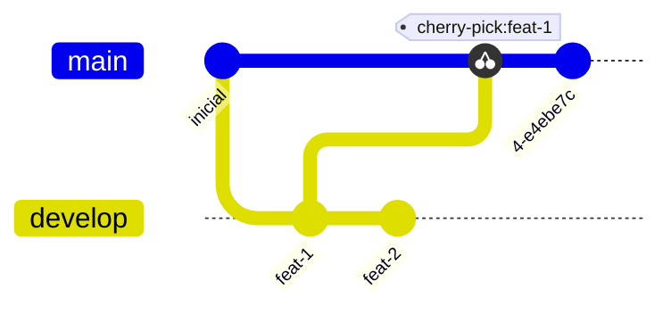

## Opciones de Commit

### ID Personalizado

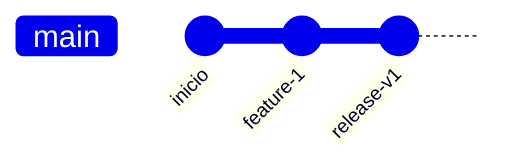

### Tipo de Commit

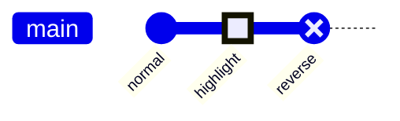

| Tipo | Descripcion | Apariencia |
|------|-------------|------------|
| `NORMAL` | Commit normal (default) | Circulo solido |
| `HIGHLIGHT` | Commit resaltado | Rectangulo |
| `REVERSE` | Commit revertido | Circulo cruzado |

### Tags

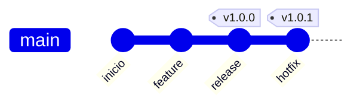

### Mensaje de Commit

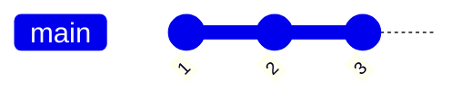

### Combinando Opciones

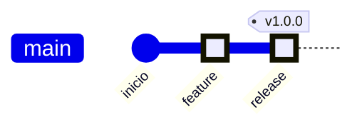

## Orientacion

### Left to Right (Default)

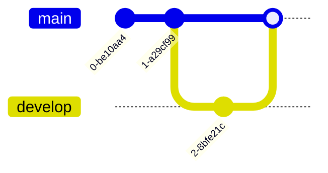

### Top to Bottom

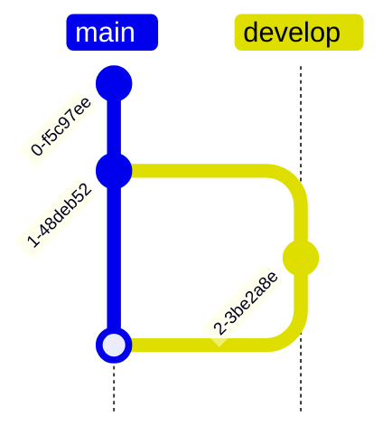

### Bottom to Top

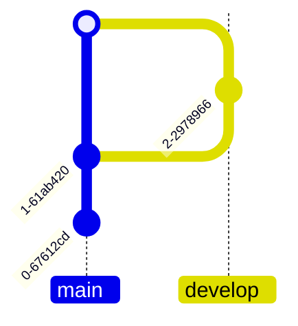

## Flujos de Trabajo

### Git Flow

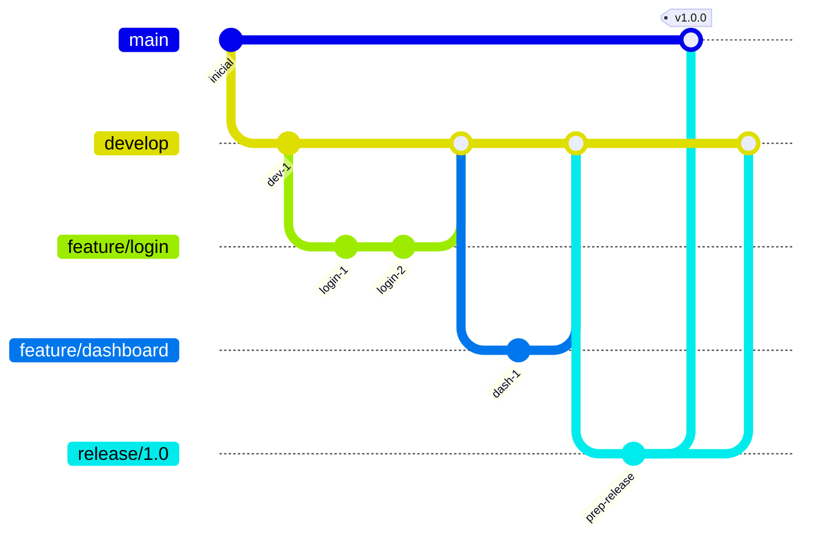

### GitHub Flow

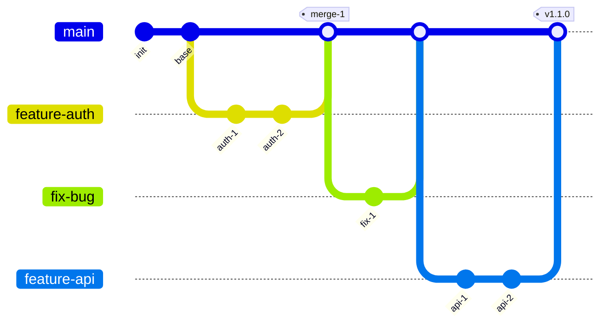

### Trunk Based Development

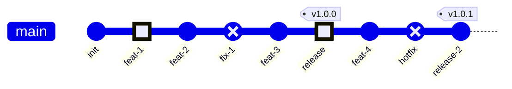

### Hotfix Flow

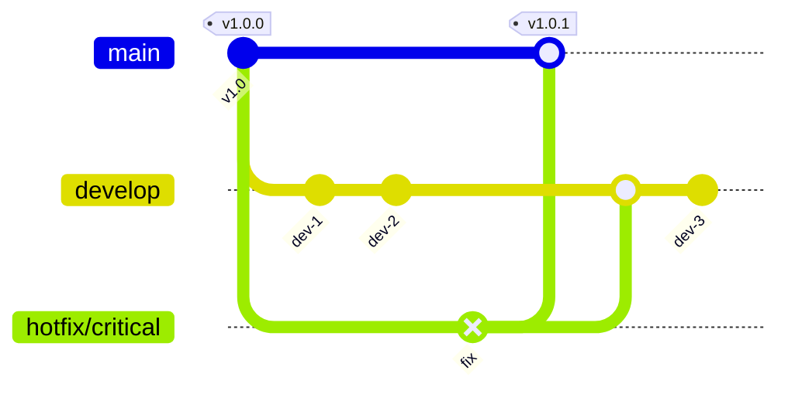

## Ejemplos por Escenario

### Release con Bugfixes

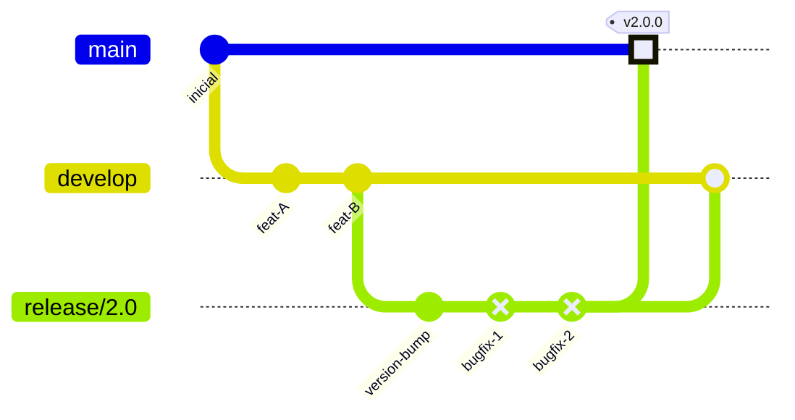

### Feature Branch con Conflictos

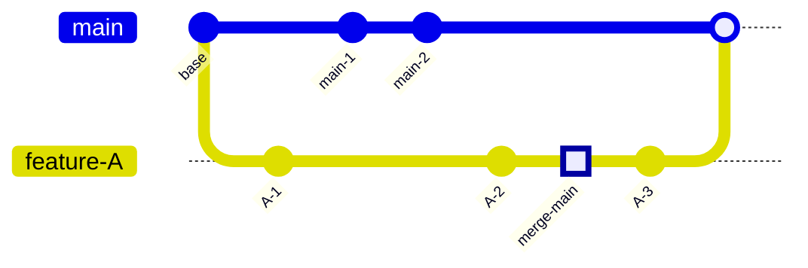

### Multiples Features en Paralelo

```mermaid
gitGraph
    commit id: "init"
    
    branch feature-1
    branch feature-2
    branch feature-3
    
    checkout feature-1
    commit id: "f1-work"
    
    checkout feature-2
    commit id: "f2-work"
    commit id: "f2-more"
    
    checkout feature-3
    commit id: "f3-work"
    
    checkout main
    merge feature-2
    merge feature-1
    merge feature-3 tag: "v1.0.0"
```

## Configuracion

### Mostrar/Ocultar Elementos

```mermaid
%%{init: { 'gitGraph': {'showBranches': true, 'showCommitLabel': true}} }%%
gitGraph
    commit id: "1"
    branch develop
    commit id: "2"
    checkout main
    merge develop
```

### Personalizar Apariencia

```mermaid
%%{init: { 'gitGraph': {
    'mainBranchName': 'master',
    'mainBranchOrder': 0
}} }%%
gitGraph
    commit
    branch feature
    commit
    checkout master
    merge feature
```

### Opciones de Configuracion

| Opcion | Descripcion | Default |
|--------|-------------|---------|
| `showBranches` | Mostrar nombres de ramas | true |
| `showCommitLabel` | Mostrar etiquetas de commits | true |
| `mainBranchName` | Nombre de rama principal | 'main' |
| `mainBranchOrder` | Orden de rama principal | 0 |
| `rotateCommitLabel` | Rotar etiquetas | true |
| `arrowMarkerAbsolute` | Flechas absolutas | false |

### Tema

```mermaid
%%{init: {'theme': 'dark'}}%%
gitGraph
    commit
    branch develop
    commit
    checkout main
    merge develop
```

### Personalizar Colores de Ramas

```mermaid
%%{init: { 'theme': 'base', 'themeVariables': {
    'git0': '#ff6b6b',
    'git1': '#4ecdc4',
    'git2': '#45b7d1',
    'git3': '#f9ca24',
    'gitBranchLabel0': '#ffffff',
    'gitBranchLabel1': '#ffffff',
    'gitBranchLabel2': '#ffffff'
}} }%%
gitGraph
    commit
    branch feature-a
    commit
    branch feature-b
    commit
    checkout main
    merge feature-a
    merge feature-b
```

## Variables de Tema

| Variable | Descripcion |
|----------|-------------|
| `git0` - `git7` | Colores de ramas (0=main) |
| `gitBranchLabel0` - `gitBranchLabel7` | Color texto etiquetas |
| `gitInv0` - `gitInv7` | Colores invertidos |
| `commitLabelColor` | Color etiquetas commit |
| `commitLabelBackground` | Fondo etiquetas commit |
| `commitLabelFontSize` | Tamano fuente etiquetas |
| `tagLabelColor` | Color etiquetas tag |
| `tagLabelBackground` | Fondo etiquetas tag |
| `tagLabelBorder` | Borde etiquetas tag |
| `tagLabelFontSize` | Tamano fuente tags |

## Resumen de Comandos

| Comando | Sintaxis | Descripcion |
|---------|----------|-------------|
| `commit` | `commit [id: "x"] [msg: "x"] [type: X] [tag: "x"]` | Crear commit |
| `branch` | `branch nombre` | Crear rama |
| `checkout` | `checkout nombre` | Cambiar a rama |
| `merge` | `merge nombre [id: "x"] [tag: "x"] [type: X]` | Fusionar rama |
| `cherry-pick` | `cherry-pick id: "x" [tag: "x"] [parent: "x"]` | Cherry-pick |

## Tips y Mejores Practicas

1. **IDs descriptivos**: Usar IDs que representen el cambio
2. **Tags para releases**: Marcar versiones importantes
3. **Tipos apropiados**: HIGHLIGHT para hitos, REVERSE para reverts
4. **Orientacion segun contexto**: TB para historiales largos, LR para flujos simples
5. **Colores consistentes**: Mantener convencion de colores por tipo de rama
6. **Simplificar**: No representar cada commit, solo los significativos
