# C4 Diagram (Diagrama C4) - Mermaid

> Documentacion oficial: https://mermaid.js.org/syntax/c4.html

Los diagramas C4 (Context, Containers, Components, Code) son un enfoque para visualizar la arquitectura de software en diferentes niveles de abstraccion.

## Niveles C4

| Nivel | Nombre | Proposito |
|-------|--------|-----------|
| 1 | Context | Vision general del sistema y actores externos |
| 2 | Container | Aplicaciones y almacenes de datos |
| 3 | Component | Componentes dentro de contenedores |
| 4 | Code | Diagramas de clases/codigo (usar classDiagram) |

## C4Context (Nivel 1 - Contexto)

Muestra el sistema en su entorno, con usuarios y sistemas externos.

### Sintaxis Basica

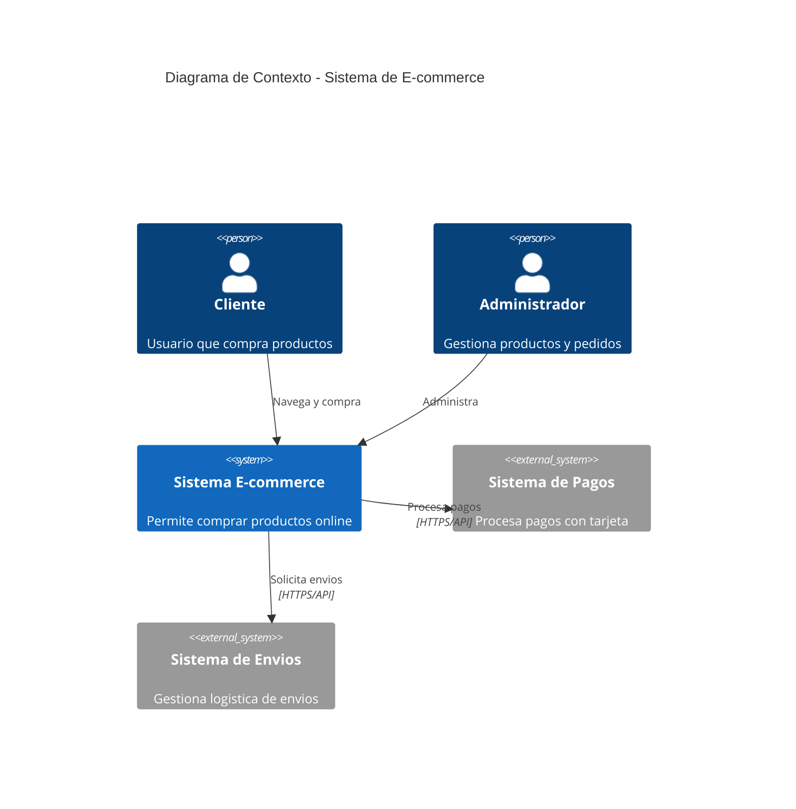

### Elementos de Contexto

| Elemento | Sintaxis | Uso |
|----------|----------|-----|
| `Person` | `Person(id, "nombre", "descripcion")` | Usuario del sistema |
| `Person_Ext` | `Person_Ext(id, "nombre", "desc")` | Usuario externo |
| `System` | `System(id, "nombre", "descripcion")` | Sistema principal |
| `System_Ext` | `System_Ext(id, "nombre", "desc")` | Sistema externo |
| `SystemDb` | `SystemDb(id, "nombre", "desc")` | Base de datos |
| `SystemDb_Ext` | `SystemDb_Ext(id, "nombre", "desc")` | BD externa |
| `SystemQueue` | `SystemQueue(id, "nombre", "desc")` | Cola de mensajes |
| `SystemQueue_Ext` | `SystemQueue_Ext(id, "nombre")` | Cola externa |

### Ejemplo Completo de Contexto

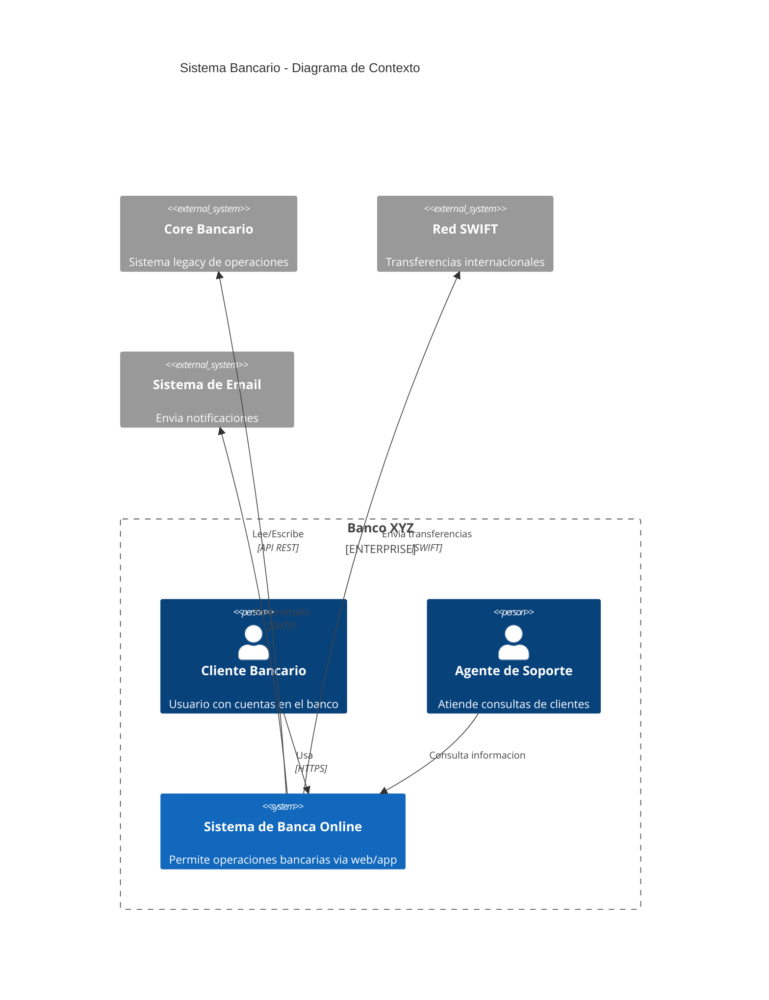

## C4Container (Nivel 2 - Contenedores)

Muestra las aplicaciones y almacenes de datos dentro del sistema.

### Sintaxis Basica

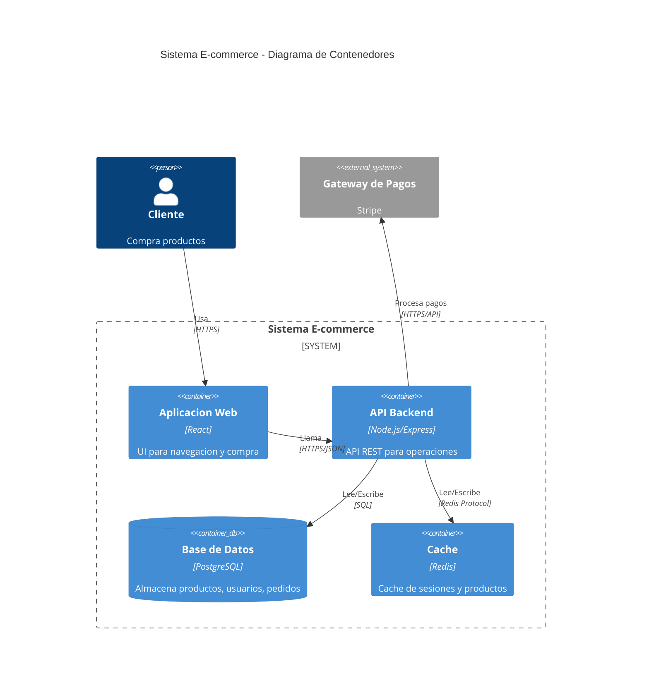

### Elementos de Container

| Elemento | Sintaxis | Uso |
|----------|----------|-----|
| `Container` | `Container(id, "nombre", "tecnologia", "desc")` | Aplicacion/servicio |
| `ContainerDb` | `ContainerDb(id, "nombre", "tech", "desc")` | Base de datos |
| `ContainerQueue` | `ContainerQueue(id, "nombre", "tech", "desc")` | Cola de mensajes |
| `Container_Ext` | `Container_Ext(id, "nombre", "tech", "desc")` | Contenedor externo |
| `Container_Boundary` | `Container_Boundary(id, "nombre") { }` | Agrupacion |

### Ejemplo con Microservicios

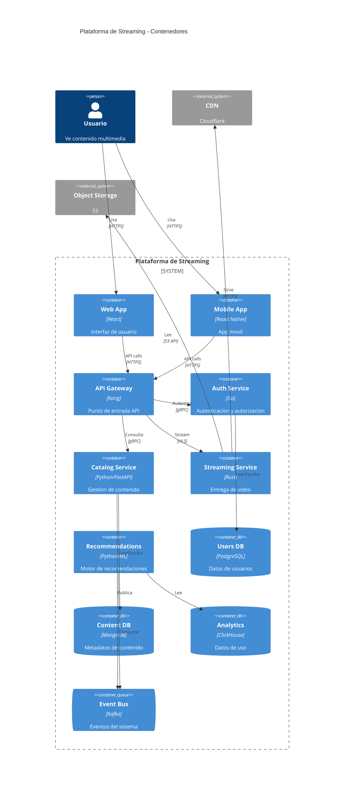

## C4Component (Nivel 3 - Componentes)

Muestra los componentes dentro de un contenedor.

### Sintaxis Basica

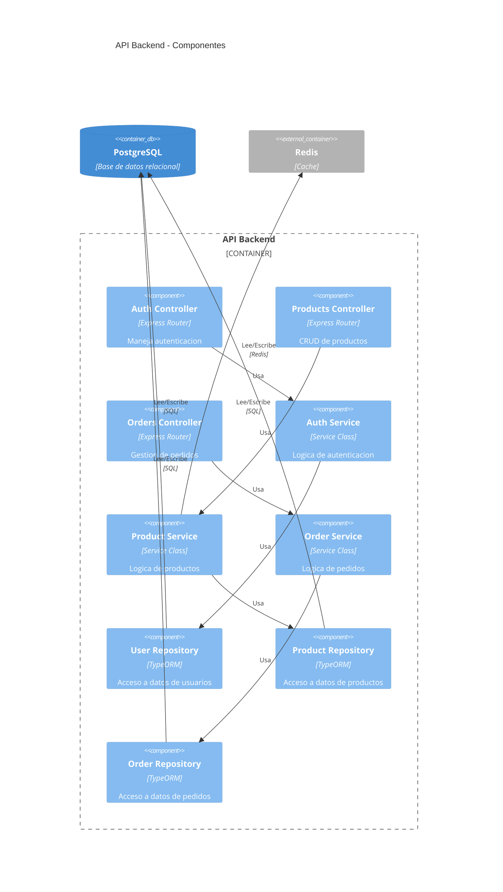

### Elementos de Component

| Elemento | Sintaxis | Uso |
|----------|----------|-----|
| `Component` | `Component(id, "nombre", "tech", "desc")` | Componente |
| `ComponentDb` | `ComponentDb(id, "nombre", "tech", "desc")` | Componente de BD |
| `ComponentQueue` | `ComponentQueue(id, "nombre", "tech", "desc")` | Componente de cola |
| `Component_Ext` | `Component_Ext(id, "nombre", "tech", "desc")` | Componente externo |

## Relaciones

### Sintaxis de Relaciones

```
Rel(origen, destino, "etiqueta", "tecnologia")
Rel_U(origen, destino, "etiqueta")  // Hacia arriba
Rel_D(origen, destino, "etiqueta")  // Hacia abajo
Rel_L(origen, destino, "etiqueta")  // Hacia izquierda
Rel_R(origen, destino, "etiqueta")  // Hacia derecha
Rel_Back(origen, destino, "etiqueta")  // Relacion inversa
BiRel(a, b, "etiqueta")  // Bidireccional
```

### Ejemplo de Relaciones Direccionales

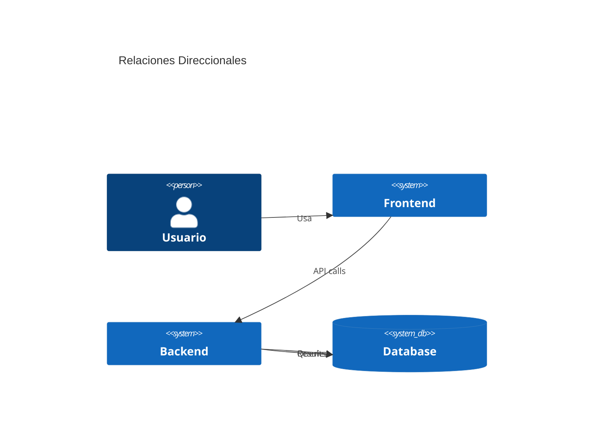

## Limites y Agrupaciones

### Enterprise Boundary

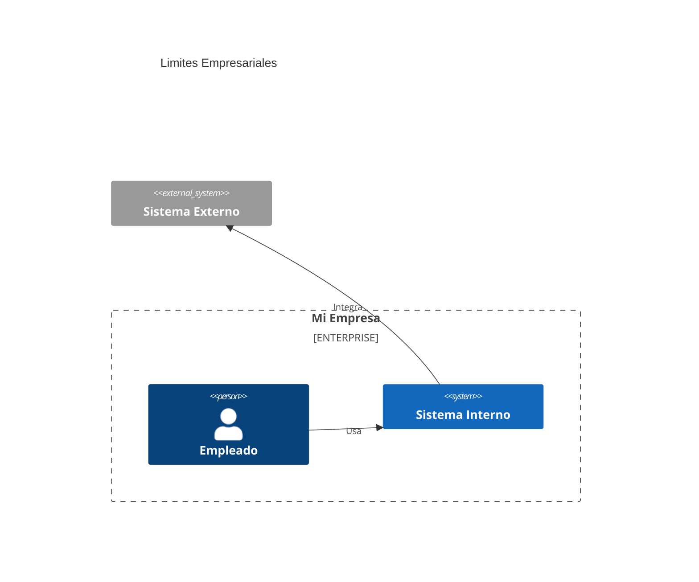

### System Boundary

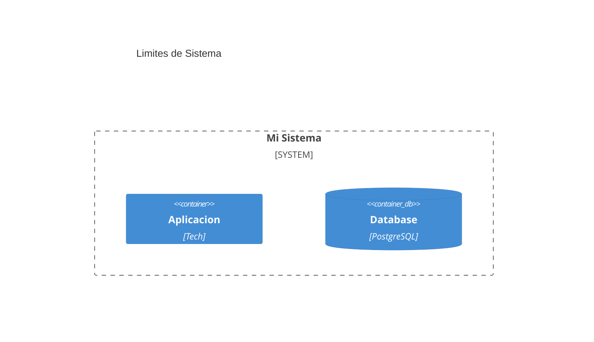

### Container Boundary

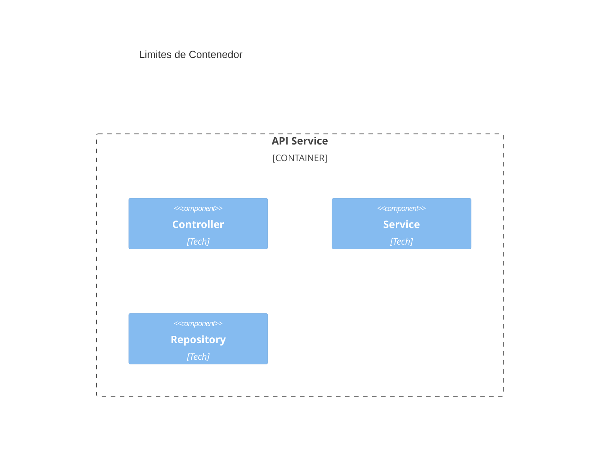

## Configuracion y Estilos

### Usando Directivas

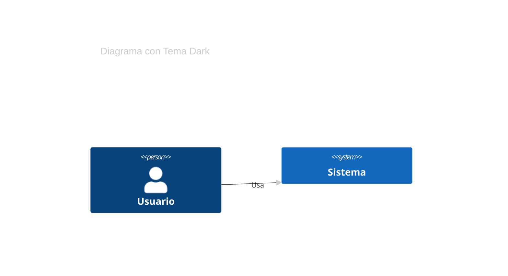

### Actualizacion de Estilos

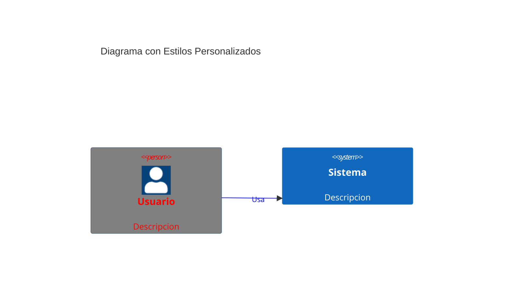

### Opciones de UpdateElementStyle

| Opcion | Descripcion |
|--------|-------------|
| `$fontColor` | Color del texto |
| `$bgColor` | Color de fondo |
| `$borderColor` | Color del borde |
| `$shadowing` | Sombra (true/false) |
| `$shape` | Forma del elemento |
| `$sprite` | Icono/sprite |
| `$techn` | Tecnologia |
| `$descr` | Descripcion |
| `$link` | URL de enlace |

### Opciones de UpdateRelStyle

| Opcion | Descripcion |
|--------|-------------|
| `$textColor` | Color del texto |
| `$lineColor` | Color de la linea |
| `$lineStyle` | Estilo de linea (dashed, dotted) |
| `$offsetX` | Desplazamiento X |
| `$offsetY` | Desplazamiento Y |

## Layout

### Direccion del Layout

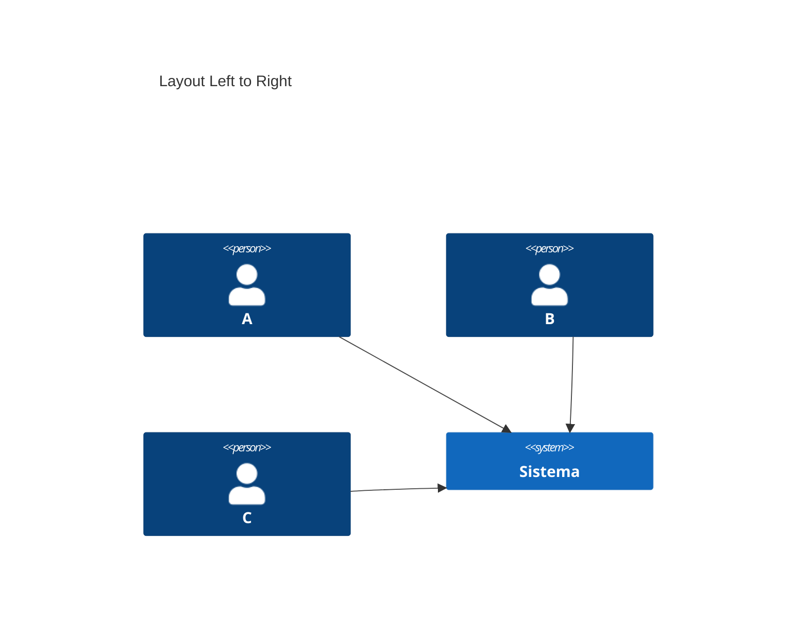

## Ejemplos Completos

### Sistema de Microservicios Completo

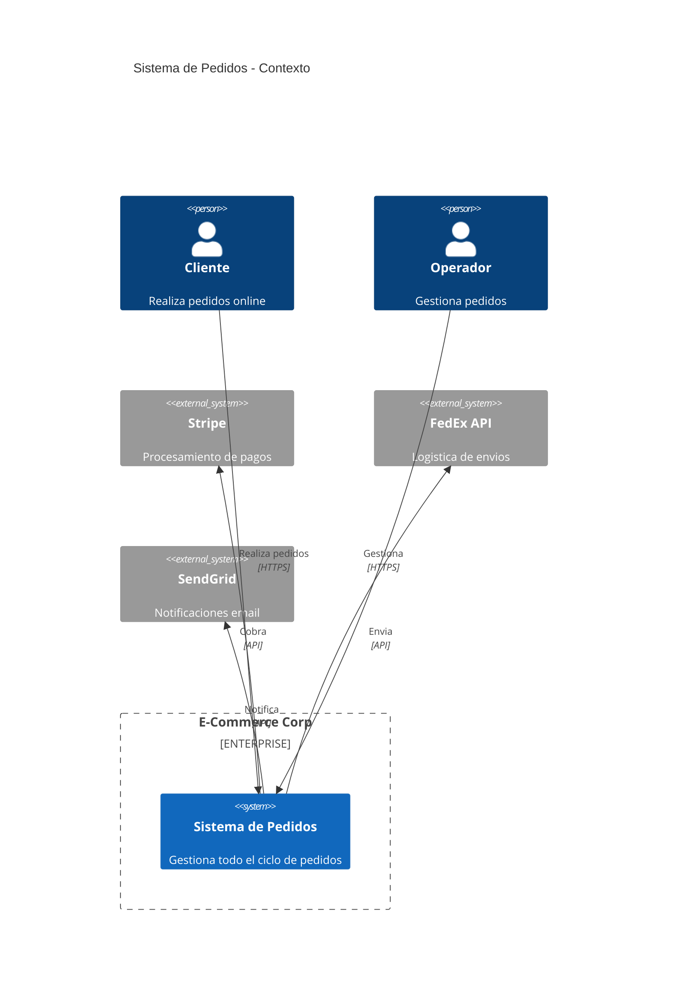

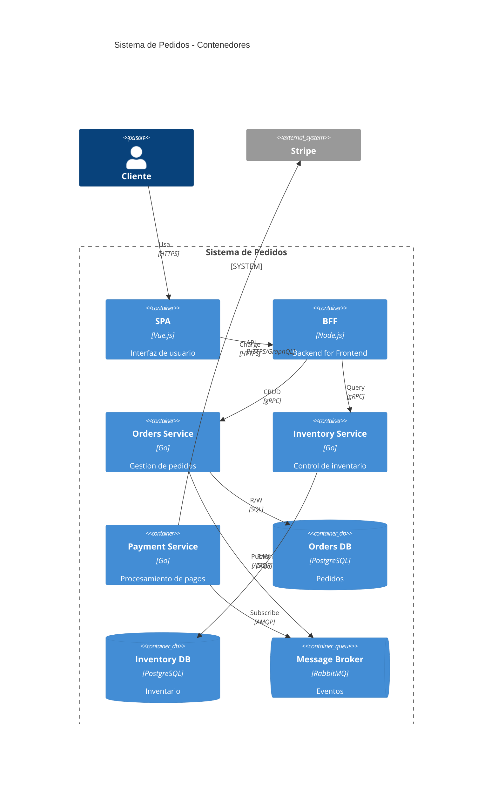

## Tips y Mejores Practicas

1. **Empezar por Context**: Siempre comenzar con el nivel mas alto
2. **Descripciones claras**: Cada elemento debe tener proposito claro
3. **Tecnologias especificas**: Indicar tecnologias en Containers y Components
4. **Limites logicos**: Usar boundaries para agrupar elementos relacionados
5. **Relaciones con etiquetas**: Describir que hace cada relacion
6. **No mezclar niveles**: Cada diagrama debe ser de un solo nivel
7. **Mantener actualizado**: Los diagramas deben reflejar el estado actual
