# Mindmap (Mapa Mental) - Mermaid

> Documentacion oficial: https://mermaid.js.org/syntax/mindmap.html

Los mapas mentales organizan informacion en una estructura jerarquica visual, partiendo de un concepto central y ramificandose en ideas relacionadas.

## Sintaxis Basica

La indentacion define la jerarquia:

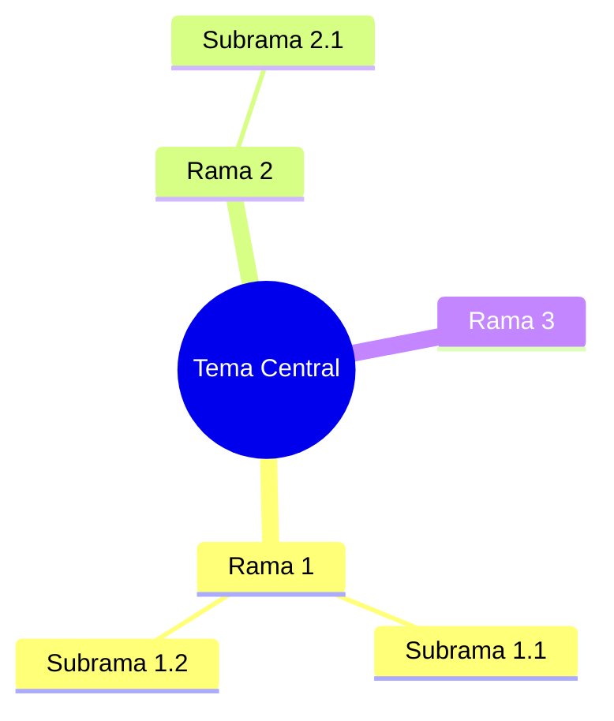

## Estructura General

```
mindmap
    root[Forma](Texto)
        Hijo 1
            Nieto 1
        Hijo 2
```

La **indentacion** (espacios o tabs) determina el nivel jerarquico.

## Formas de Nodos

### Formas Disponibles

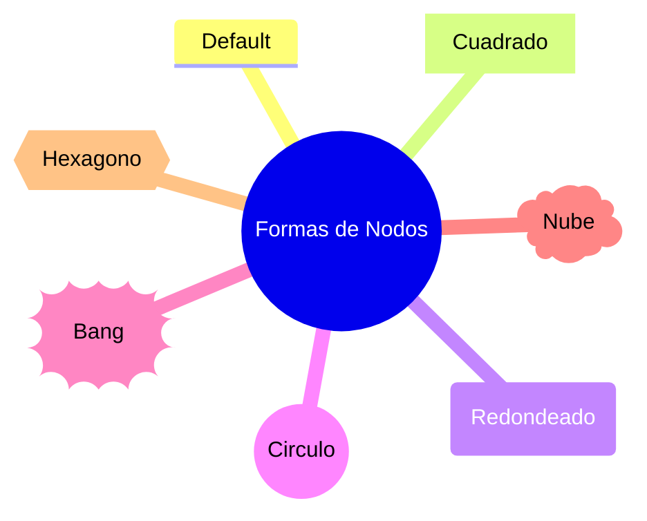

### Tabla de Formas

| Sintaxis | Forma | Uso Tipico |
|----------|-------|------------|
| `texto` | Default (rectangulo) | Nodos generales |
| `[texto]` | Cuadrado | Tareas, items |
| `(texto)` | Redondeado | Procesos, pasos |
| `((texto))` | Circulo | Nodo central, inicio |
| `))texto((` | Bang/Explosion | Enfasis, alerta |
| `)texto(` | Nube | Ideas, conceptos |
| `{{texto}}` | Hexagono | Decisiones |

## Nodo Raiz

El nodo raiz es el concepto central:

### Circulo (Comun para raiz)

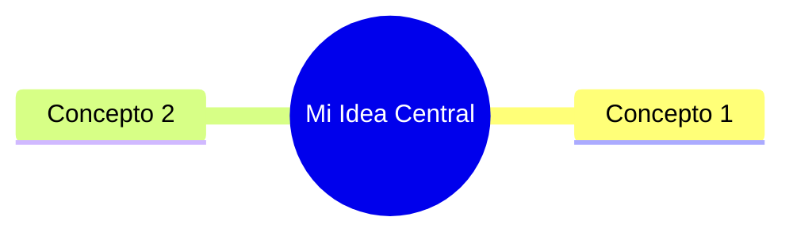

### Otras Formas de Raiz

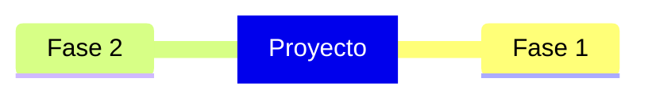

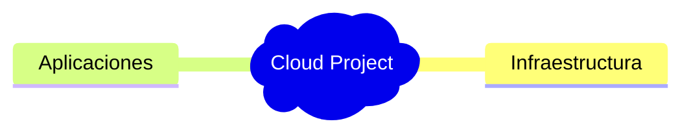

## Jerarquias

### Multiples Niveles

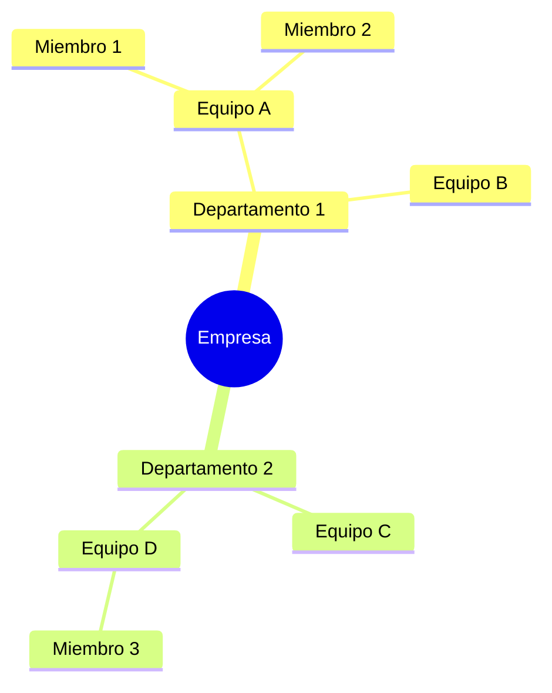

### Ramas Paralelas

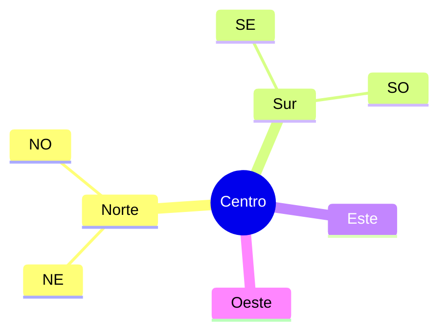

## Iconos

### Sintaxis de Iconos

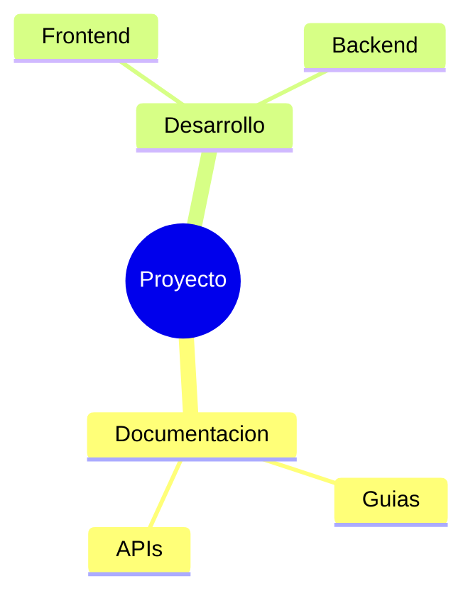

### Iconos Font Awesome

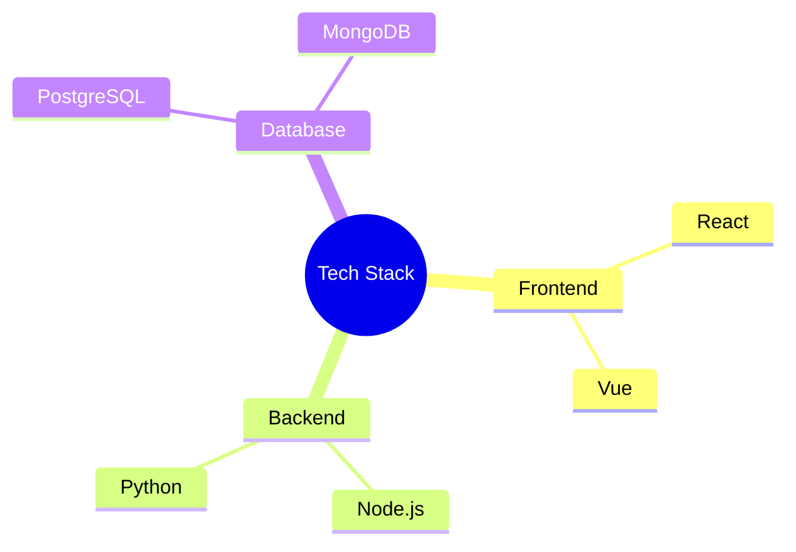

**Nota**: Los iconos requieren que Font Awesome este cargado en la pagina.

## Markdown en Nodos

### Texto con Formato

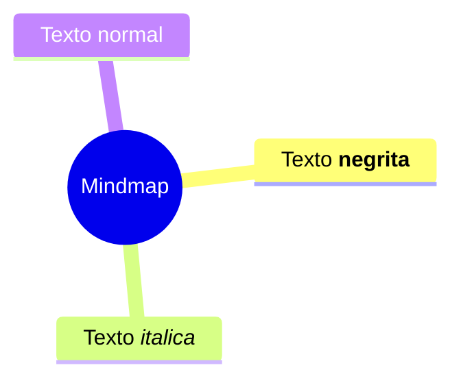

### Multiples Lineas

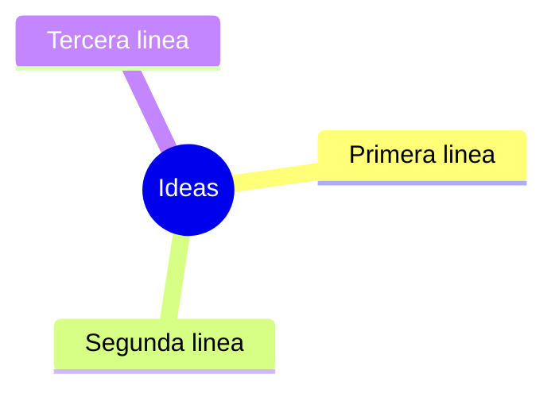

## Clases y Estilos

### Aplicar Clases

```mermaid
mindmap
    root((Central))
        Importante:::destacado
        Normal
        Urgente:::urgente

    classDef destacado fill:#f9f,stroke:#333,stroke-width:2px
    classDef urgente fill:#f00,color:#fff
```

## Ejemplos por Categoria

### Planificacion de Proyecto

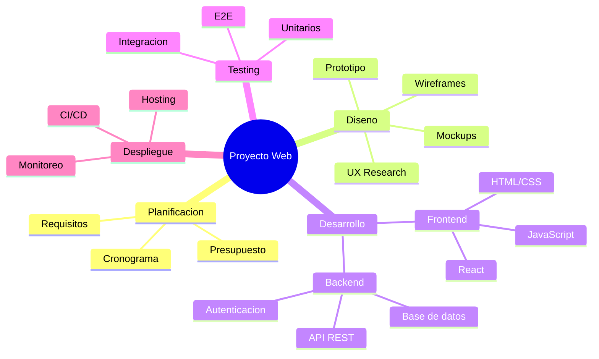

### Estructura de Curso

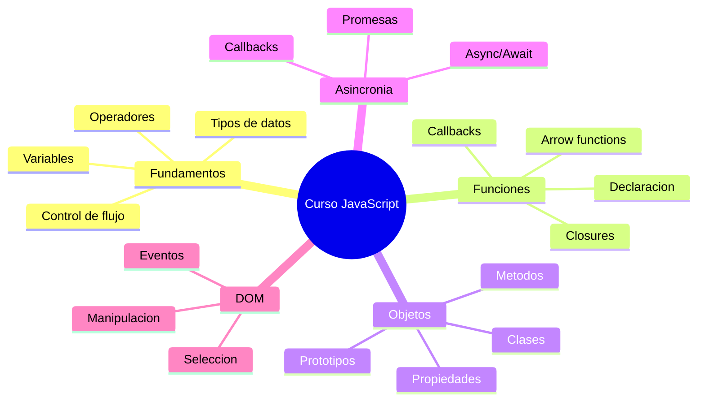

### Brainstorming

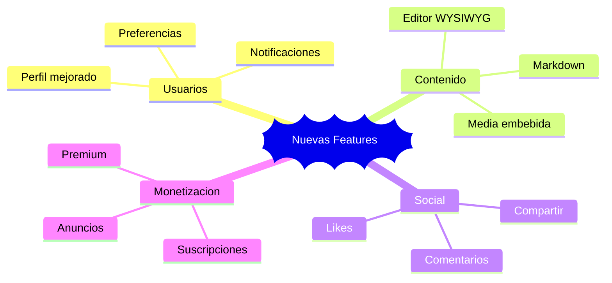

### Resolucion de Problemas

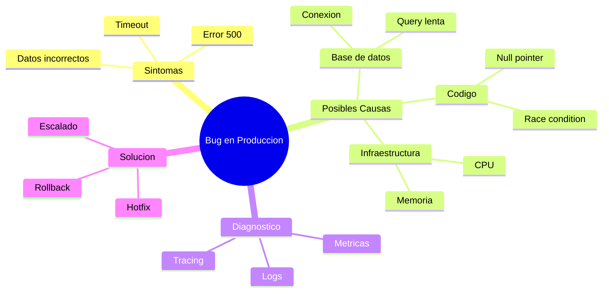

### Organizacion Personal

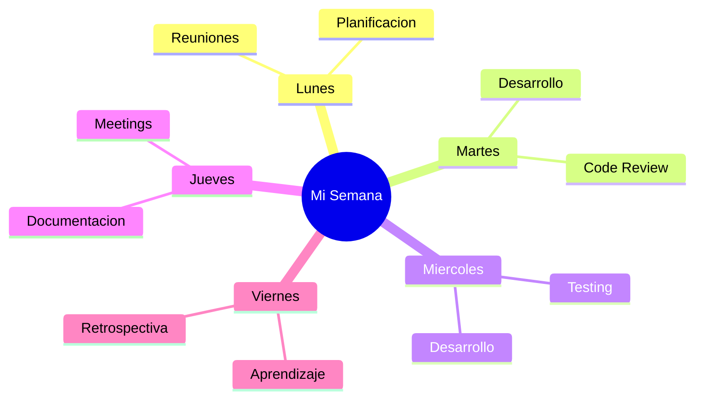

### Stack Tecnologico

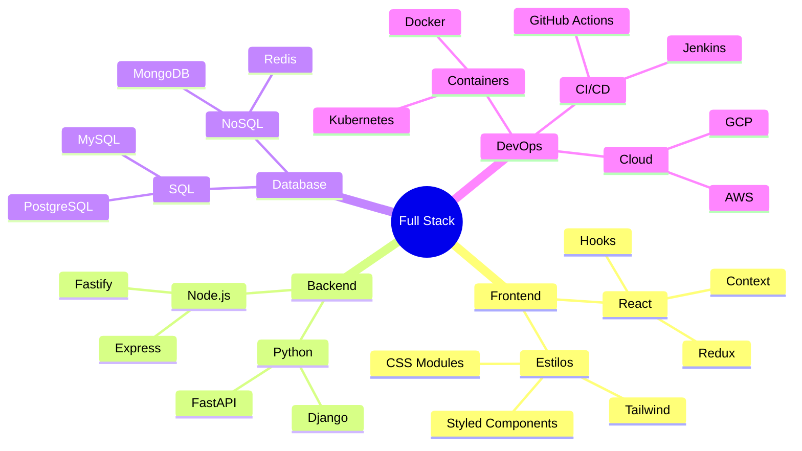

### Analisis FODA

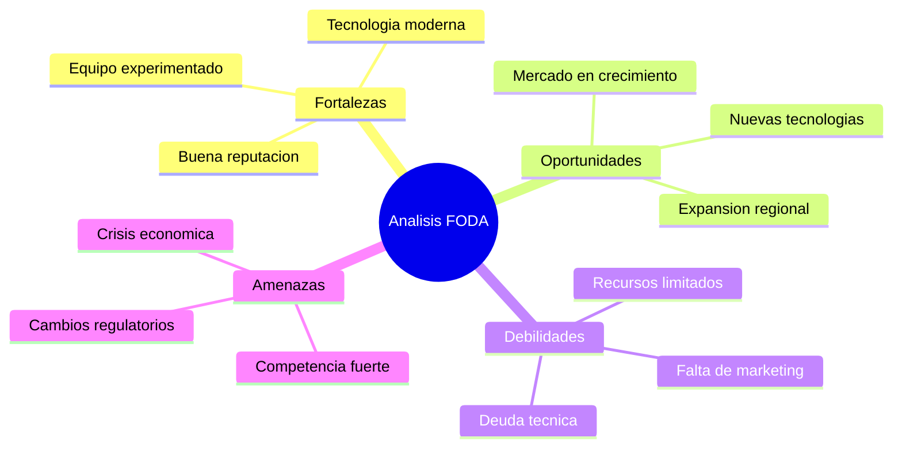

## Configuracion

### Tema Default

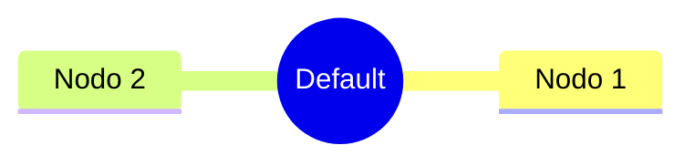

### Tema Forest

```mermaid
%%{init: {'theme': 'forest'}}%%
mindmap
    root((Forest))
        Nodo 1
        Nodo 2
```

### Tema Dark

```mermaid
%%{init: {'theme': 'dark'}}%%
mindmap
    root((Dark))
        Nodo 1
        Nodo 2
```

### Personalizacion

```mermaid
%%{init: {'theme': 'base', 'themeVariables': {'primaryColor': '#ff6b6b', 'primaryTextColor': '#fff'}}}%%
mindmap
    root((Personalizado))
        Nodo 1
        Nodo 2
```

## Opciones de Configuracion

| Opcion | Descripcion |
|--------|-------------|
| `maxTextWidth` | Ancho maximo del texto |
| `curve` | Tipo de curva para las ramas |

## Tips y Mejores Practicas

1. **Concepto central claro**: El root debe ser el tema principal
2. **Jerarquia logica**: Organizar de general a especifico
3. **Balance visual**: Distribuir ramas uniformemente
4. **Textos concisos**: Palabras clave, no oraciones largas
5. **Usar formas con proposito**: Diferentes formas para diferentes tipos de nodos
6. **Limitar profundidad**: Maximo 4-5 niveles para legibilidad
7. **Colores consistentes**: Usar clases para categorizar

## Casos de Uso

| Uso | Descripcion |
|-----|-------------|
| Brainstorming | Generar y organizar ideas |
| Notas de estudio | Resumir temas complejos |
| Planificacion | Estructurar proyectos |
| Presentaciones | Visualizar conceptos |
| Documentacion | Mostrar estructuras |
| Toma de decisiones | Evaluar opciones |
