# Timeline (Linea de Tiempo) - Mermaid

> Documentacion oficial: https://mermaid.js.org/syntax/timeline.html

Las lineas de tiempo ilustran cronologias de eventos, mostrando la progresion temporal de acontecimientos.

## Sintaxis Basica

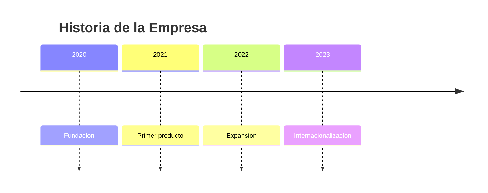

## Estructura General

```
timeline
    title Titulo de la linea de tiempo
    periodo : evento1 : evento2
    section Nombre de seccion
        periodo : evento
```

## Componentes

### Titulo

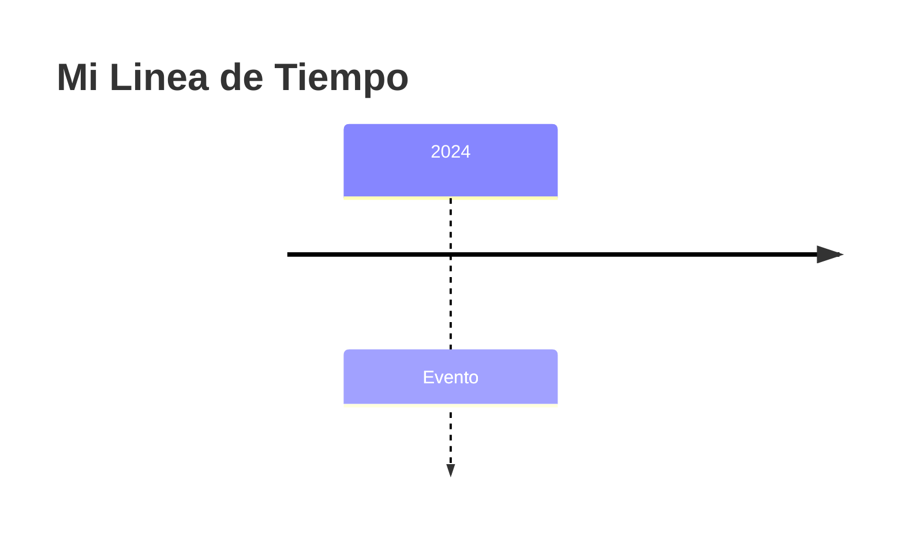

### Periodos y Eventos


### Multiples Eventos por Periodo

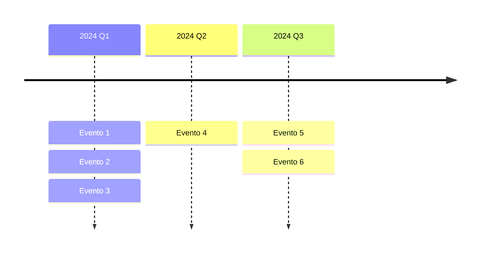

## Secciones

Las secciones agrupan periodos relacionados:

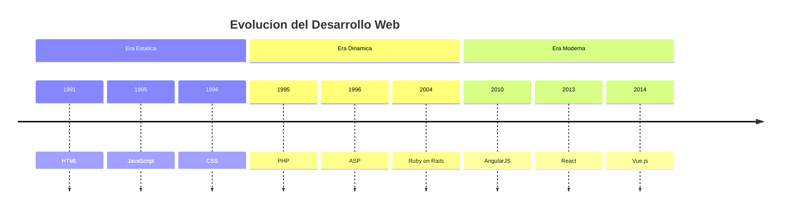

## Formatos de Periodo

### Anos


### Trimestres

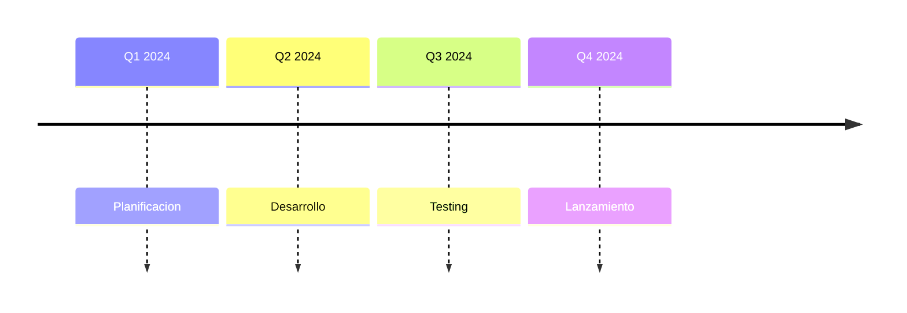

### Meses

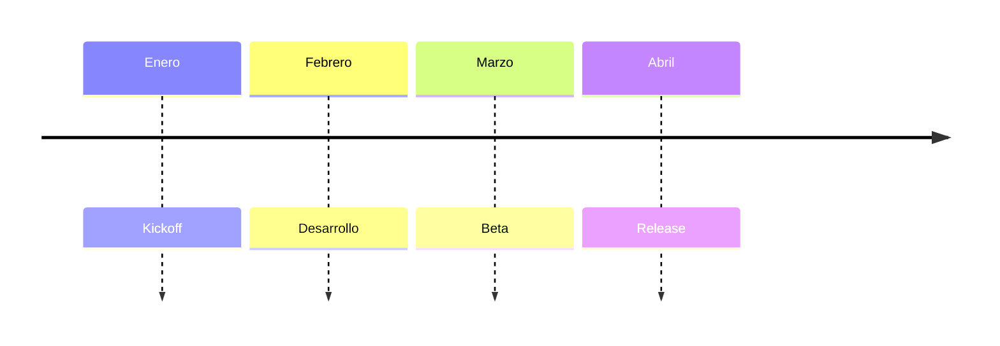

### Fechas Especificas


### Texto Libre

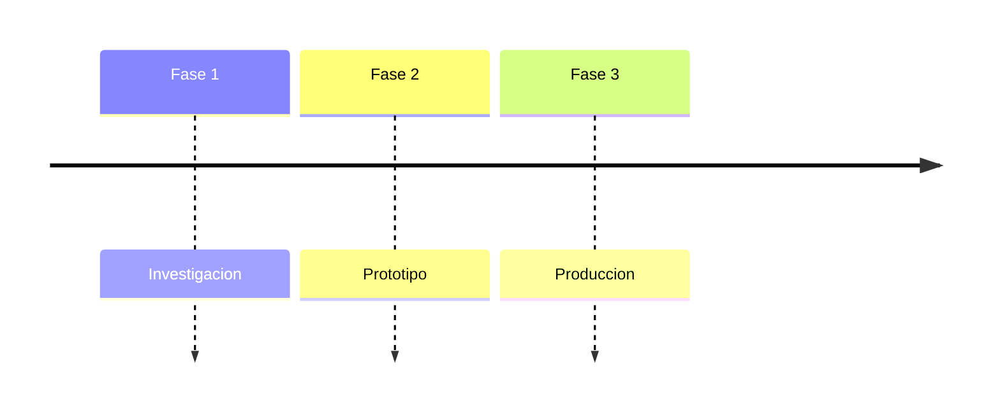

## Ejemplos por Categoria

### Historia de Tecnologia

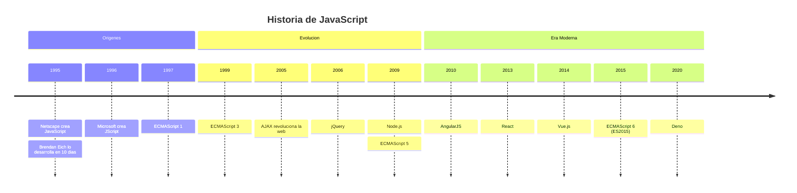

### Roadmap de Producto

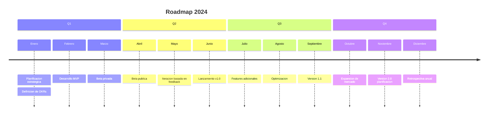

### Proceso de Proyecto

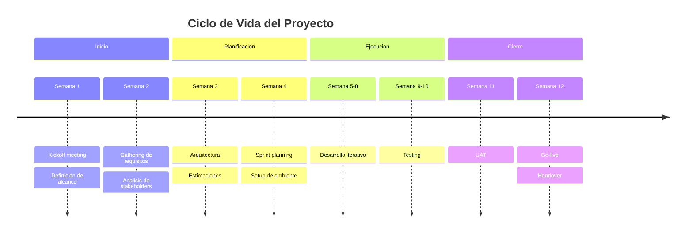

### Biografia/Historia Personal

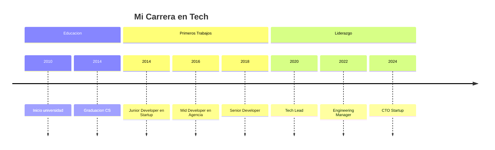

### Release History

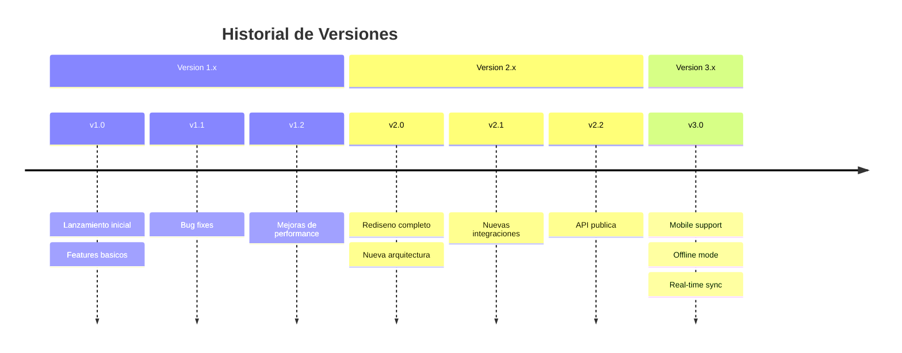

### Sprint Timeline

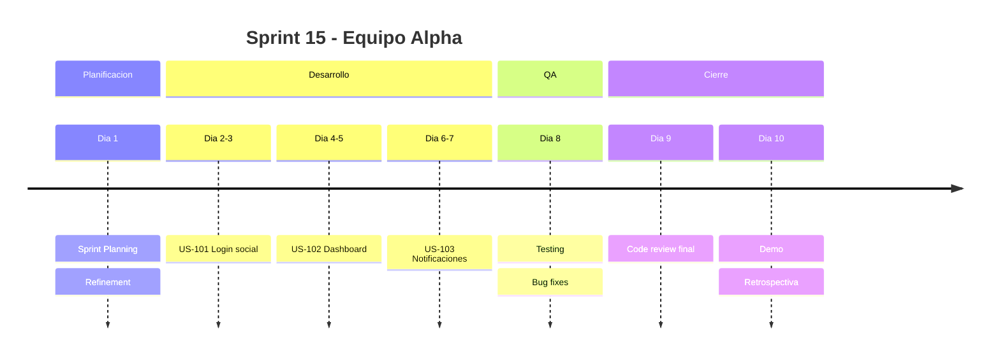

### Historia de Empresa

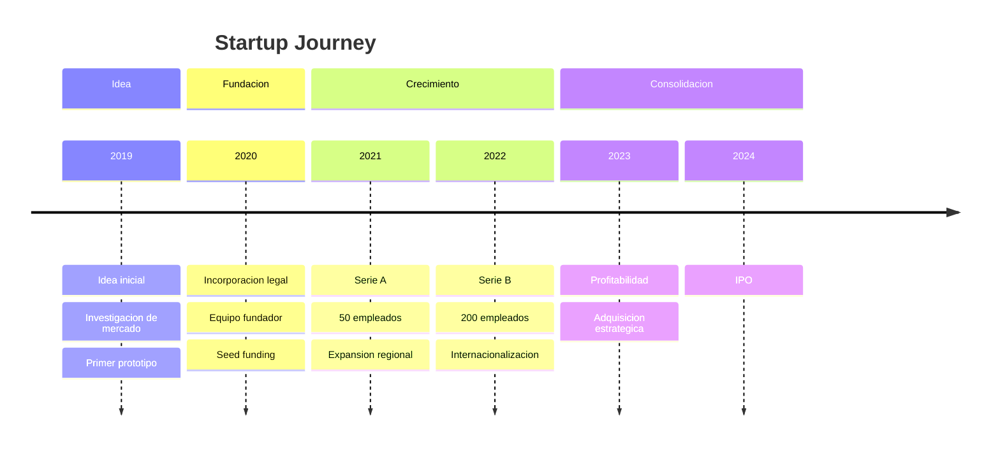

## Configuracion

### Temas

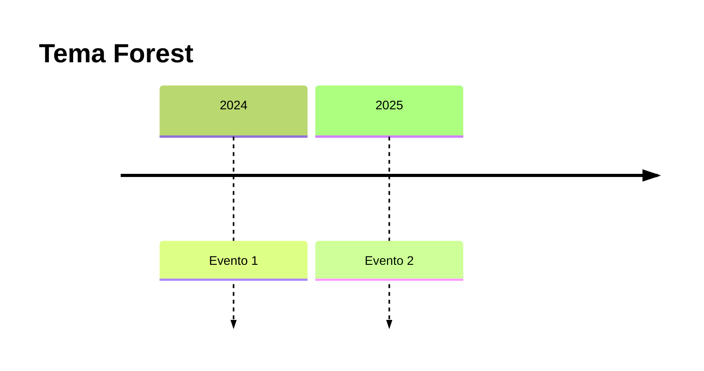

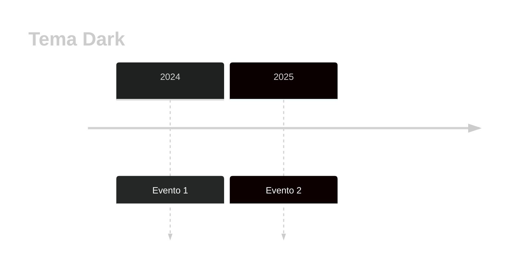

### Personalizacion

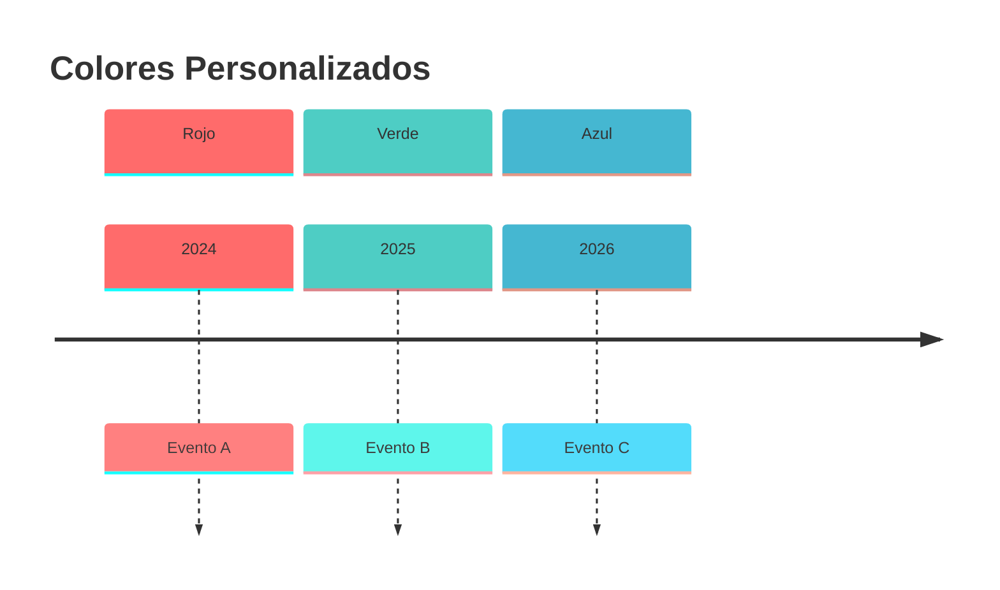

## Variables de Tema

| Variable | Descripcion |
|----------|-------------|
| `cScale0` - `cScale11` | Colores de las secciones |
| `cScaleLabel0` - `cScaleLabel11` | Colores de etiquetas |

## Tips y Mejores Practicas

1. **Periodos claros**: Usar formatos de fecha consistentes
2. **Eventos concisos**: Descripciones cortas y precisas
3. **Usar secciones**: Agrupar eventos relacionados
4. **Balance visual**: No sobrecargar un periodo
5. **Orden cronologico**: Mantener secuencia temporal
6. **Multiples eventos**: Usar `:` para separar eventos del mismo periodo
7. **Titulos descriptivos**: El titulo debe indicar el tema de la timeline

## Casos de Uso

| Uso | Descripcion |
|-----|-------------|
| Roadmaps | Planificacion de productos |
| Historia | Cronologia de eventos pasados |
| Biografias | Trayectoria personal/profesional |
| Releases | Historial de versiones |
| Proyectos | Fases y milestones |
| Sprints | Planificacion de iteraciones |
| Onboarding | Proceso de incorporacion |
