# ZenUML (Diagramas de Secuencia) - Mermaid

> Documentacion oficial: https://mermaid.js.org/syntax/zenuml.html

ZenUML es una sintaxis alternativa para crear diagramas de secuencia con un estilo mas cercano a codigo de programacion.

## Sintaxis Basica

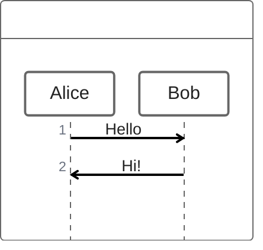

## Comparacion con Sequence Diagram

| sequenceDiagram | zenuml |
|-----------------|--------|
| `A->>B: msg` | `A->B: msg` |
| `A-->>B: msg` | `A->B: msg` (async) |
| `activate A` | Automatico con bloques |
| Sintaxis declarativa | Sintaxis imperativa |

## Participantes

### Declaracion Implicita

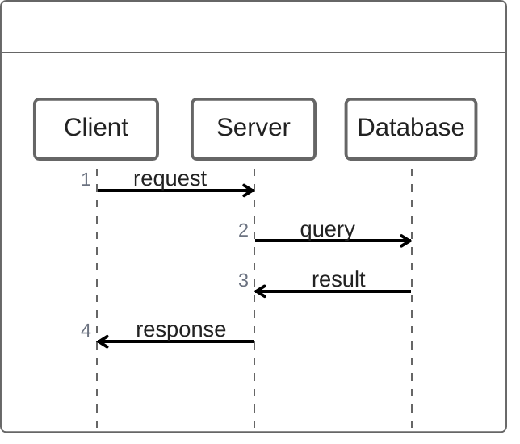

### Declaracion Explicita

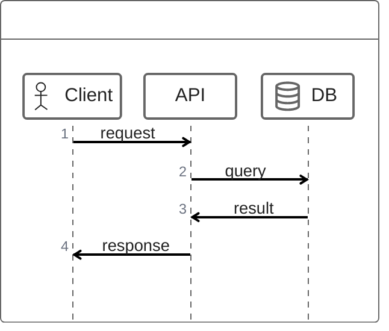

### Tipos de Participantes

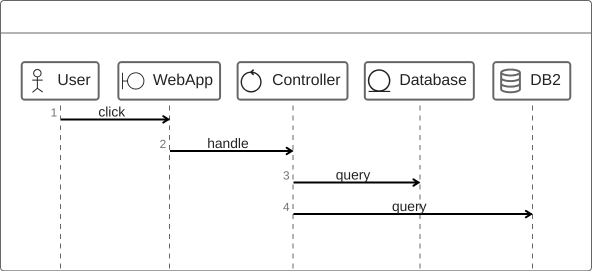

| Tipo | Descripcion | Icono |
|------|-------------|-------|
| `@Actor` | Usuario/persona | Figura humana |
| `@Boundary` | Interfaz de sistema | Linea con circulo |
| `@Control` | Controlador/logica | Circulo con flecha |
| `@Entity` | Entidad de datos | Circulo subrayado |
| `@Database` | Base de datos | Cilindro |

## Mensajes

### Mensaje Simple

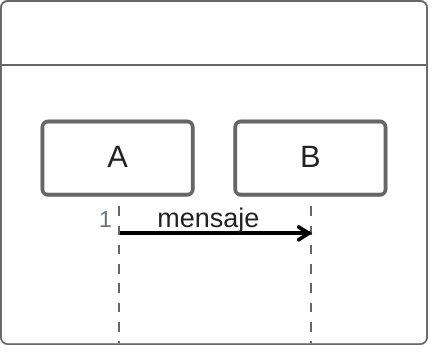

### Mensaje con Retorno

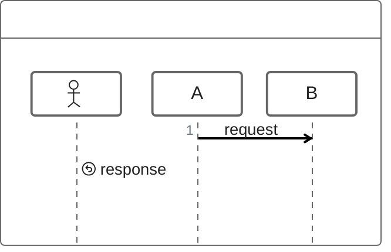

### Mensaje Asincrono

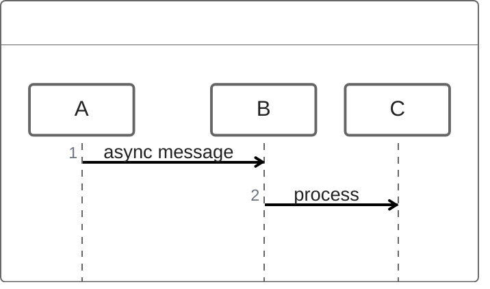

### Self-Message

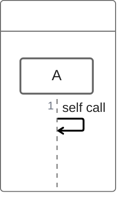

## Bloques de Activacion

Los bloques `{}` crean activaciones automaticas:

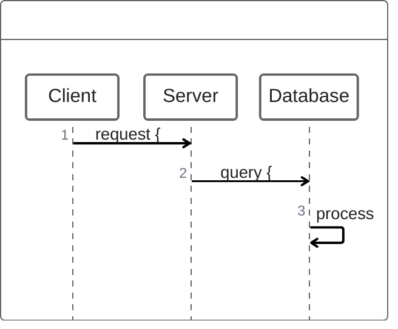

## Estructuras de Control

### If/Else

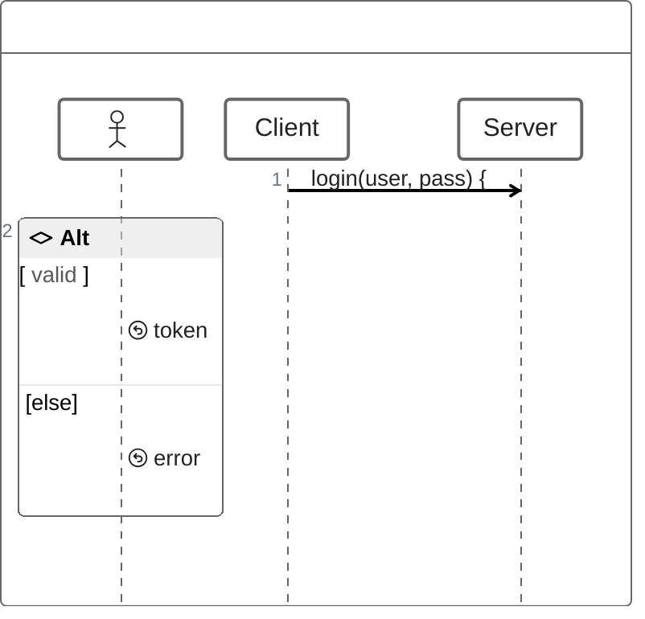

### If/Else If/Else

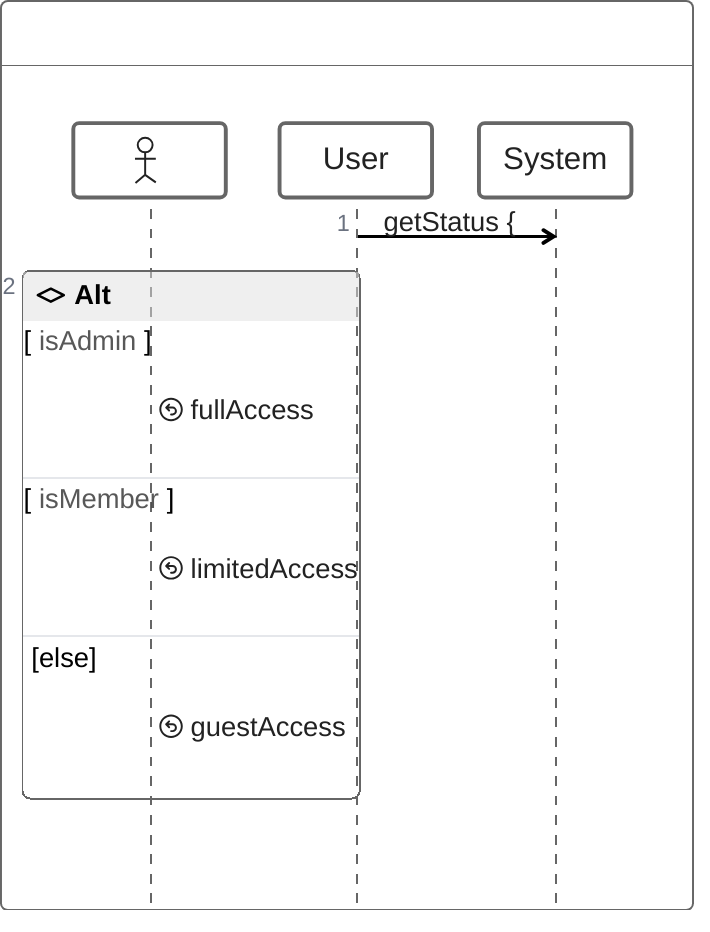

### While Loop

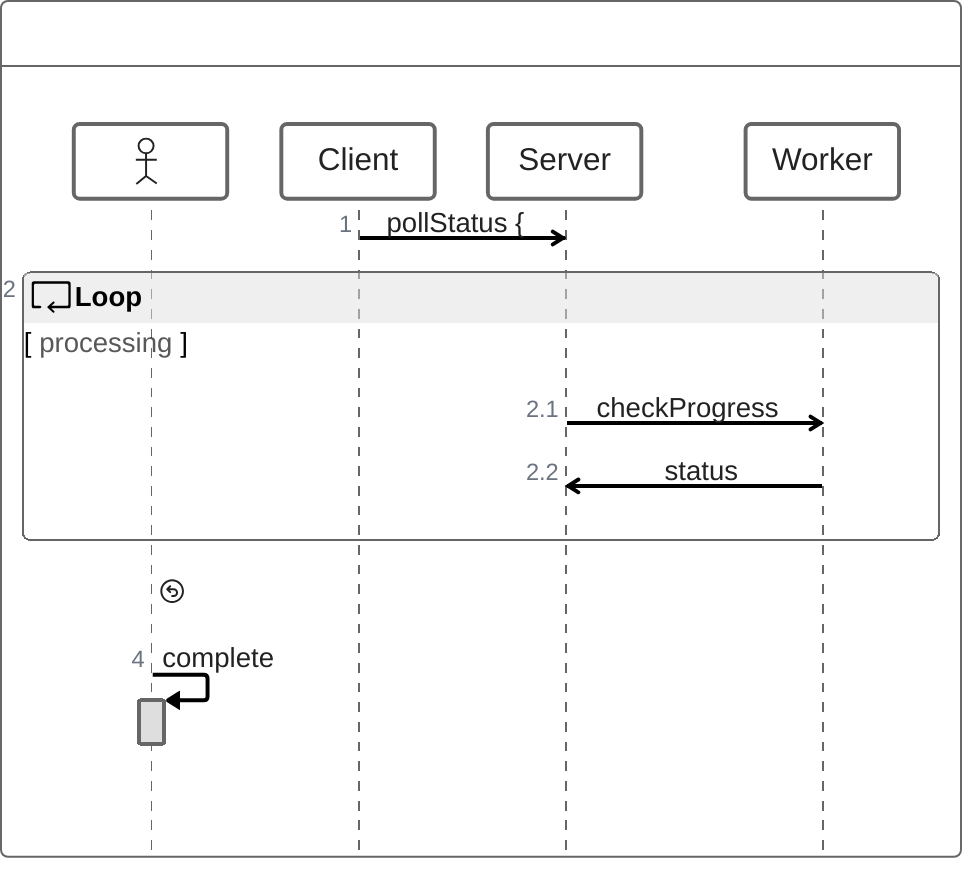

### For Each / Loop

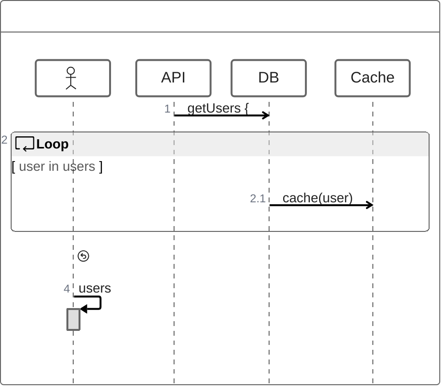

### Try/Catch/Finally

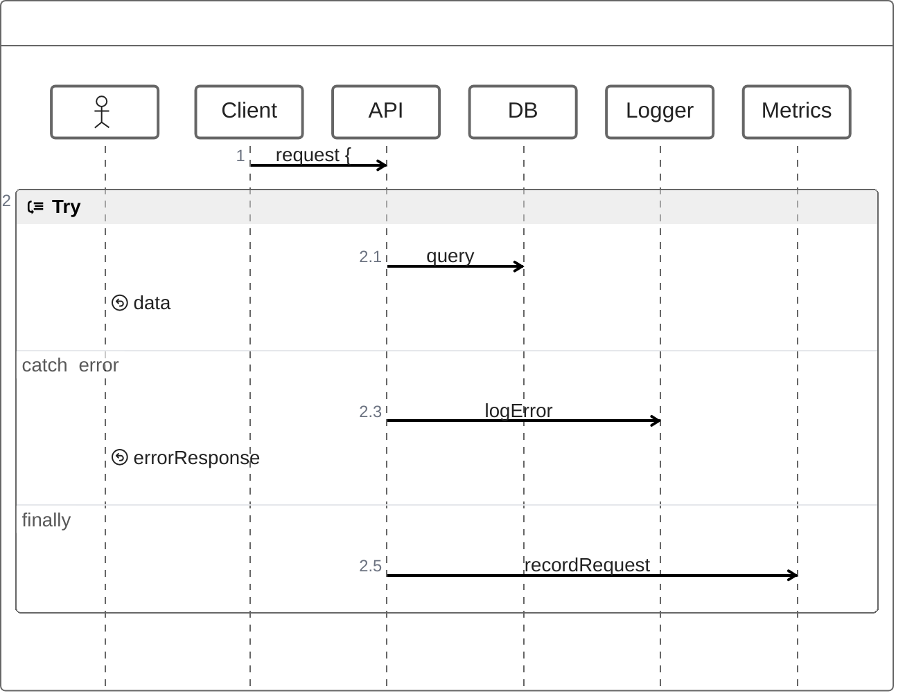

### Par (Paralelo)

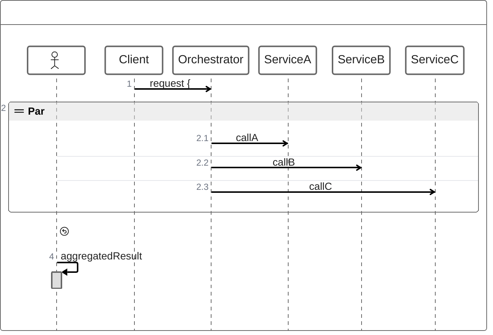

### Opt (Opcional)

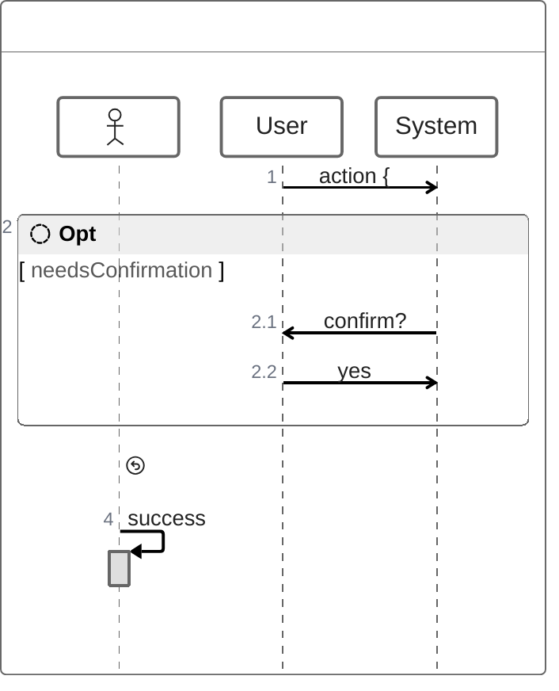

### Break

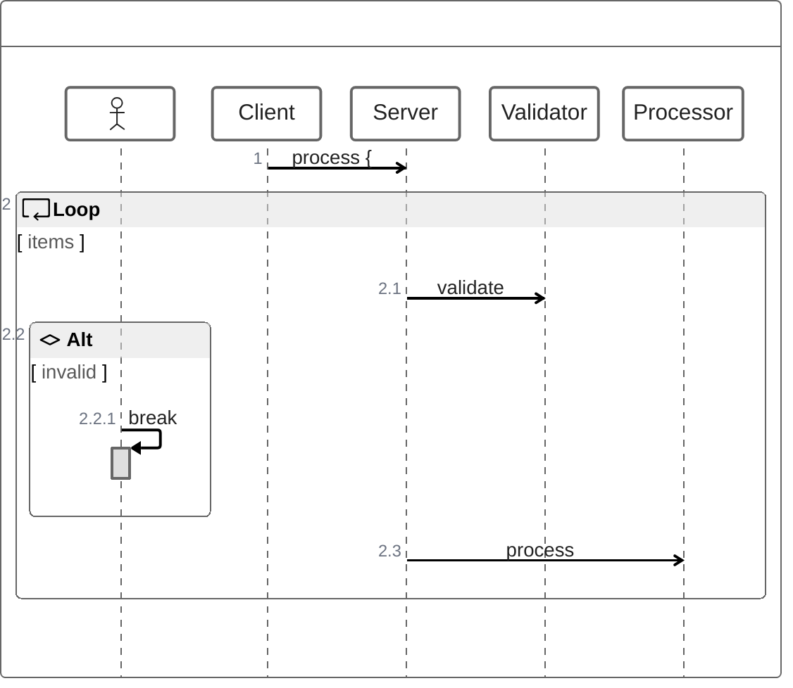

## Comentarios y Notas

### Comentarios

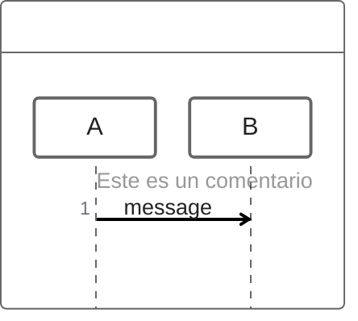

### Notas

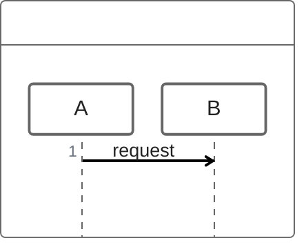

## Ejemplos Completos

### Autenticacion OAuth

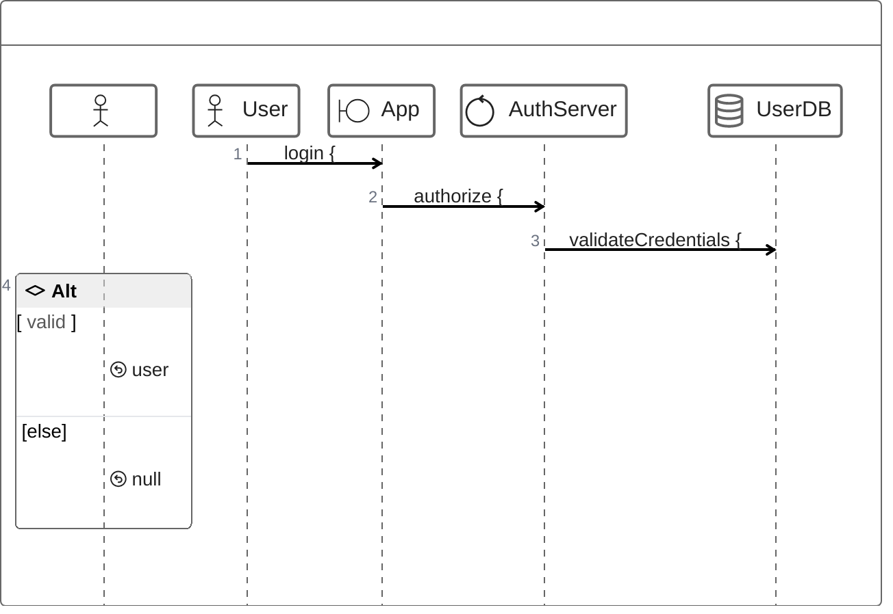

### API REST con Cache

```mermaid
zenuml
    @Actor Client
    @Boundary Gateway
    @Control API
    @Database Cache
    @Database DB

    Client->Gateway: GET /users/123 {
        Gateway->API: getUser(123) {
            API->Cache: get(user:123) {
                if (exists) {
                    return cachedUser
                }
            }
            if (cachedUser == null) {
                API->DB: SELECT * FROM users WHERE id=123
                DB->API: userData
                API->Cache: set(user:123, userData)
            }
            return user
        }
        return response
    }
```

### Proceso de Checkout

```mermaid
zenuml
    @Actor Customer
    @Boundary WebStore
    @Control OrderService
    @Control PaymentService
    @Control InventoryService
    @Database OrderDB

    Customer->WebStore: checkout(cart) {
        WebStore->InventoryService: checkAvailability(items) {
            forEach (item in items) {
                InventoryService->InventoryService: validateStock
            }
            if (allAvailable) {
                return true
            } else {
                return unavailableItems
            }
        }

        if (available) {
            WebStore->PaymentService: processPayment(amount) {
                try {
                    PaymentService->PaymentService: validateCard
                    PaymentService->PaymentService: charge
                    return transactionId
                } catch (error) {
                    return paymentError
                }
            }

            if (paymentSuccess) {
                WebStore->OrderService: createOrder(cart, transactionId) {
                    OrderService->OrderDB: INSERT order
                    par {
                        OrderService->InventoryService: reserveItems
                        OrderService->OrderService: sendConfirmationEmail
                    }
                    return orderId
                }
                return orderConfirmation
            } else {
                return paymentFailed
            }
        } else {
            return itemsUnavailable
        }
    }
```

### Microservicios con Saga

```mermaid
zenuml
    @Boundary API
    @Control Saga
    @Control OrderSvc
    @Control PaymentSvc
    @Control ShippingSvc

    API->Saga: startSaga(order) {
        try {
            Saga->OrderSvc: createOrder {
                return orderId
            }

            Saga->PaymentSvc: processPayment(orderId) {
                if (success) {
                    return paymentId
                } else {
                    throw PaymentError
                }
            }

            Saga->ShippingSvc: scheduleShipping(orderId) {
                return trackingId
            }

            return sagaComplete
        } catch (error) {
            // Compensating transactions
            Saga->ShippingSvc: cancelShipping
            Saga->PaymentSvc: refundPayment
            Saga->OrderSvc: cancelOrder
            return sagaFailed
        }
    }
```

## Configuracion

### Tema

```mermaid
%%{init: {'theme': 'forest'}}%%
zenuml
    A->B: message
    B->A: response
```

### Tema Dark

```mermaid
%%{init: {'theme': 'dark'}}%%
zenuml
    A->B: message
    B->A: response
```

## Comparacion: ZenUML vs sequenceDiagram

### sequenceDiagram

```mermaid
sequenceDiagram
    participant A as Client
    participant B as Server

    A->>B: request
    activate B
    B->>B: process
    B-->>A: response
    deactivate B
```

### ZenUML equivalente

```mermaid
zenuml
    @Client A
    @Server B

    A->B: request {
        B->B: process
        return response
    }
```

## Ventajas de ZenUML

| Ventaja | Descripcion |
|---------|-------------|
| Sintaxis familiar | Similar a lenguajes de programacion |
| Activacion automatica | Bloques `{}` manejan activaciones |
| Estructuras de control | if/else, while, try/catch nativos |
| Menos verboso | Requiere menos lineas de codigo |
| Legible | Facil de leer como pseudocodigo |

## Tips y Mejores Practicas

1. **Usar bloques**: Las llaves `{}` clarifican el alcance
2. **Participantes tipados**: Usar `@Actor`, `@Database`, etc.
3. **Estructuras de control**: Aprovechar if/else, loops nativos
4. **Comentarios**: Documentar logica compleja
5. **Nombres descriptivos**: Mensajes que expliquen la accion
6. **Return explicitos**: Usar `return` para respuestas
7. **Manejo de errores**: Usar try/catch para flujos de error
