# Sankey Diagram - Mermaid

> Documentacion oficial: https://mermaid.js.org/syntax/sankey.html

Los diagramas Sankey visualizan flujos de una fuente a un destino, donde el ancho de las flechas es proporcional a la cantidad de flujo.

## Sintaxis Basica

El formato es CSV con tres columnas: origen, destino, valor.

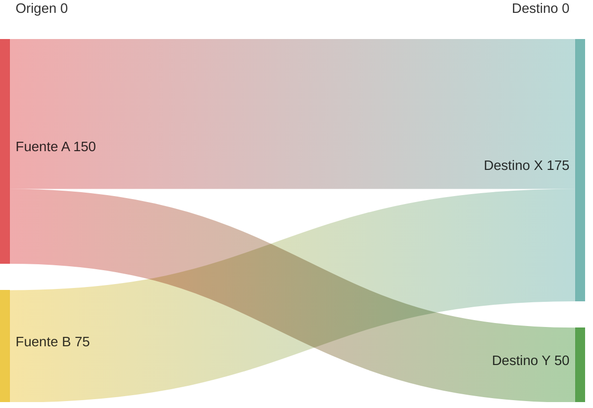

## Estructura General

```
sankey-beta

NodoOrigen,NodoDestino,ValorFlujo
```

**Nota**: `sankey-beta` indica que esta funcionalidad esta en version beta.

## Formato de Datos

### Sin Encabezado

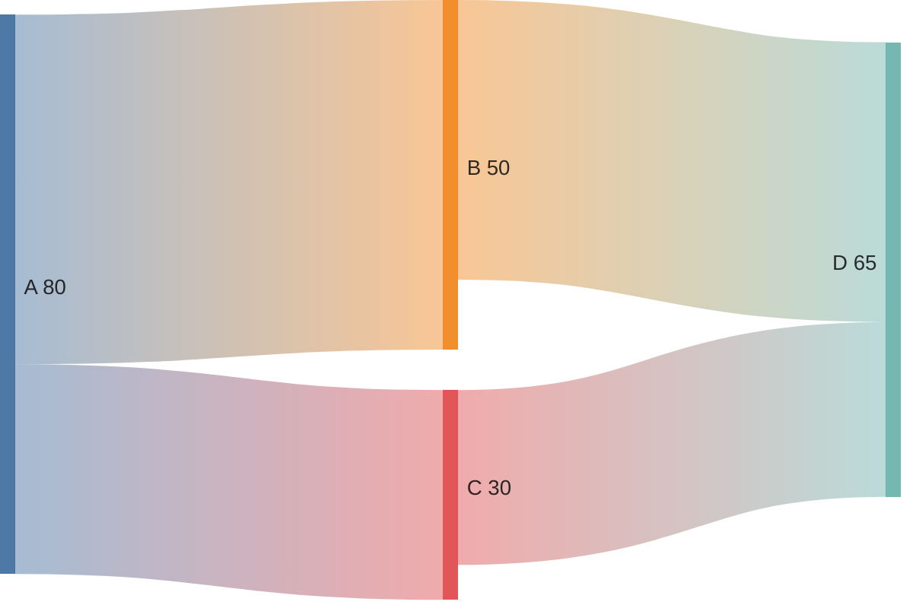

### Con Nombres Descriptivos

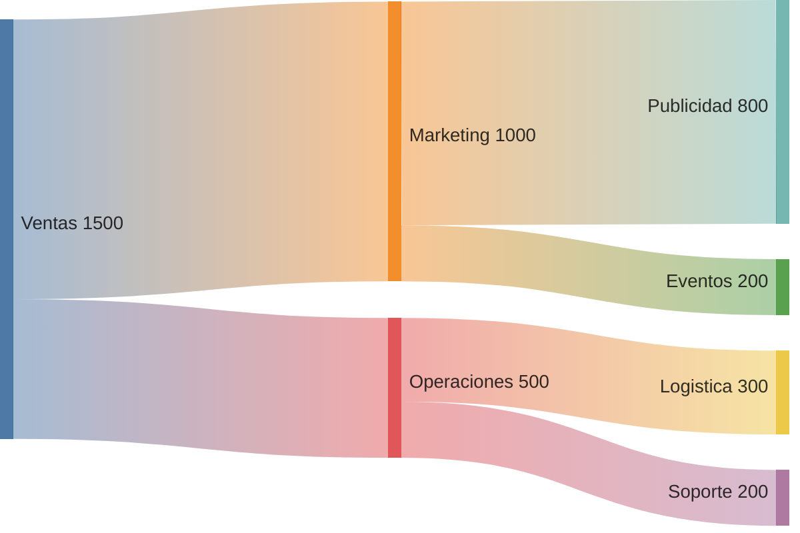

### Multiples Niveles

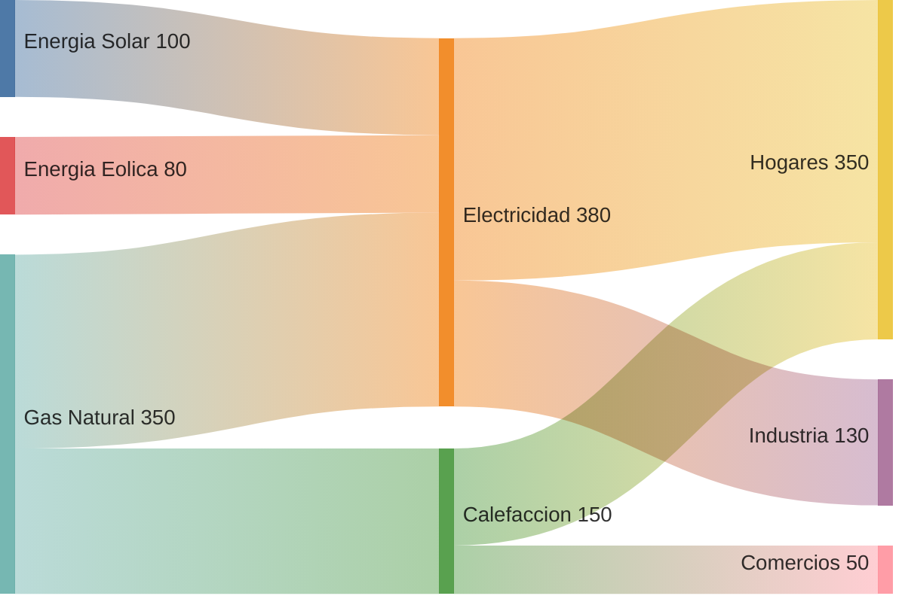

## Ejemplos por Categoria

### Flujo de Energia

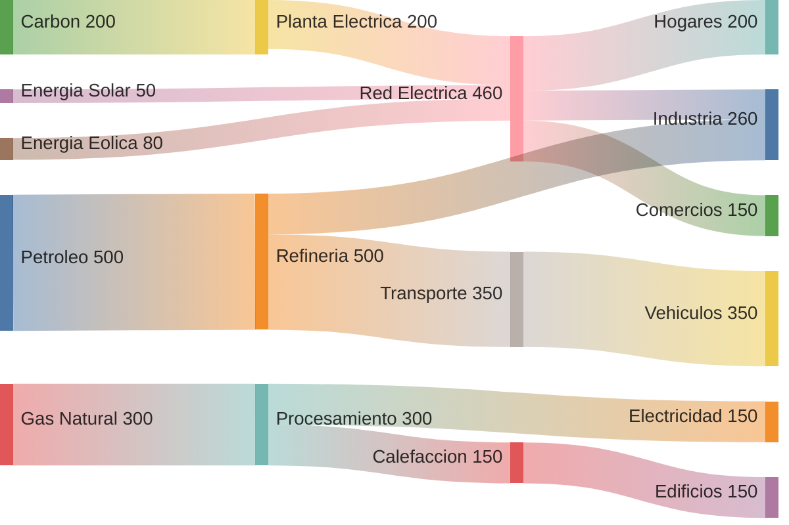

### Presupuesto Empresarial

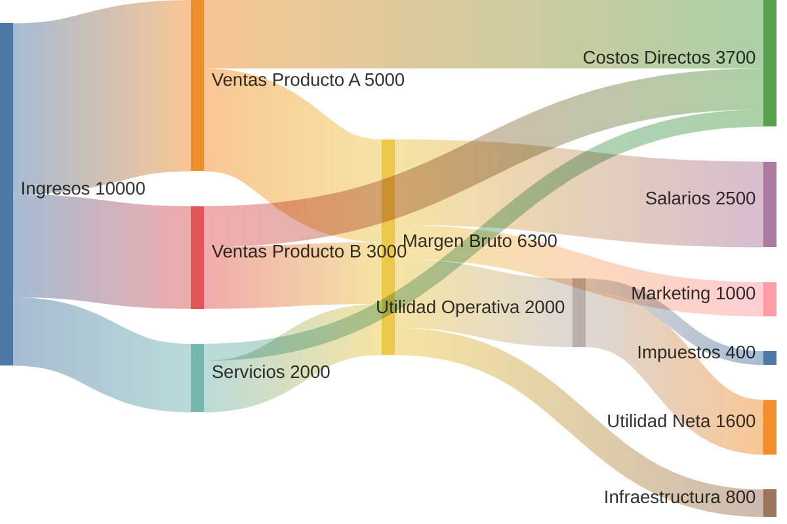

### Conversion de Marketing

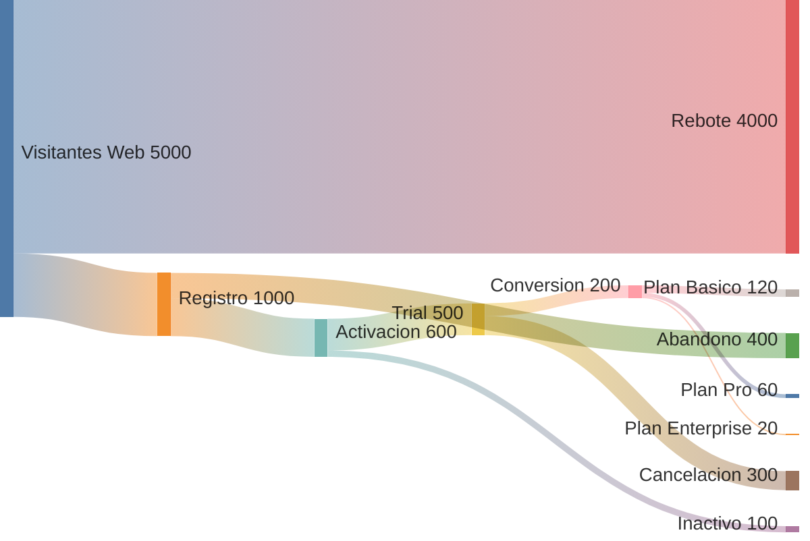

### Flujo de Usuarios

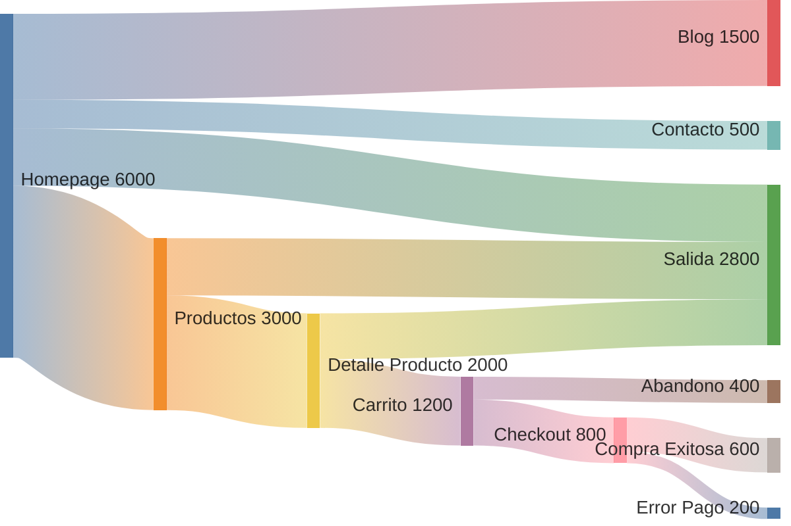

### Cadena de Suministro

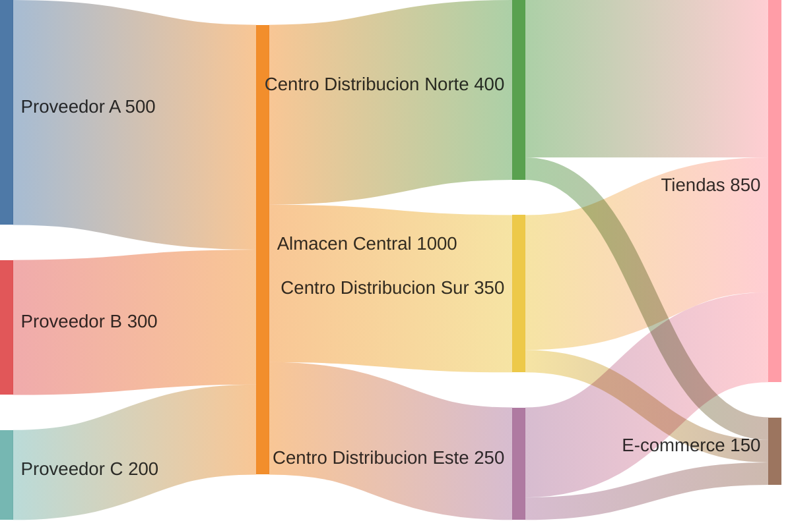

### Migracion de Datos

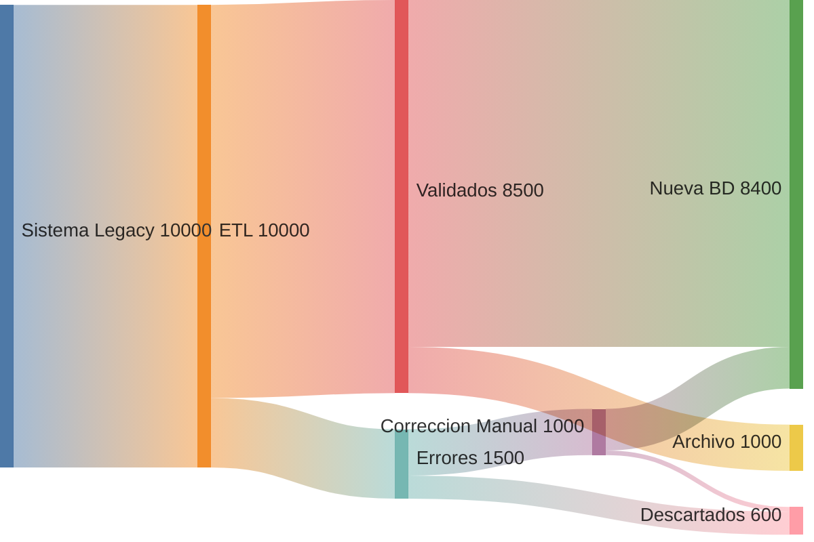

### Embudo de Ventas

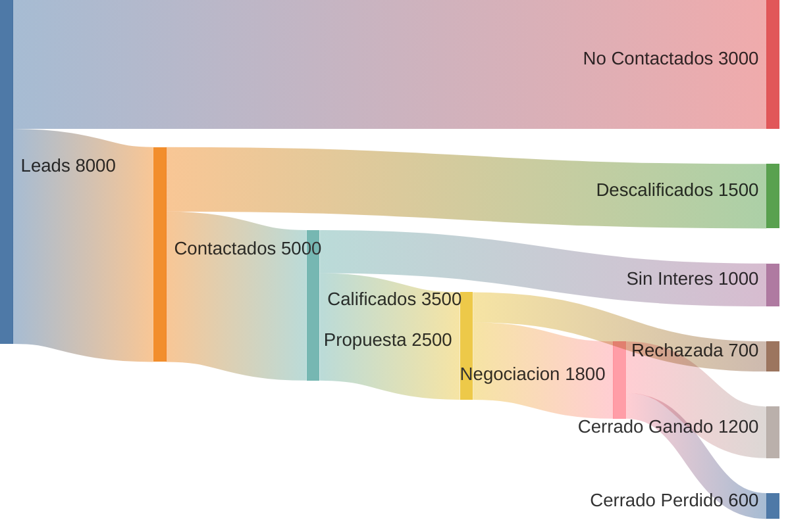

### Tiempo de Empleados

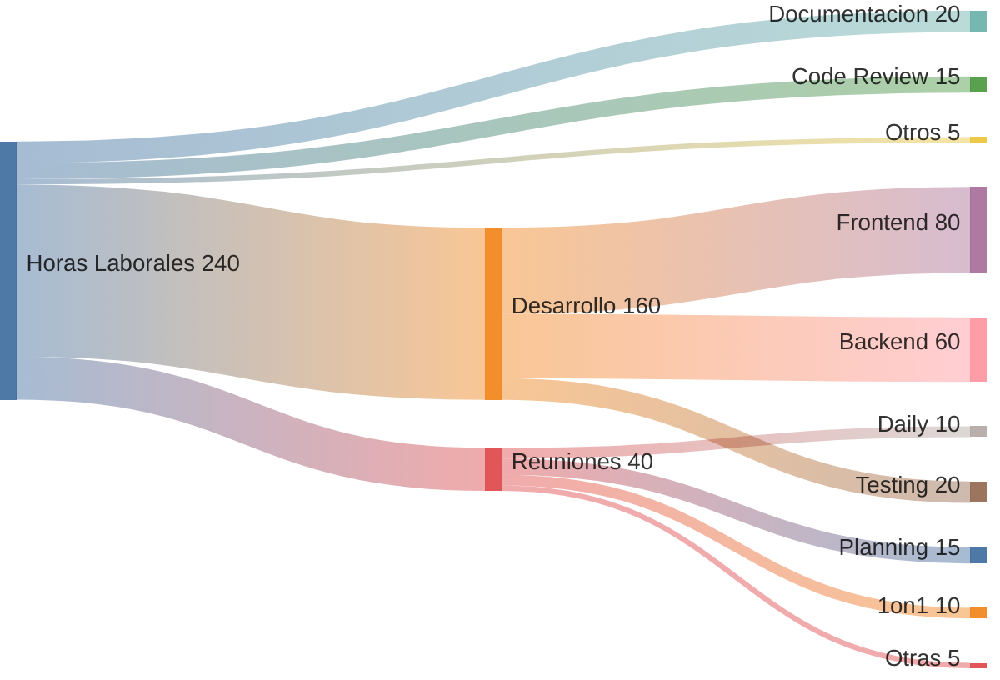

## Configuracion

### Configuracion via JavaScript

```javascript
mermaid.initialize({
  sankey: {
    width: 800,
    height: 400,
    linkColor: 'gradient', // source, target, gradient, o color hex
    nodeAlignment: 'justify' // justify, center, left, right
  }
});
```

### Opciones de linkColor

| Valor | Descripcion |
|-------|-------------|
| `source` | Color del nodo origen |
| `target` | Color del nodo destino |
| `gradient` | Degradado entre origen y destino |
| `#hexcolor` | Color especifico |

### Opciones de nodeAlignment

| Valor | Descripcion |
|-------|-------------|
| `justify` | Distribucion uniforme (default) |
| `center` | Centrado |
| `left` | Alineado a la izquierda |
| `right` | Alineado a la derecha |

### Tema

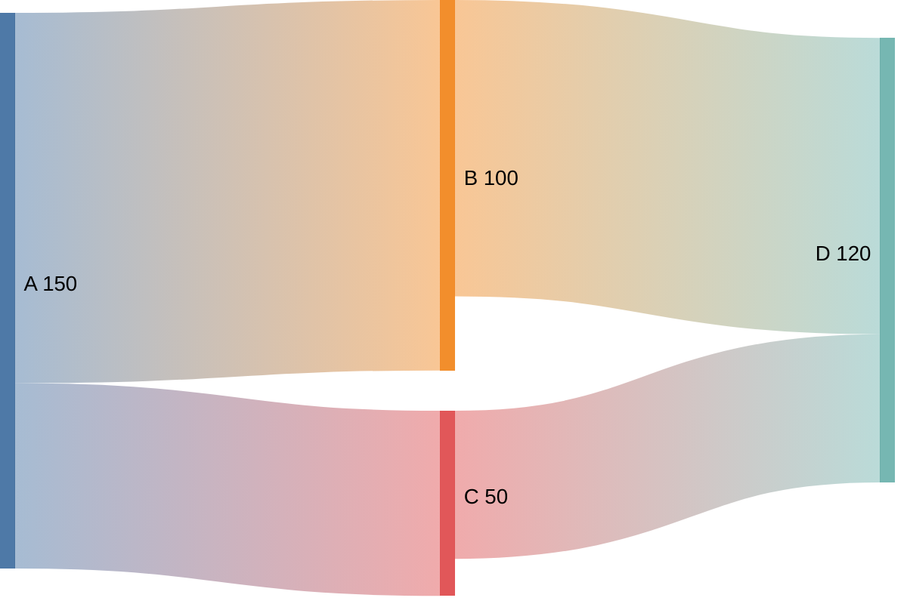

### Tema Dark

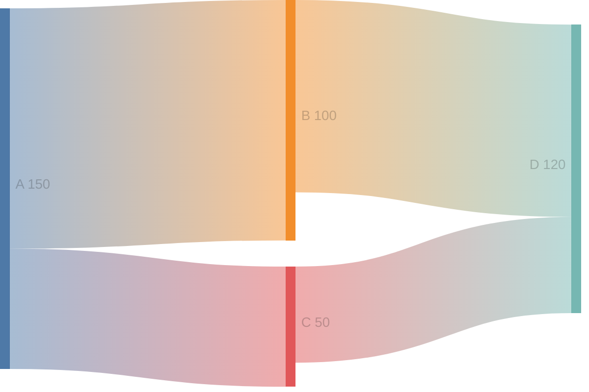

## Personalizacion de Colores

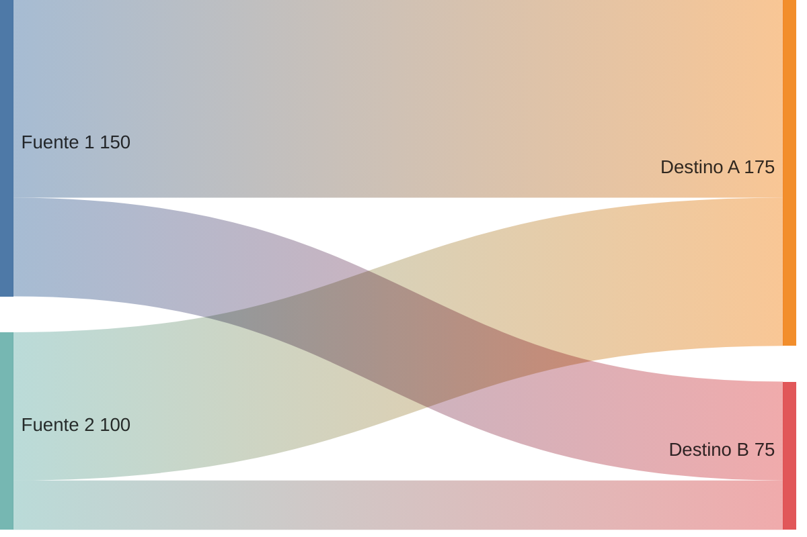

## Casos de Uso

| Uso | Descripcion |
|-----|-------------|
| Flujo de energia | Produccion, transformacion, consumo |
| Finanzas | Ingresos, gastos, presupuestos |
| Marketing | Embudos, conversiones, atribucion |
| Logistica | Cadenas de suministro, distribucion |
| Migraciones | Flujo de datos entre sistemas |
| Procesos | Entradas, transformaciones, salidas |

## Consideraciones

### Limitaciones

- Esta en version **beta**
- Soporte limitado de estilos personalizados
- No soporta interactividad avanzada

### Buenas Practicas

1. **Datos consistentes**: Los valores deben sumar correctamente
2. **Nombres descriptivos**: Usar etiquetas claras para nodos
3. **Jerarquia logica**: Organizar de izquierda (origen) a derecha (destino)
4. **Limitar complejidad**: Demasiados flujos reducen legibilidad
5. **Colores significativos**: Usar colores para categorizar flujos

## Tips de Formateo

1. **Una linea por flujo**: Cada conexion en su propia linea
2. **Sin espacios extra**: Mantener formato CSV limpio
3. **Valores numericos**: Solo numeros positivos para el valor
4. **Nombres sin comas**: Evitar comas en nombres de nodos

## Errores Comunes

| Error | Causa | Solucion |
|-------|-------|----------|
| Diagrama vacio | Formato incorrecto | Verificar CSV (origen,destino,valor) |
| Valores no visibles | Valores muy pequenos | Usar escala apropiada |
| Nodos desconectados | Nombres inconsistentes | Verificar ortografia exacta |
| Flujo inverso | Origen y destino invertidos | Revisar direccion logica |
