# XY Chart (Grafico XY) - Mermaid

> Documentacion oficial: https://mermaid.js.org/syntax/xyChart.html

Los graficos XY permiten crear visualizaciones de datos con barras, lineas o combinaciones de ambas.

## Sintaxis Basica

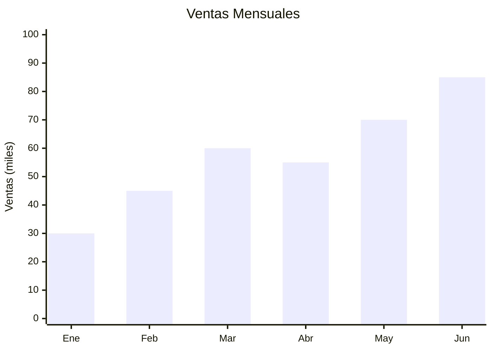
```mermaid
xychart-beta
    title "Ventas Mensuales"
    x-axis [Ene, Feb, Mar, Abr, May, Jun]
    y-axis "Ventas (miles)" 0 --> 100
    bar [30, 45, 60, 55, 70, 85]
```

## Estructura General

```
xychart-beta [orientacion]
    title "Titulo"
    x-axis "Etiqueta" [valores] o rango
    y-axis "Etiqueta" min --> max
    bar [datos]
    line [datos]
```

## Componentes

### Titulo

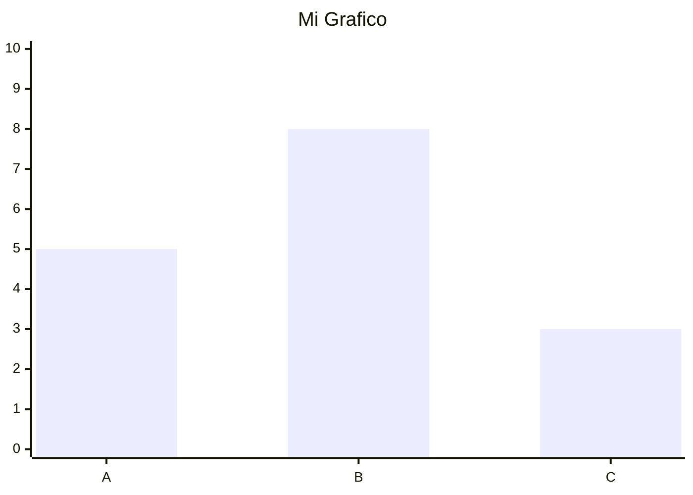
```mermaid
xychart-beta
    title "Mi Grafico"
    x-axis [A, B, C]
    y-axis 0 --> 10
    bar [5, 8, 3]
```

### Eje X - Categorias

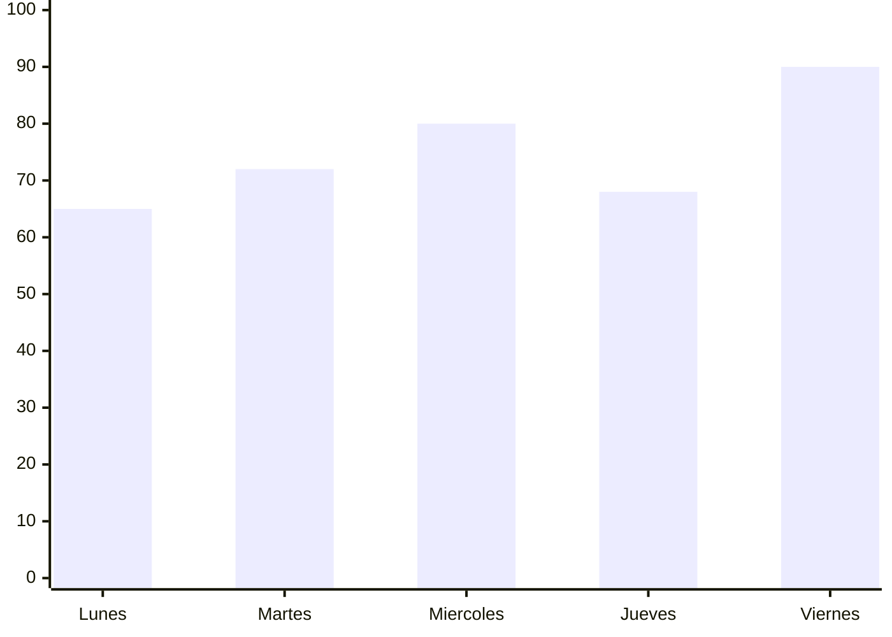
```mermaid
xychart-beta
    x-axis [Lunes, Martes, Miercoles, Jueves, Viernes]
    y-axis 0 --> 100
    bar [65, 72, 80, 68, 90]
```

### Eje X - Numerico

```mermaid
xychart-beta
    x-axis 0 --> 10
    y-axis 0 --> 100
    line [10, 25, 40, 35, 60, 80, 75, 90, 85, 95]
```

### Eje X con Etiqueta

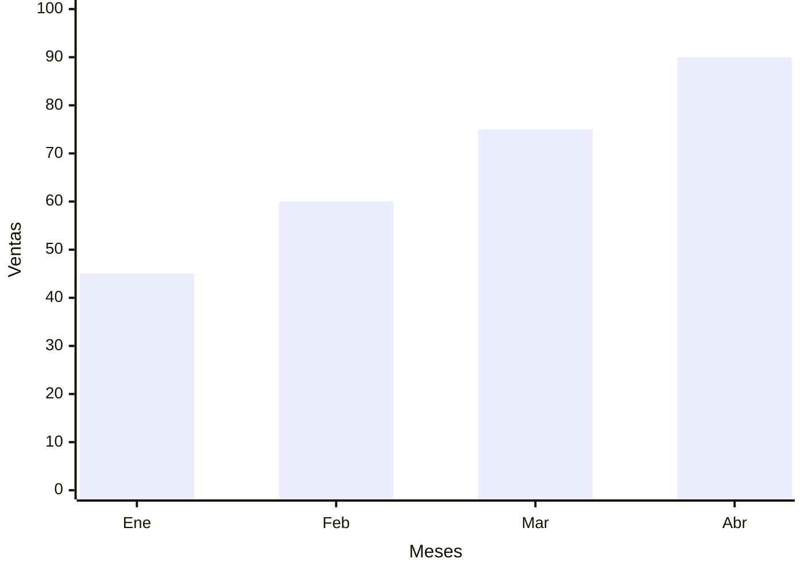
```mermaid
xychart-beta
    x-axis "Meses" [Ene, Feb, Mar, Abr]
    y-axis "Ventas" 0 --> 100
    bar [45, 60, 75, 90]
```

### Eje Y con Rango

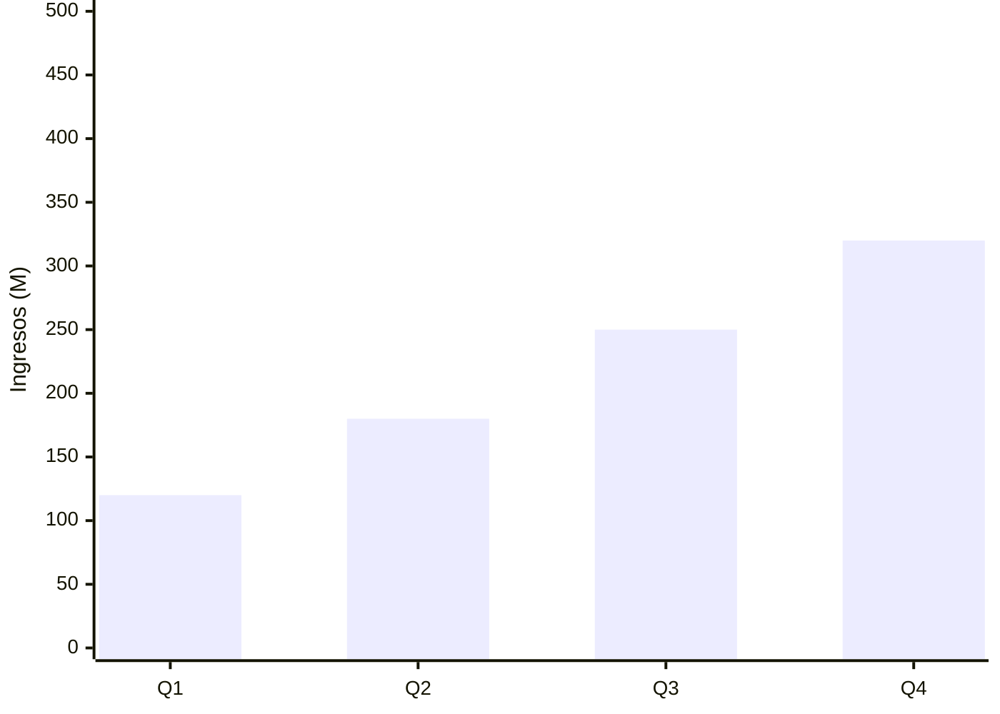
```mermaid
xychart-beta
    x-axis [Q1, Q2, Q3, Q4]
    y-axis "Ingresos (M)" 0 --> 500
    bar [120, 180, 250, 320]
```

## Tipos de Graficos

### Grafico de Barras

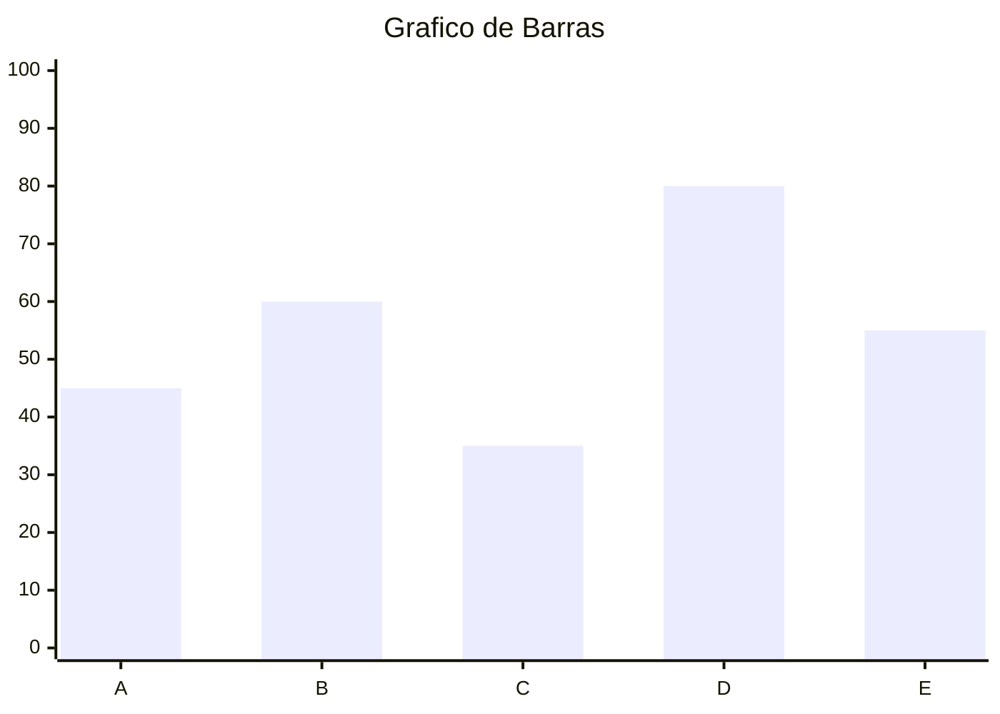
```mermaid
xychart-beta
    title "Grafico de Barras"
    x-axis [A, B, C, D, E]
    y-axis 0 --> 100
    bar [45, 60, 35, 80, 55]
```

### Grafico de Lineas

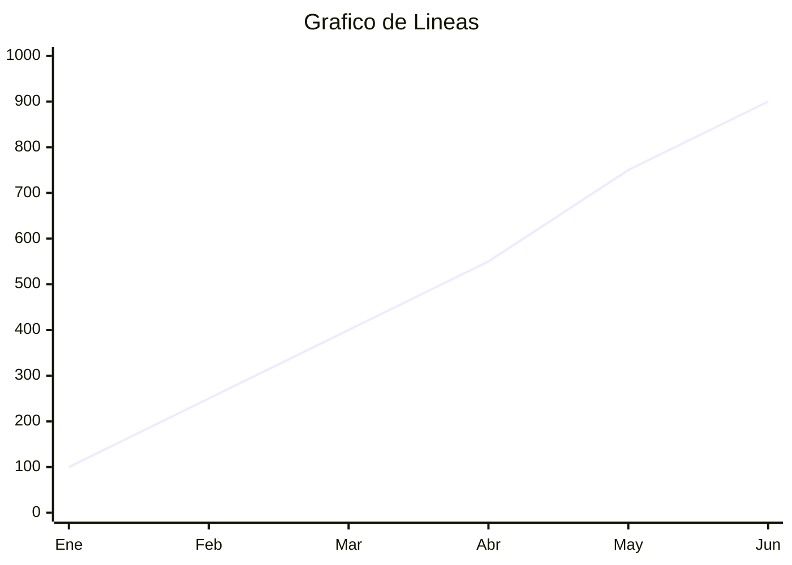
```mermaid
xychart-beta
    title "Grafico de Lineas"
    x-axis [Ene, Feb, Mar, Abr, May, Jun]
    y-axis 0 --> 1000
    line [100, 250, 400, 550, 750, 900]
```

### Grafico Combinado

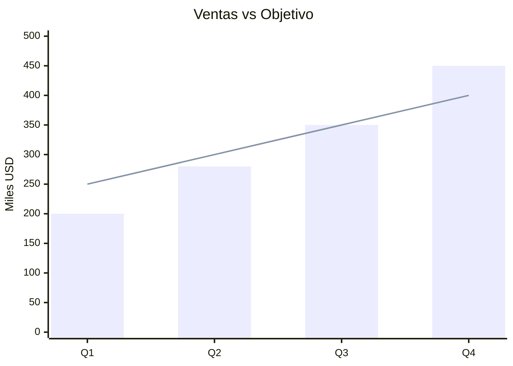
```mermaid
xychart-beta
    title "Ventas vs Objetivo"
    x-axis [Q1, Q2, Q3, Q4]
    y-axis "Miles USD" 0 --> 500
    bar [200, 280, 350, 450]
    line [250, 300, 350, 400]
```

### Multiples Series


```mermaid
xychart-beta
    title "Comparativa de Productos"
    x-axis [Ene, Feb, Mar, Abr, May, Jun]
    y-axis 0 --> 100
    bar [30, 40, 45, 50, 55, 60]
    bar [25, 35, 40, 45, 50, 55]
    line [40, 45, 50, 55, 60, 70]
```

## Orientacion

### Vertical (Default)

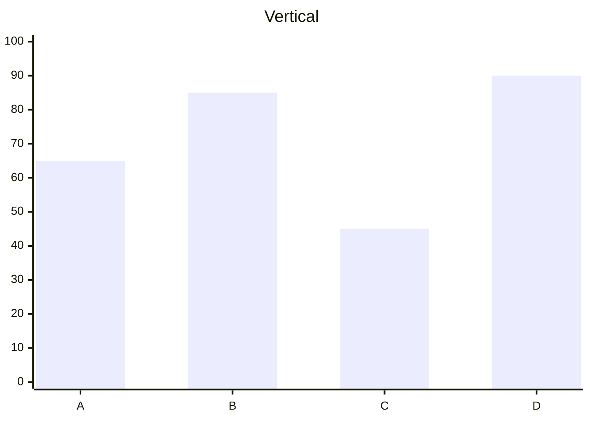
```mermaid
xychart-beta
    title "Vertical"
    x-axis [A, B, C, D]
    y-axis 0 --> 100
    bar [65, 85, 45, 90]
```

### Horizontal

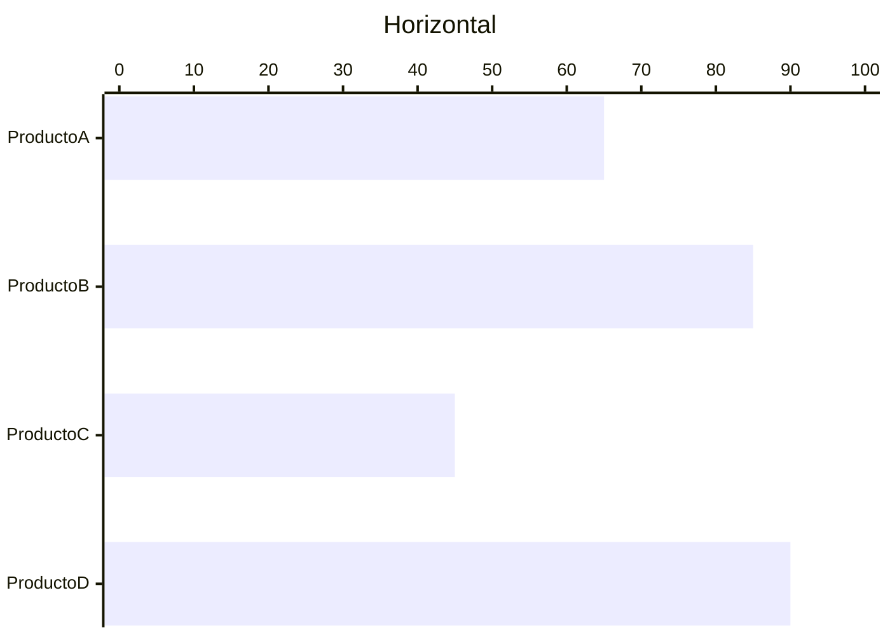
```mermaid
xychart-beta horizontal
    title "Horizontal"
    x-axis [Producto A, Producto B, Producto C, Producto D]
    y-axis 0 --> 100
    bar [65, 85, 45, 90]
```

## Ejemplos por Categoria

### Ventas Mensuales

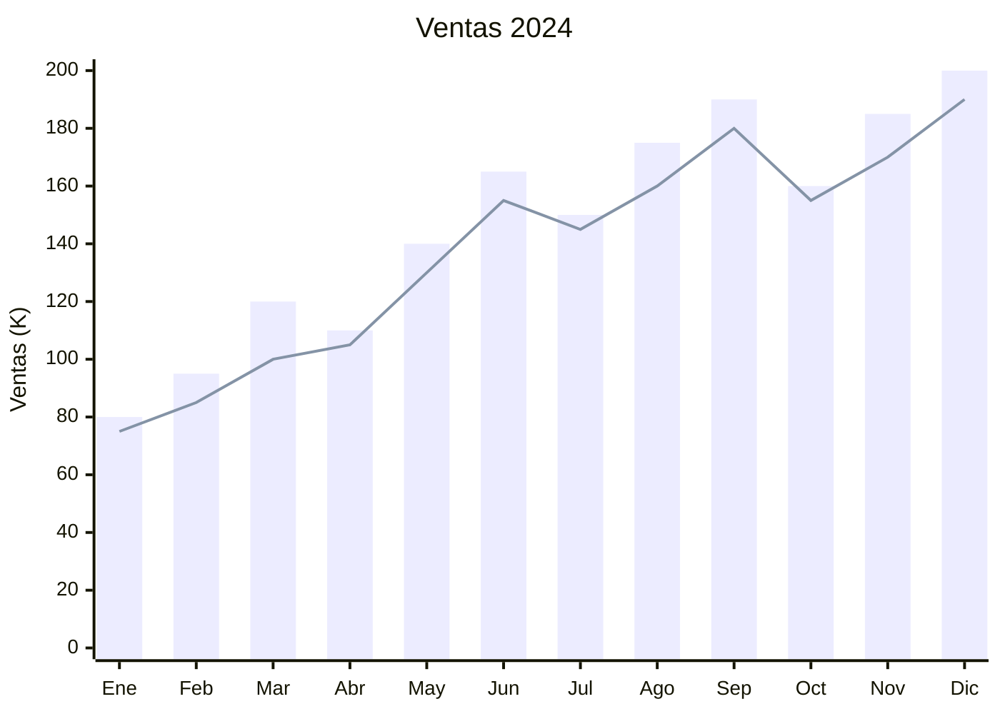
```mermaid
xychart-beta
    title "Ventas 2024"
    x-axis [Ene, Feb, Mar, Abr, May, Jun, Jul, Ago, Sep, Oct, Nov, Dic]
    y-axis "Ventas (K)" 0 --> 200
    bar [80, 95, 120, 110, 140, 165, 150, 175, 190, 160, 185, 200]
    line [75, 85, 100, 105, 130, 155, 145, 160, 180, 155, 170, 190]
```

### Trafico Web

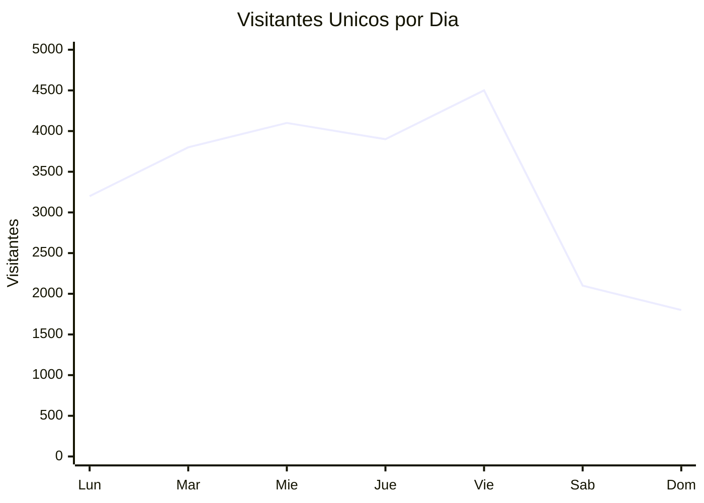
```mermaid
xychart-beta
    title "Visitantes Unicos por Dia"
    x-axis [Lun, Mar, Mie, Jue, Vie, Sab, Dom]
    y-axis "Visitantes" 0 --> 5000
    line [3200, 3800, 4100, 3900, 4500, 2100, 1800]
```

### Comparativa de Rendimiento

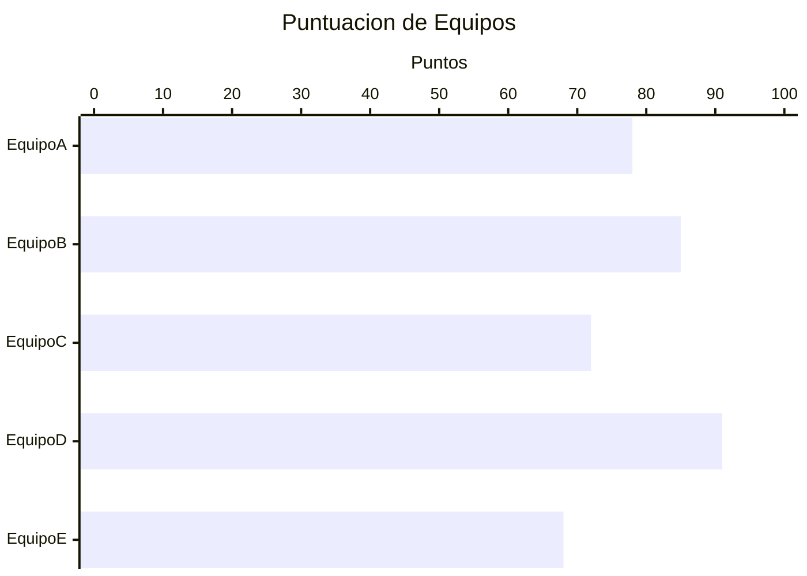
```mermaid
xychart-beta horizontal
    title "Puntuacion de Equipos"
    x-axis [Equipo A, Equipo B, Equipo C, Equipo D, Equipo E]
    y-axis "Puntos" 0 --> 100
    bar [78, 85, 72, 91, 68]
```

### Crecimiento Anual

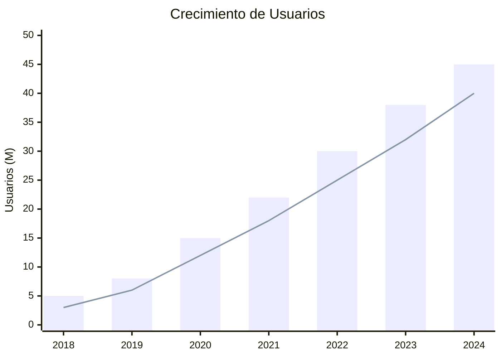
```mermaid
xychart-beta
    title "Crecimiento de Usuarios"
    x-axis [2018, 2019, 2020, 2021, 2022, 2023, 2024]
    y-axis "Usuarios (M)" 0 --> 50
    bar [5, 8, 15, 22, 30, 38, 45]
    line [3, 6, 12, 18, 25, 32, 40]
```

### Metricas de Sprint

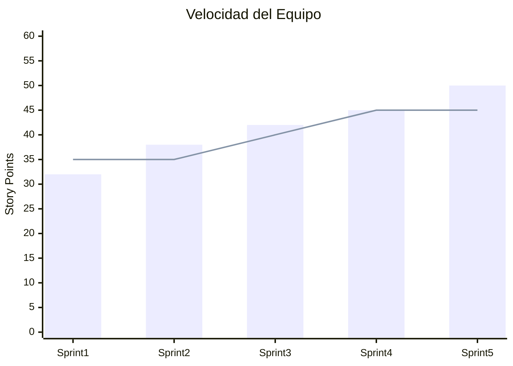
```mermaid
xychart-beta
    title "Velocidad del Equipo"
    x-axis [Sprint 1, Sprint 2, Sprint 3, Sprint 4, Sprint 5]
    y-axis "Story Points" 0 --> 60
    bar [32, 38, 42, 45, 50]
    line [35, 35, 40, 45, 45]
```

### Encuesta de Satisfaccion

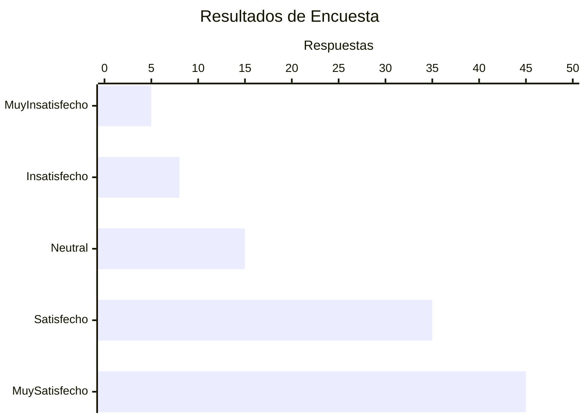
```mermaid
xychart-beta horizontal
    title "Resultados de Encuesta"
    x-axis [Muy Insatisfecho, Insatisfecho, Neutral, Satisfecho, Muy Satisfecho]
    y-axis "Respuestas" 0 --> 50
    bar [5, 8, 15, 35, 45]
```

### Temperaturas Mensuales

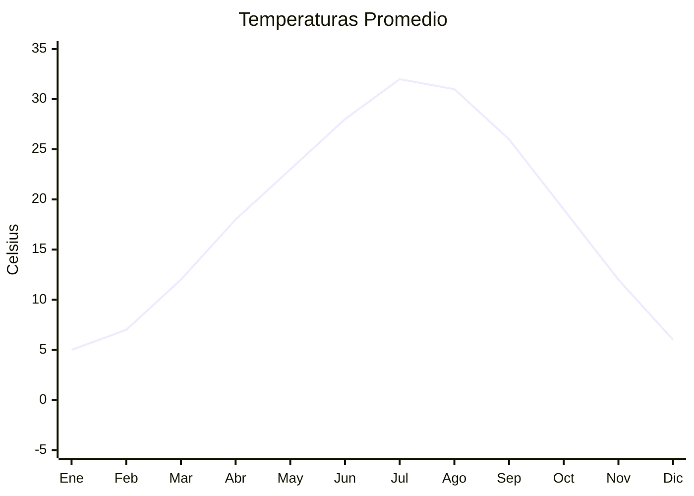
```mermaid
xychart-beta
    title "Temperaturas Promedio"
    x-axis [Ene, Feb, Mar, Abr, May, Jun, Jul, Ago, Sep, Oct, Nov, Dic]
    y-axis "Celsius" -5 --> 35
    line [5, 7, 12, 18, 23, 28, 32, 31, 26, 19, 12, 6]
```

### Presupuesto vs Real


```mermaid
xychart-beta
    title "Presupuesto vs Gasto Real"
    x-axis [Marketing, Desarrollo, Operaciones, RRHH, Infraestructura]
    y-axis "Miles USD" 0 --> 500
    bar [300, 450, 200, 150, 180]
    bar [280, 480, 190, 160, 175]
```

### Conversion por Canal

```mermaid
xychart-beta horizontal
    title "Tasa de Conversion por Canal"
    x-axis [Email, Redes Sociales, Busqueda Organica, PPC, Referidos]
    y-axis "%" 0 --> 10
    bar [4.5, 2.8, 3.5, 5.2, 6.1]
```

### Series Temporales

```mermaid
xychart-beta
    title "Precio de Accion"
    x-axis "Dia" 1 --> 30
    y-axis "USD" 50 --> 100
    line [55, 58, 62, 60, 65, 68, 72, 70, 75, 78, 82, 80, 85, 88, 90, 87, 92, 95, 93, 97, 100, 98, 102, 105, 103, 108, 110, 107, 112, 115]
```

## Configuracion

### Tema Default

```mermaid
xychart-beta
    x-axis [A, B, C]
    y-axis 0 --> 10
    bar [5, 8, 6]
```

### Tema Forest

```mermaid
%%{init: {'theme': 'forest'}}%%
xychart-beta
    title "Tema Forest"
    x-axis [A, B, C]
    y-axis 0 --> 10
    bar [5, 8, 6]
```

### Tema Dark

```mermaid
%%{init: {'theme': 'dark'}}%%
xychart-beta
    title "Tema Dark"
    x-axis [A, B, C]
    y-axis 0 --> 10
    bar [5, 8, 6]
    line [4, 7, 5]
```

### Configuracion Avanzada

```mermaid
%%{init: {'xyChart': {'width': 600, 'height': 400, 'titleFontSize': 20}}}%%
xychart-beta
    title "Grafico Configurado"
    x-axis [Q1, Q2, Q3, Q4]
    y-axis 0 --> 100
    bar [45, 60, 75, 90]
```

## Opciones de Configuracion

| Opcion | Descripcion | Default |
|--------|-------------|---------|
| `width` | Ancho del grafico | 700 |
| `height` | Alto del grafico | 500 |
| `titleFontSize` | Tamano fuente titulo | 20 |
| `titlePadding` | Padding del titulo | 10 |
| `showTitle` | Mostrar titulo | true |
| `xAxisLabelFontSize` | Tamano etiqueta X | 14 |
| `yAxisLabelFontSize` | Tamano etiqueta Y | 14 |
| `xAxisTickFontSize` | Tamano ticks X | 12 |
| `yAxisTickFontSize` | Tamano ticks Y | 12 |
| `plotBorderWidth` | Ancho borde | 2 |

## Notas Importantes

### Estado Beta

- `xychart-beta` indica version beta
- Algunas funcionalidades pueden cambiar

### Limitaciones

- Numero limitado de series soportadas
- Personalizacion de colores por serie limitada
- Sin soporte para tooltips interactivos nativos

### Mejores Practicas

1. **Limitar puntos de datos**: Demasiados valores reducen legibilidad
2. **Rango Y apropiado**: Ajustar para visualizar bien los datos
3. **Etiquetas claras**: Nombres descriptivos para ejes
4. **Combinar con proposito**: Barras + lineas cuando tiene sentido (ej: real vs objetivo)
5. **Horizontal para texto largo**: Usar orientacion horizontal cuando las etiquetas X son largas

## Casos de Uso

| Tipo | Mejor Uso |
|------|-----------|
| Barras | Comparar categorias |
| Lineas | Mostrar tendencias |
| Combinado | Real vs objetivo, multiples metricas |
| Horizontal | Etiquetas largas, rankings |
