# Block Diagram (Diagrama de Bloques) - Mermaid

> Documentacion oficial: https://mermaid.js.org/syntax/block.html

Los diagramas de bloques permiten crear layouts estructurados con bloques anidados, ideal para arquitecturas, diagramas de sistema y estructuras organizacionales.

## Sintaxis Basica

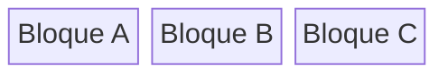

## Estructura General

```
block-beta
    columns N
    bloque["Texto"]
    bloque:N  %% Ocupa N columnas
    block:nombre
        %% bloques anidados
    end
```

## Columnas

### Definir Columnas

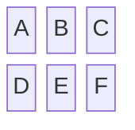

### Bloques que Ocupan Multiples Columnas

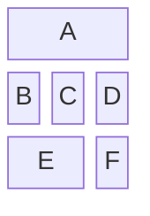

## Formas de Bloques

### Diferentes Formas

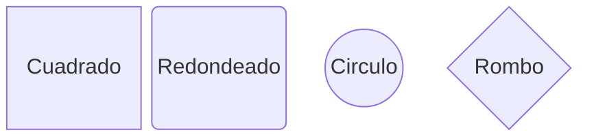

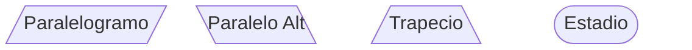

### Tabla de Formas

| Sintaxis | Forma |
|----------|-------|
| `["texto"]` | Rectangulo |
| `("texto")` | Redondeado |
| `(("texto"))` | Circulo |
| `{"texto"}` | Rombo |
| `[/"texto"/]` | Paralelogramo |
| `[\"texto"\]` | Paralelogramo alt |
| `[/"texto"\]` | Trapecio |
| `(["texto"])` | Estadio |
| `[["texto"]]` | Subrutina |
| `[("texto")]` | Cilindro |
| `{{"texto"}}` | Hexagono |

## Bloques Anidados

### Bloque Contenedor

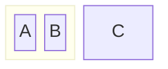

### Multiples Niveles

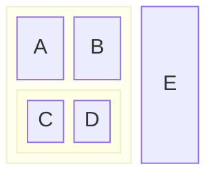

## Conexiones

### Conexiones Basicas

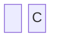

### Conexiones con Etiquetas

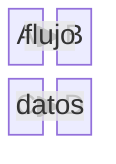

### Tipos de Flechas

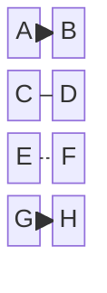

## Espacios

### Espacio en Blanco

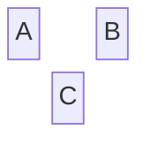

### Espacio que Ocupa Columnas

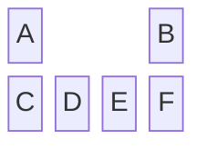

## Estilos

### Clases de Estilo

```mermaid
block-beta
    columns 2
    A:::importante
    B:::normal
    
    classDef importante fill:#f96,stroke:#333
    classDef normal fill:#9f9,stroke:#333
```

### Estilo por Bloque

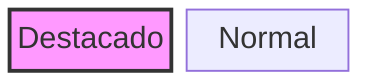

## Ejemplos por Categoria

### Arquitectura de Sistema

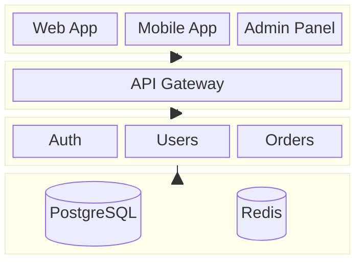

### Flujo de CI/CD

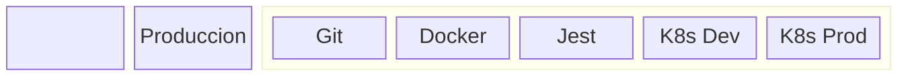

### Organizacion de Equipo

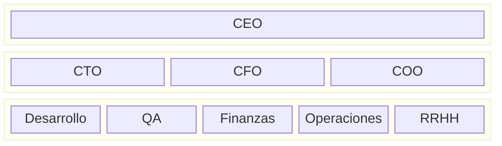

### Stack Tecnologico

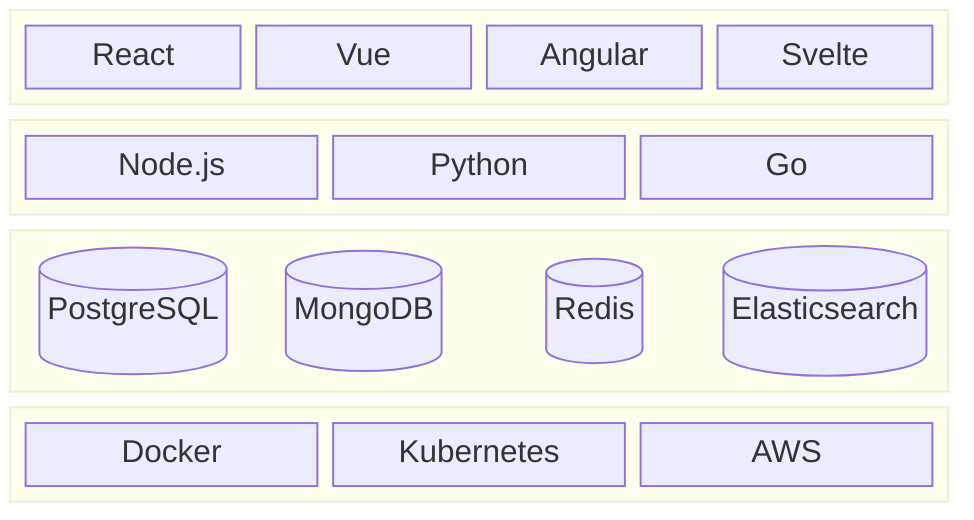

### Proceso de Desarrollo

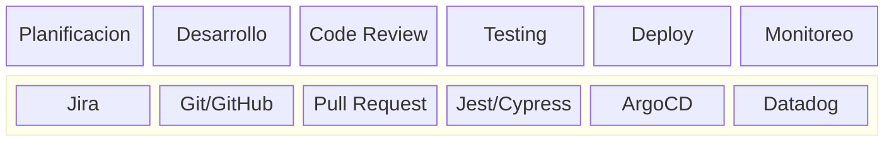

### Arquitectura de Microservicios

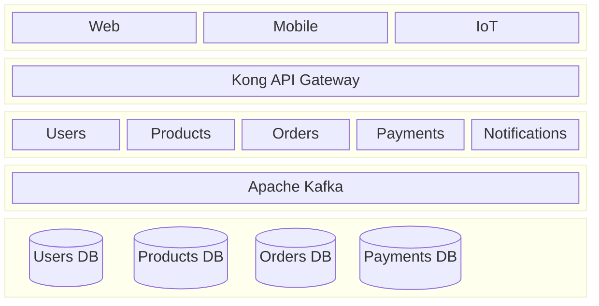

### Dashboard de Metricas

```mermaid
block-beta
    columns 4
    
    block:header:4
        columns 1
        Title["Dashboard de Metricas"]
    end
    
    block:kpis:4
        columns 4
        Revenue["Revenue\n$1.2M"] Users["Usuarios\n50K"] Conversion["Conversion\n3.5%"] NPS["NPS\n72"]
    end
    
    block:charts:4
        columns 2
        Chart1["Ventas Mensuales"] Chart2["Trafico por Canal"]
    end
    
    block:tables:4
        columns 2
        Table1["Top Productos"] Table2["Ultimas Transacciones"]
    end
```

### Red de Computadoras

```mermaid
block-beta
    columns 5
    
    block:internet:5
        columns 1
        Internet(("Internet"))
    end
    
    block:perimeter:5
        columns 3
        Firewall{"Firewall"} space:2
    end
    
    block:dmz:5
        columns 2
        WebServer["Web Server"] MailServer["Mail Server"]
    end
    
    block:internal:5
        columns 4
        AppServer1["App Server 1"] AppServer2["App Server 2"] DBPrimary[("DB Primary")] DBReplica[("DB Replica")]
    end
```

## Configuracion

### Tema

```mermaid
%%{init: {'theme': 'forest'}}%%
block-beta
    columns 3
    A B C
```

### Tema Dark

```mermaid
%%{init: {'theme': 'dark'}}%%
block-beta
    columns 3
    A B C
    D E F
```

## Opciones de Configuracion

| Opcion | Descripcion |
|--------|-------------|
| `padding` | Espaciado interno |
| `margin` | Margen externo |

## Comparacion con Flowchart

| Caracteristica | Block Diagram | Flowchart |
|---------------|---------------|-----------|
| Layout | Grid-based | Graph-based |
| Columnas | Explicitas | Automatico |
| Anidamiento | Nativo | Subgrafos |
| Conexiones | Simples | Multiples tipos |
| Uso principal | Arquitectura, layouts | Flujos, procesos |

## Tips y Mejores Practicas

1. **Definir columnas primero**: Establecer estructura base con `columns N`
2. **Usar bloques anidados**: Para agrupar componentes relacionados
3. **Spans para enfasis**: Usar `:N` para bloques importantes
4. **Espacios para layout**: Usar `space` para alineacion
5. **Formas con proposito**: Diferentes formas para diferentes tipos de componentes
6. **Estilos consistentes**: Usar clases para categorizar

## Casos de Uso

| Uso | Descripcion |
|-----|-------------|
| Arquitecturas | Diagramas de sistema |
| Layouts | Estructuras de UI |
| Organizacion | Organigramas |
| Dashboards | Mockups de paneles |
| Redes | Topologias de red |
| Stacks | Pilas tecnologicas |
