# Packet Diagram (Diagrama de Paquetes) - Mermaid

> Documentacion oficial: https://mermaid.js.org/syntax/packet.html

Los diagramas de paquetes visualizan la estructura de protocolos de red, formatos de datos y layouts de memoria a nivel de bits y bytes.

## Sintaxis Basica

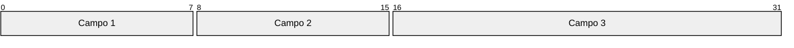

## Estructura General

```
packet-beta
    inicio-fin: "Etiqueta"
```

Donde `inicio` y `fin` son posiciones de bits (0-indexed).

## Campos de Bits

### Campo Simple


### Campo de Multiples Bits

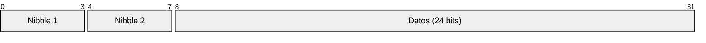

### Bits Individuales

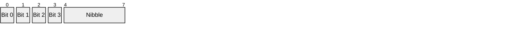

## Ejemplos de Protocolos

### Header IPv4

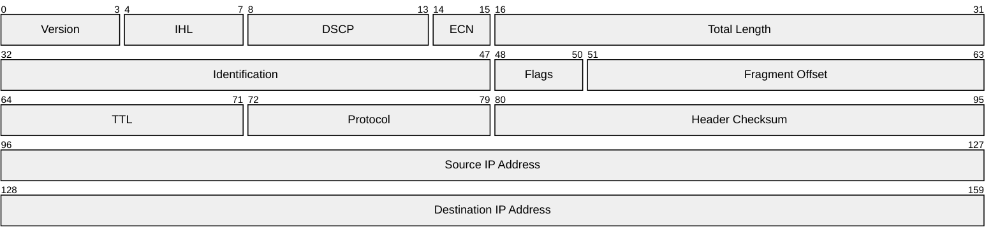

### Header TCP

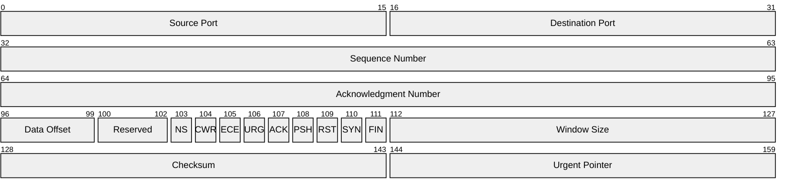

### Header UDP

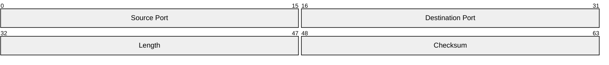

### Header Ethernet

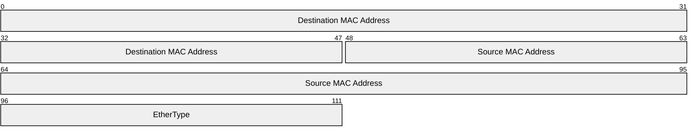

### Header ICMP

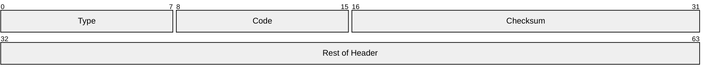

### DNS Header

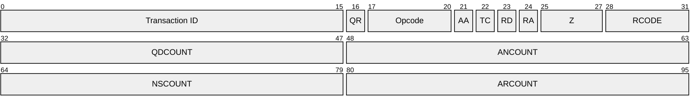

## Formatos de Datos

### Estructura de Archivo

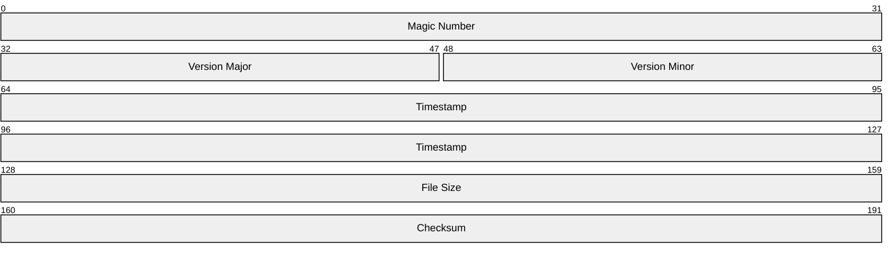

### Registro de Base de Datos

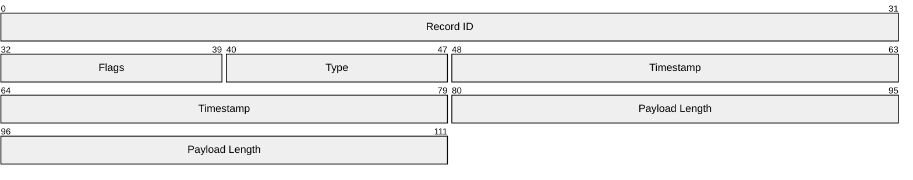

### Mensaje de Protocolo

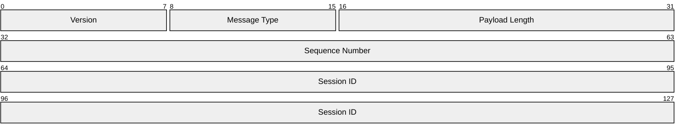

## Layouts de Memoria

### Estructura de Datos

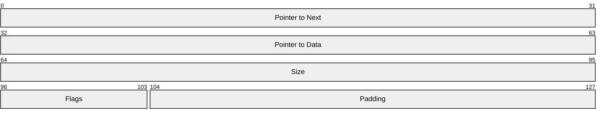

### Buffer Layout

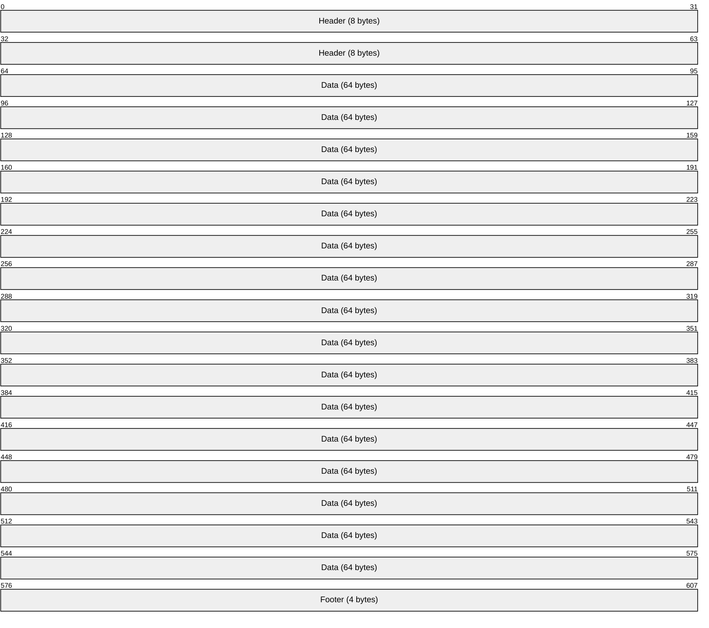

### Registro de CPU

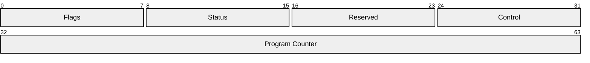

## Protocolos Personalizados

### Protocolo de Chat

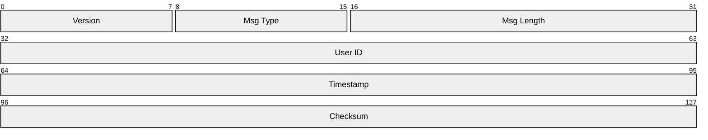

### Comando IoT

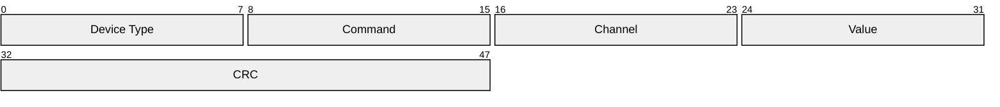

### Frame de Sensor

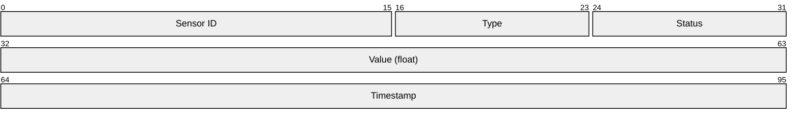

## Configuracion

### Tema Default

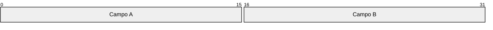

### Tema Forest

```mermaid
%%{init: {'theme': 'forest'}}%%
packet-beta
    0-15: "Campo A"
    16-31: "Campo B"
```

### Tema Dark

```mermaid
%%{init: {'theme': 'dark'}}%%
packet-beta
    0-15: "Campo A"
    16-31: "Campo B"
```

## Opciones de Configuracion

```mermaid
%%{init: {
  'packet': {
    'bitsPerRow': 32,
    'bitWidth': 20,
    'rowHeight': 30
  }
}}%%
packet-beta
    0-7: "Byte 1"
    8-15: "Byte 2"
    16-23: "Byte 3"
    24-31: "Byte 4"
```

| Opcion | Descripcion | Default |
|--------|-------------|---------|
| `bitsPerRow` | Bits por fila | 32 |
| `bitWidth` | Ancho de cada bit | 20 |
| `rowHeight` | Alto de cada fila | 30 |

## Consideraciones

### Alineacion

Los campos deben estar alineados correctamente:

```mermaid
packet-beta
    0-7: "Byte 0"
    8-15: "Byte 1"
    16-23: "Byte 2"
    24-31: "Byte 3"
```

### Campos Grandes

Para campos que cruzan filas:

```mermaid
packet-beta
    0-31: "Primera Palabra"
    32-63: "Segunda Palabra"
    64-127: "Datos (64 bits)"
```

### Bits de Flags

Para bits individuales:

```mermaid
packet-beta
    0: "SYN"
    1: "ACK"
    2: "FIN"
    3: "RST"
    4-7: "Reserved"
    8-15: "Window"
```

## Casos de Uso

| Uso | Descripcion |
|-----|-------------|
| Redes | Headers de protocolos (IP, TCP, UDP, etc.) |
| Formatos de archivo | Estructuras de archivos binarios |
| Memoria | Layouts de estructuras de datos |
| Hardware | Registros de CPU, perifericos |
| Protocolos custom | Diseño de protocolos propios |
| Documentacion | Especificaciones tecnicas |

## Tips y Mejores Practicas

1. **Alinear a bytes**: Cuando sea posible, alinear campos a limites de byte
2. **Etiquetas descriptivas**: Usar nombres claros para cada campo
3. **Bits por fila**: Configurar segun el protocolo (32 bits para IPv4, etc.)
4. **Campos reservados**: Documentar campos reservados/unused
5. **Bits de flags**: Documentar significado de cada bit
6. **Orden de bytes**: Indicar endianness si es relevante

## Errores Comunes

| Error | Causa | Solucion |
|-------|-------|----------|
| Superposicion | Rangos de bits superpuestos | Verificar rangos no se solapen |
| Gaps | Bits sin asignar | Llenar con campos reservados |
| Alineacion | Campos mal alineados | Verificar limites de bytes |
| Etiquetas largas | Texto demasiado largo | Usar abreviaciones |
