# Kanban Board (Tablero Kanban) - Mermaid

> Documentacion oficial: https://mermaid.js.org/syntax/kanban.html

Los tableros Kanban visualizan flujos de trabajo con columnas que representan etapas del proceso y tarjetas que representan items de trabajo.

## Sintaxis Basica

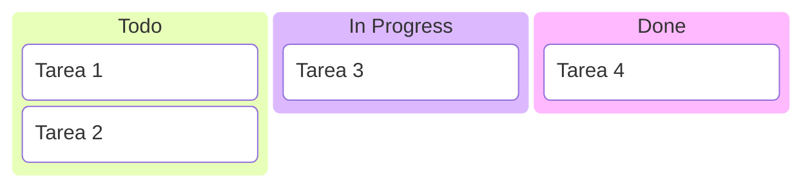

## Estructura General

```
kanban
    columna[Titulo Columna]
        tarea[Titulo Tarea]
        tarea[Titulo Tarea]
    columna[Titulo Columna]
        tarea[Titulo Tarea]
```

## Columnas

### Multiples Columnas

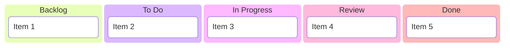

### Columnas Vacias

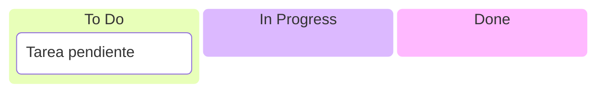

## Tarjetas

### Tarjetas Simples

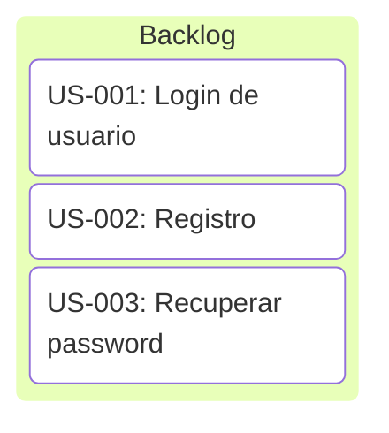

### Multiples Tarjetas por Columna

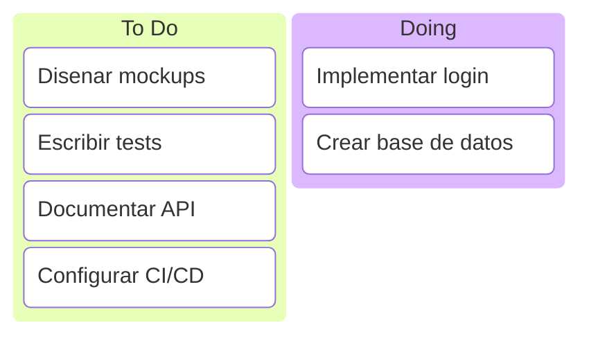

## Ejemplos por Contexto

### Sprint Board

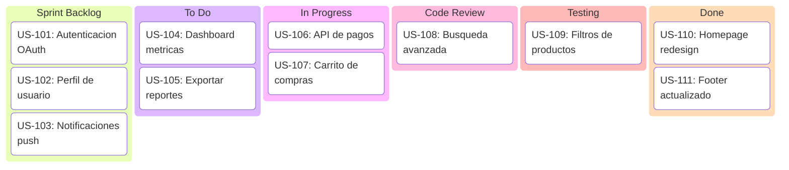

### Personal Task Board

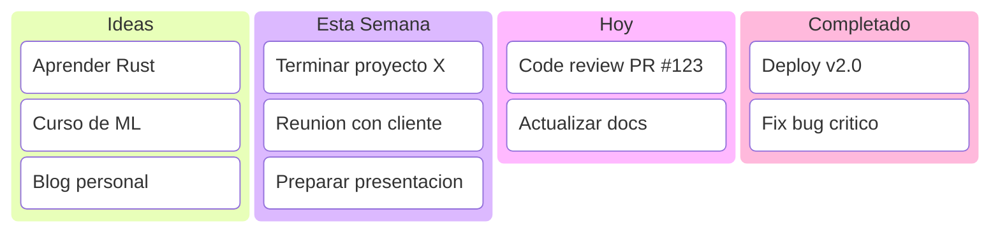

### Bug Tracking

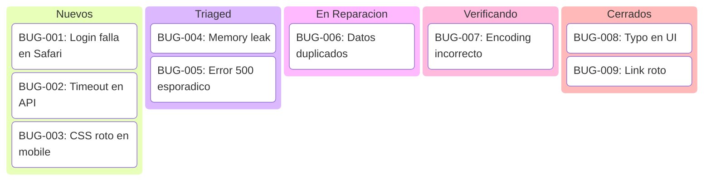

### Recruitment Pipeline

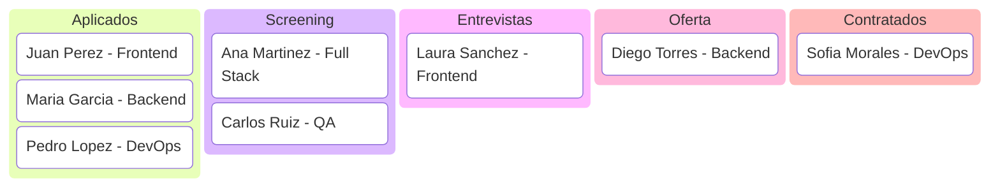

### Content Pipeline

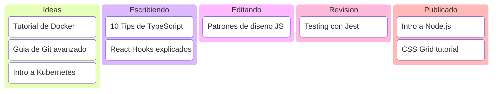

### Support Tickets

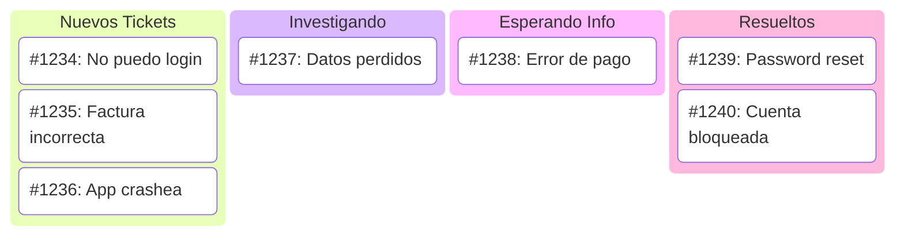

### Release Planning

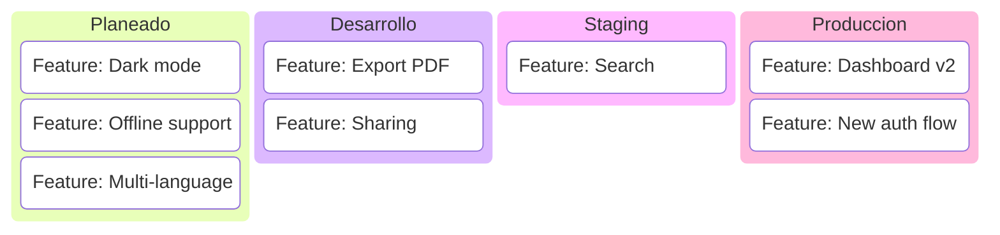

### Project Phases

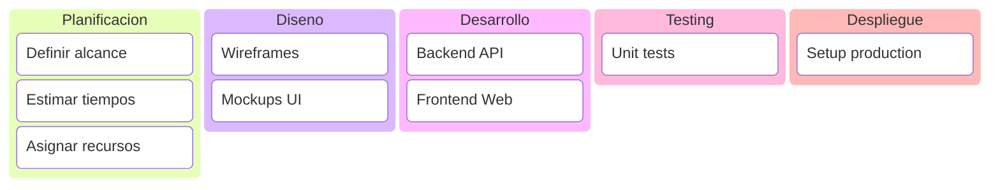

## Configuracion

### Tema Default

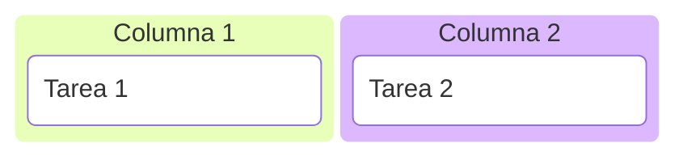

### Tema Forest

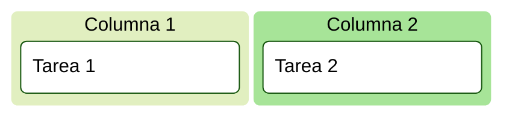

### Tema Dark

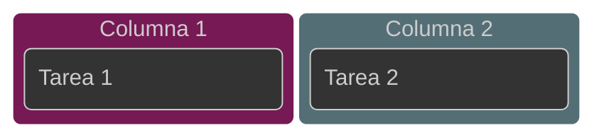

## Opciones de Configuracion

| Opcion | Descripcion |
|--------|-------------|
| `padding` | Espaciado interno |
| `margin` | Margen entre elementos |

## Comparacion con Otras Herramientas

| Mermaid Kanban | Trello/Jira |
|----------------|-------------|
| Estatico | Interactivo |
| Codigo | Drag & drop |
| Versionable | Base de datos |
| Documentacion | Gestion activa |

## Mejores Practicas

### Limite de WIP

Limitar trabajo en progreso:

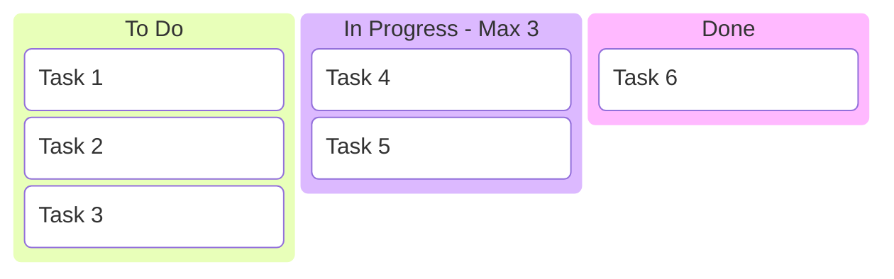

### Columnas Claras

Nombres descriptivos de etapas:

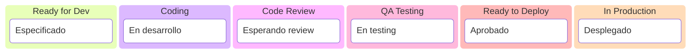

## Tips

1. **Columnas limitadas**: 4-6 columnas maximo
2. **Nombres cortos**: Titulos concisos para columnas y tarjetas
3. **Flujo izquierda-derecha**: De backlog a completado
4. **IDs en tarjetas**: Incluir identificadores cuando sea util
5. **WIP limits**: Indicar limites en nombres de columna
6. **Categorias**: Agrupar tarjetas similares

## Casos de Uso

| Uso | Descripcion |
|-----|-------------|
| Sprints | Visualizar trabajo del sprint |
| Personal | Organizar tareas personales |
| Bugs | Tracking de errores |
| Contenido | Pipeline de publicacion |
| Hiring | Proceso de reclutamiento |
| Releases | Planificacion de versiones |
| Soporte | Gestion de tickets |

## Limitaciones

- No soporta drag & drop (estatico)
- No tiene asignaciones de usuario nativas
- No tiene fechas/deadlines visibles
- No tiene etiquetas/labels
- Diseñado para visualizacion, no gestion activa
