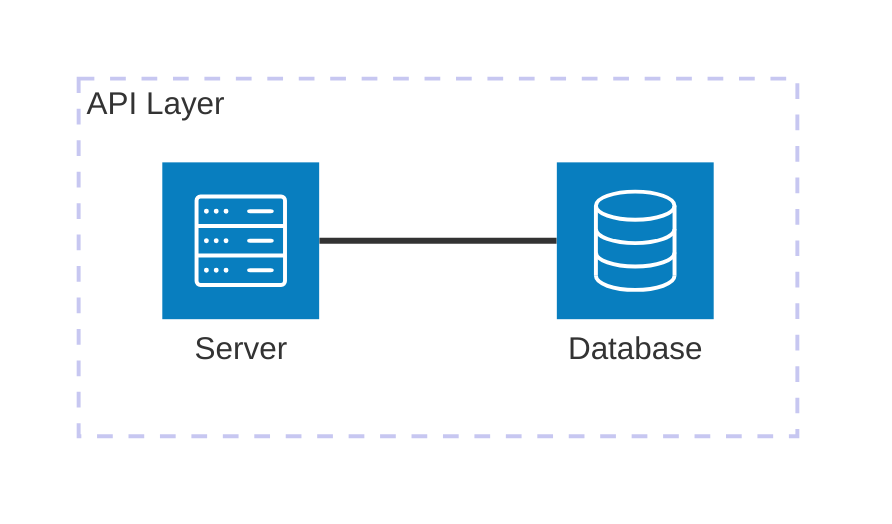
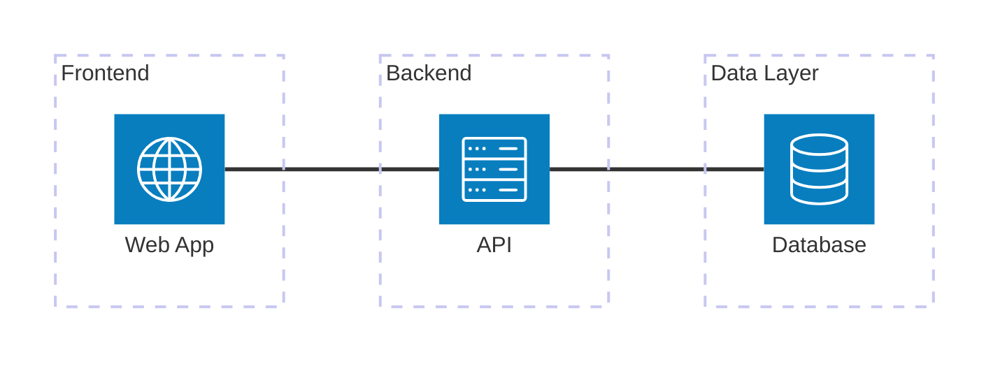
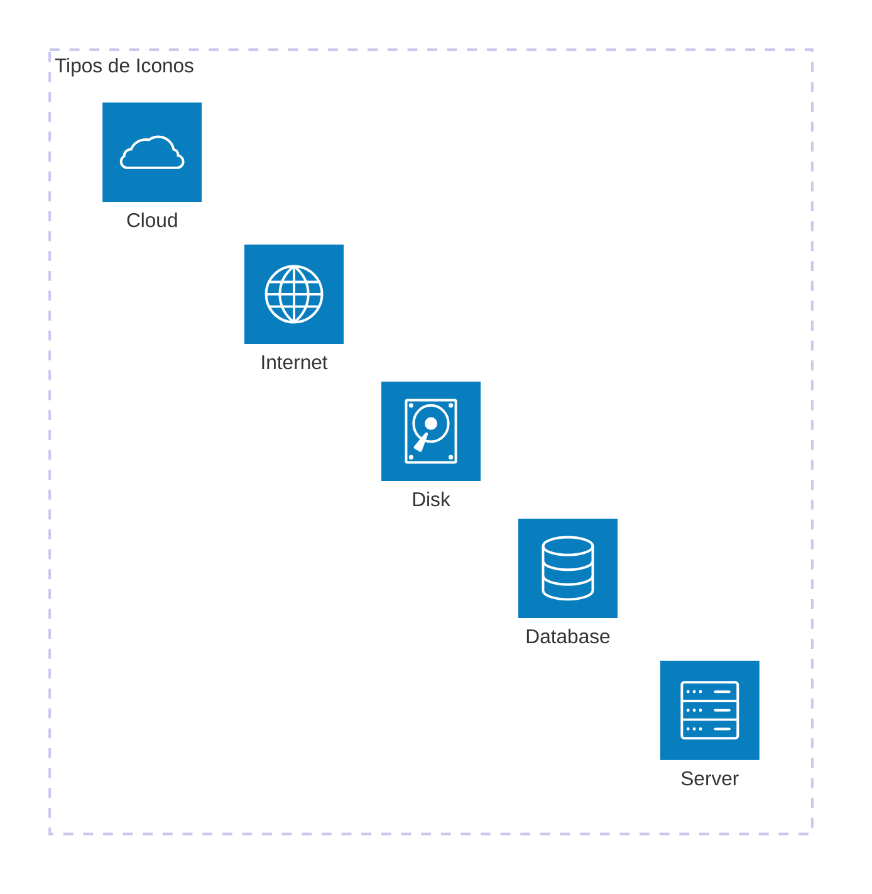
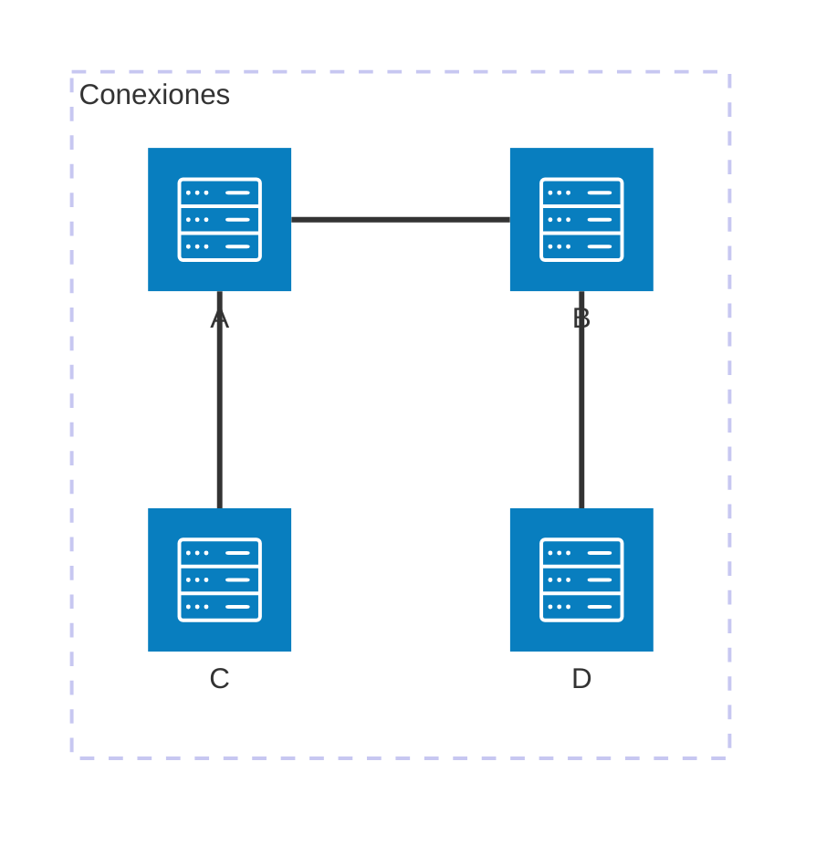
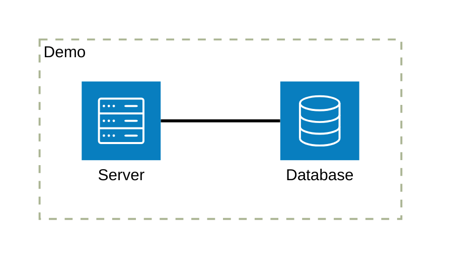
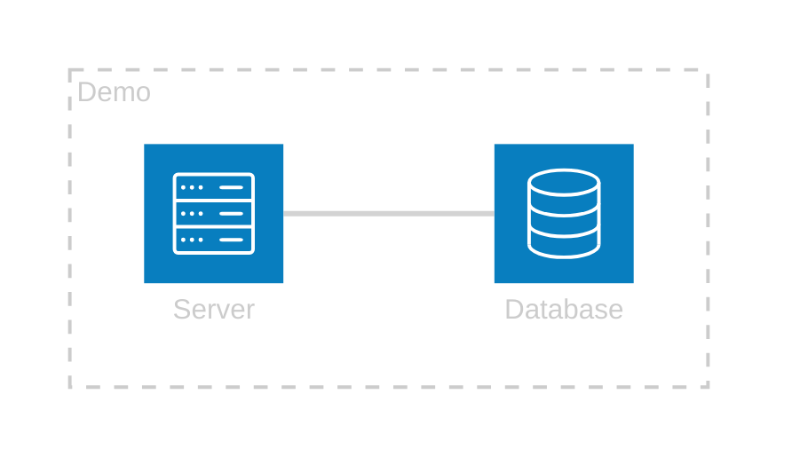

# Architecture Diagram (Diagrama de Arquitectura) - Mermaid

> Documentacion oficial: https://mermaid.js.org/syntax/architecture.html

Los diagramas de arquitectura visualizan la infraestructura de sistemas, incluyendo servicios cloud, redes y componentes de infraestructura con iconos representativos.

## Sintaxis Basica



## Estructura General

```
architecture-beta
    group nombre[Etiqueta]
    service id(tipo)[Etiqueta] in grupo
    servicio1:posicion -- posicion:servicio2
```

## Grupos

Los grupos agrupan servicios relacionados:



### Grupos Anidados


## Servicios

### Tipos de Servicios (Iconos)



### Tabla de Tipos

| Tipo | Icono | Uso |
|------|-------|-----|
| `server` | Servidor | Servidores, aplicaciones |
| `database` | Base de datos | Bases de datos |
| `disk` | Disco | Almacenamiento |
| `internet` | Globo | Internet, redes externas |
| `cloud` | Nube | Servicios cloud |

### Servicios Fuera de Grupos


## Conexiones

### Direcciones

Las conexiones usan posiciones: `T` (top), `B` (bottom), `L` (left), `R` (right)



### Sintaxis de Conexion

```
servicio1:posicion -- posicion:servicio2
```

## Ejemplos de Arquitecturas

### Aplicacion Web Basica


### Microservicios


### Cloud Architecture


### Container Architecture


### Event-Driven Architecture


### CI/CD Pipeline


### Data Pipeline


## Configuracion

### Tema



### Tema Dark



## Posiciones de Conexion

| Posicion | Descripcion |
|----------|-------------|
| `T` | Top (arriba) |
| `B` | Bottom (abajo) |
| `L` | Left (izquierda) |
| `R` | Right (derecha) |

## Mejores Practicas

1. **Agrupar logicamente**: Usar grupos para capas o zonas
2. **Direccion consistente**: Flujo general de izquierda a derecha o arriba a abajo
3. **Etiquetas claras**: Nombres descriptivos para servicios
4. **Tipos apropiados**: Usar iconos que representen el servicio
5. **Conexiones minimas**: Evitar demasiadas lineas cruzadas
6. **Niveles de detalle**: Ajustar detalle segun audiencia

## Casos de Uso

| Uso | Descripcion |
|-----|-------------|
| Cloud Architecture | Infraestructura en la nube |
| Network Topology | Topologia de red |
| Microservices | Arquitectura de microservicios |
| Data Flow | Flujo de datos |
| Deployment | Arquitectura de despliegue |
| Security | Zonas de seguridad |

## Limitaciones

- Conjunto limitado de iconos
- Esta en version beta
- Sin soporte para iconos personalizados
- Layout automatico puede no ser optimo para diagramas complejos

## Notas

- `architecture-beta` indica version beta
- Los iconos son genericos, no especificos de proveedores cloud
- Para arquitecturas cloud especificas (AWS, Azure, GCP), considerar herramientas especializadas
